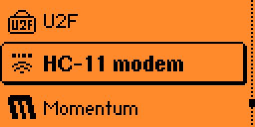
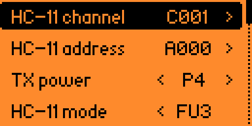
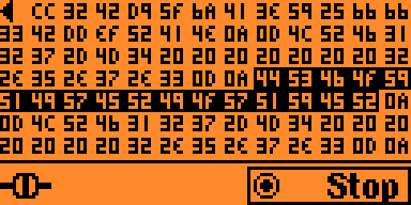
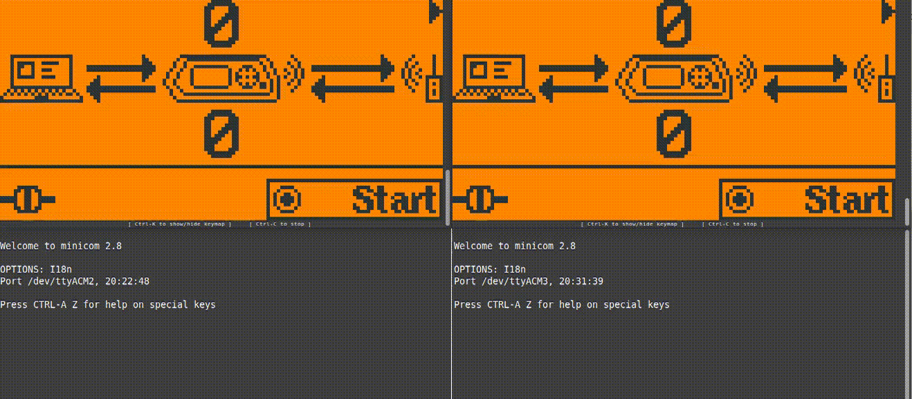

# HC-11 wireless modem emulator for the Flipper Zero
### Version 0.1

* [Usage](#Usage)
* [Installation](#Installation)
* [Notes](#Notes)
* [License](#License)

Flipper Zero app send data to / from a [HC-11](https://www.hc01.com/goods/640e91920be12d0114404c98) wireless RF UART communication module.

*See [here](https://www.elecrow.com/434mhz-serial-rf-module-hc11-140m-p-873.html), [here](https://hobbycomponents.com/wired-wireless/513-hc-11-433mhz-wireless-serial-module), [here](https://elektronik-lavpris.dk/p134115/modu0054-hc-11-433mhz-wireless-serial-module/), [here](https://invize.se/produkt/radiomodul-hc11/) or [here](https://littlebirdelectronics.com.au/products/434mhz-serial-rf-module-hc-11-1-40m) for a few distributors of the HC-11 module around the world.*

#### Functions

- Wirelessly send USB serial data to a remote HC-11 module
- Wirelessly receive serial data from a HC-11 module and relay it back to USB
- Supports 20 radio channels and 16 module addresses
- Supports all 8 HC-11 transmission power levels
- Supports RX/TX transmission in mode 3 (FU3) and **mode 1 (FU1) reliably in RX only. Modes 2 (FU2) and 4 (FU4) are not supported at this time!**
- Supports USB passthrough on channel 0 or 1

## Usage

Start the application in **Apps ▶ Sub-GHz**.

The main menu opens:

### Configuration

Set radio channel your HC-11 communicates on (see [HC-11 user manual](https://www.hc01.com/downloads/HC-11%20english%20datasheet.pdf) p.6 - **AT+Cxxx** configuration command):

- **C001** ▶ **C020** (default **C001**)

Set the module address your HC-11 communicates at (see [HC-11 user manual](https://www.hc01.com/downloads/HC-11%20english%20datasheet.pdf) p.5 - **AT+Axxx** configuration command):

- **A001** ▶ **A015** (default **A000**)

Set the transmission power (same setting as if the Flipper Zero was a genuine HC-11 module - see [HC-11 user manual](https://www.hc01.com/downloads/HC-11%20english%20datasheet.pdf) p.6 - **AT+Px** configuration command):

- **P1** ▶ **P8** (default **P4**)

Set the transmission mode used by your HC-11 (see [HC-11 user manual](https://www.hc01.com/downloads/HC-11%20english%20datasheet.pdf) p.6 - **AT+FUx** configuration command):

- **FU1 (RX)**: the Flipper Zero only receives data from the HC-11 module reliably in this mode
- **FU3**: data is received and transmitted reliably in this mode (default)

  *Note: modes 2 (FU2) and 4 (FU4) are not supported at this point!*

Set the USB channel to either:

- **0**: the single virtual COM port normally used by the Flipper Zero is repurposed to relay data to / from the HC-11 module
- **1**: a second virtual COM port is created specifically to relay data to / from the HC-11 module

When using channel 0, the Flipper Zero always appears as one single COM port. However, qFlipper and the CLI become unavailable in the passthrough view.

When using channel 1, depending on whether the passthrough view is started or not, the Flipper Zero appears as one or two COM ports. qFlipper and the CLI remain available on the lower COM port (channel 0).

### USB serial passthrough

Selecting the **USB serial passthrough** enables the modem function. The Flipper Zero starts receiving data from the HC- module and relaying the data to the USB serial port, and conversely, transmit USB serial data wirelessly to the HC-11 module.

The first screen shows the overall amount of serial traffic going to and from the HC-11 module:

The second screen, accessible with the right arrow, shows the actual traffic: bytes sent to the HC-11 are showed in black while bytes received from the HC-11 are showed normally.

### About

Gives information about the app. Use the **OK** button or the arrows to switch pages.

### Flipper-to-Flipper wireless communication

It's worth noting that there is no functional distinction between a HC-11 module and a Flipper Zero running this app. Therefore, it's perfectly possible to exchange data between two or more Flipper Zeros wirelessly without the need for a HC-11 module.

## Installation

### Pre-built app

Install this app from https://lab.flipper.net/apps/hc11_modem

### Manually

- Clone this repository
- Install [uFBT](https://github.com/flipperdevices/flipperzero-ufbt)
- Connect the Flipper Zero to the computer with a USB cable
- cd into the repository
- Invoke `ufbt launch` to install the app in the **Apps ▶ Sub-GHz** menu and run it for the first time

## Notes

- The protocol used by the HC-11 was reverse-engineered and is not fully understood. The effort to fully support the HC-11 module in the Flipper Zero is a work in progress. Don't be too surprised if this app doesn't work for you.

- See also [this manual](https://www.elecrow.com/download/HC-11.pdf) for a more complete documentation of the HC-11 module in English.

## License

MIT
