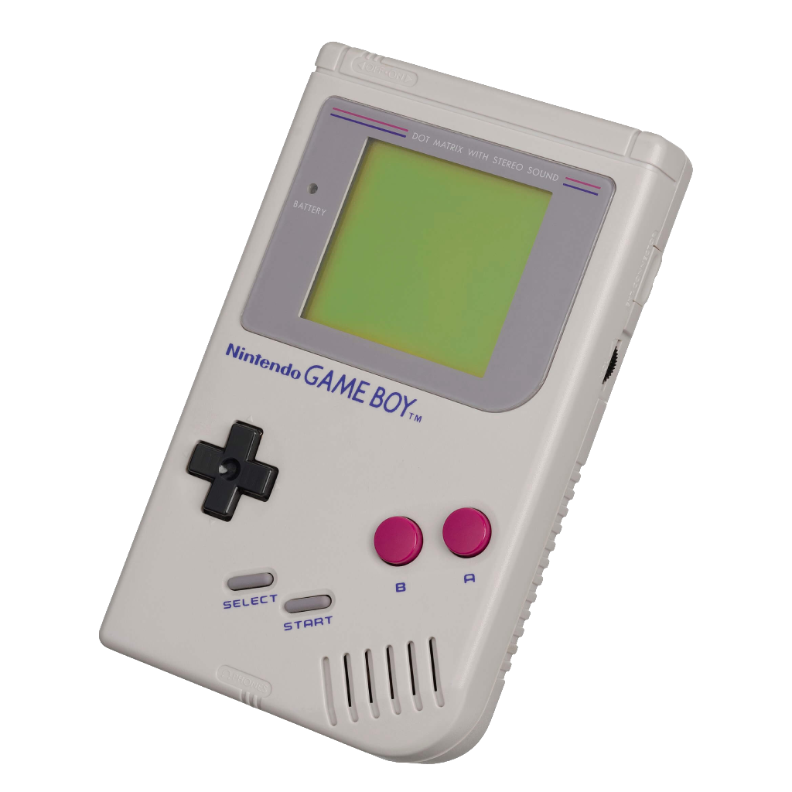
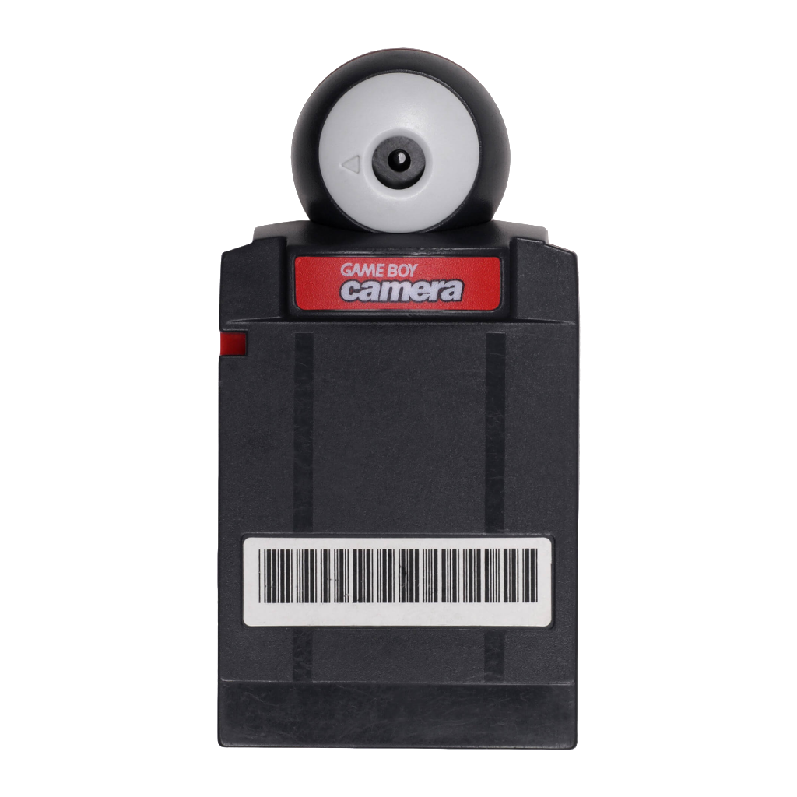
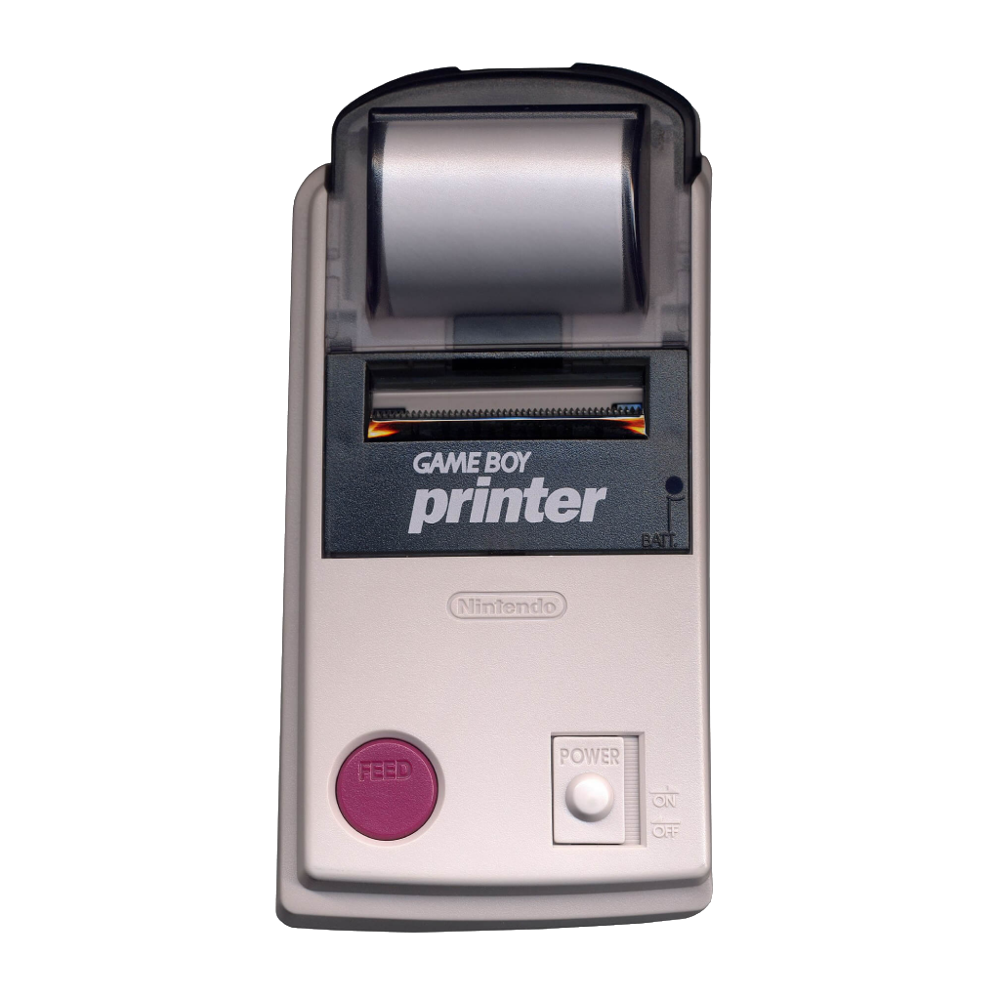

# MALVEKE - *GAME BOY* Tools for Flipper Zero 🐬

***GAME BOY*** Tools for Flipper Zero

<picture>
    <source media="(prefers-color-scheme: dark)" srcset="./assets/logo.png">
    <source media="(prefers-color-scheme: light)" srcset="./assets/logo-b.png">
    
</picture>

<figure>
    
    <figcaption>MALVEKE Prototype V2.3</figcaption>
</figure>

**GAME BOY** Tools for Flipper Zero. The perfect companion for your Flipper Zero. Equipped with ESP32 for WiFi, it allows you to connect all GAME BOY peripherals and additional accessories such as NRF24, CC1101, and GPS..

<table>
  <tbody>
    <tr>
      <td style="border: none"></td>
      <td style="border: none"></td>
      <td style="border: none"></td>
      <td style="border: none"></td>
    </tr>
    <tr>
      <td style="border: none"></td>
      <td style="border: none"></td>
      <td style="border: none"></td>
      <td style="border: none"></td>
    </tr>
  </tbody>
</table>

## Features (WIP)

- Can read/write GB/GBC/GBA cartridges.
- You can read the ***GAME BOY*** Camera cartridge and view the photos.
- It has 2 ***GAME BOY*** Cable Link ports.
- You can connect a ***GAME BOY*** with a **GAME BOY CAMERA** via Cable Link to emulate a **GAME BOY Printer** and view images.
- You can connect a GB Printer and upload an image for printing.
- It can also integrate games like `Pokemon` into the ecosystem.
- Use **GAME BOY CAMERA** like Camera
- Extra modules
    - Slot for `NRF24`
    - Slot for `CC1101`.
    - Slot for `GPS NEO-6M` Module (wardrive)
- Includes Marauder ESP32 (v0.12.0).

## Flipper faps
- [[MALVEKE] GAME BOY Cartridge  (GB/GBC)](./flipper_companion_apps/applications/external/malveke_gb_cartridge/README.md)
- [[MALVEKE] GAME BOY ADVANCE Cartridge](./flipper_companion_apps/applications/external/malveke_gba_cartridge/README.md)
- [MALVEKE] GAME BOY Camera Viewer 
- [[MALVEKE] GAME BOY Live Camera](./flipper_companion_apps/applications/external/malveke_gb_live_camera/README.md)
- [[MALVEKE] GAME BOY Camera Link Cable Transfer](./flipper_companion_apps/applications/external/malveke_gb_link_camera/README.md)
- [MALVEKE] GAME BOY Printer Link Cable Transfer
- [MALVEKE] GAME BOY Logo Generator
- [MALVEKE] Pokemon Trading

## Contributors

## More functionality
Join in on the fun and contribute to the development. You could add new functionality, such as:

- GAME BOY Camera Nany Cam
- GAME BOY Camera Motion detection
- Hack GAME BOY Specifics Cartridges/Games
- GAME BOY Camera Record videos
- GAME BOY Wifi/SugGhz Multiplayer
- Print photos from Flipper Zero to the GAME BOY Printer
- GAME BOY Emulator that runs on Flipper Zero.
- [Send your suggestion](/MALVEKE-Flipper-Zero/issues/new) (or just hack the code yourself)

## TODO
- [ ] Refactor Code
- [ ] Documentation
- [ ] Application GAME BOY Printer
- [ ] Play a GAME BOY ROM in Flipper Zero

## Acknowledgements
This project builds upon the excellent work of [Just Call Me Koko](https://github.com/justcallmekoko/), the [ESP32Marauder](https://github.com/justcallmekoko/ESP32Marauder)

 
 
From Talcahuano 🇨🇱 with ❤ 

