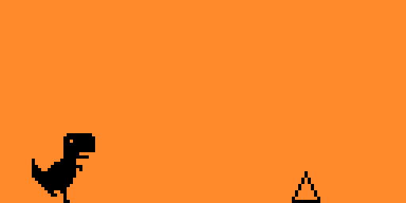

# t-rex-runner
Flipper Zero port of Chrome's running T-rex game

## Screenshots




## Improvements
- Added command to move DINO
- Added (boring) cactus spawn
- Added lose condition and lose screen

## TODO
- Change cactus icon
- More random cactus spawn
- Increase cactus speed with time
- Allow to play again without the need to close the game in the lose screen

## Compiling

You need a full source of the [Flipper Zero firmware](https://github.com/flipperdevices/flipperzero-firmware/tree/release),
take the `release` branch to build for the stable release.

Copy or symlink this folder as `flipperzero-firmware/applications_user/t-rex-runner`.

Run the build from the root of the firmware folder:
```
./fbt firmware_t-rex-runner
```

If you have Flipper Zero attached to USB, you can immediately compile and run the app on device:
```
./fbt launch_app APPSRC=applications_user/t-rex-runner
```
