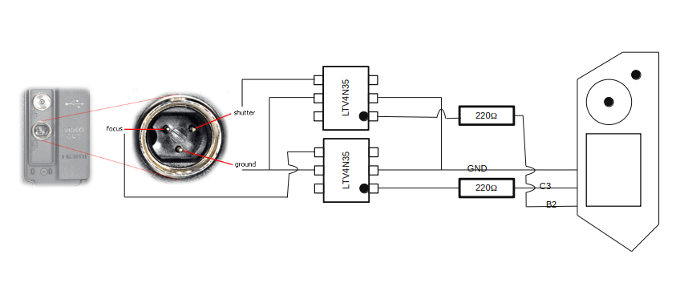

# Flipper Zero intervalometer

## Hardware

### Parts
+ 2 LTV4N35 octocopuler
+ 2 220 Ohm resistor
+ Wires

### Schema

(The photo from the N3 connector created by Martin Pot. [Source](https://martybugs.net/blog/blog.cgi/gear/CanonN3Connector.html))
