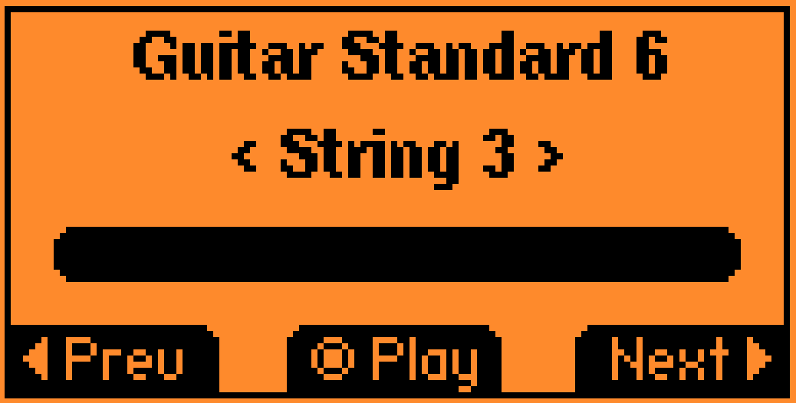
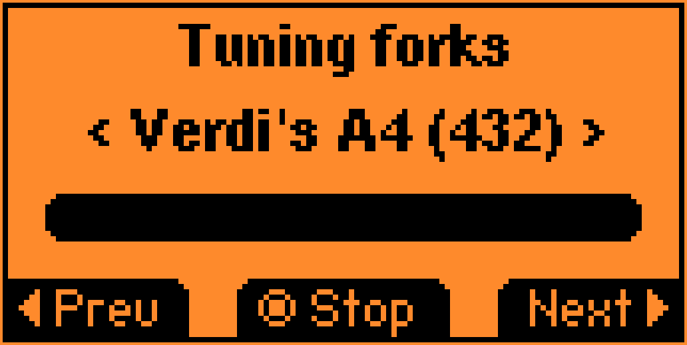

# Tuning Fork

Inspired by [Metronome](https://github.com/panki27/Metronome)

A tuning fork for the [Flipper Zero](https://flipperzero.one/) device.
Allows to play different types of notes, including guitar tuning.





## Features

- Guitar Standard (6 strings)
- Guitar Drop D (6 strings)
- Guitar D (6 strings)
- Guitar Drop C (6 strings)
- Tuning forks (440, 432, etc.)
- Scientific pitch (..., 256, 512, 1024, ...)

## Compiling

```
./fbt firmware_tuning_fork
```
