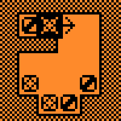

# Vexed for Flipper Zero

Vexed is puzzle game, where your goal is to clear level from bricks in smallest possible count of moves. Easy to learn, **hard to master**

Originally developed for Palm.OS by James McCombe, and later extended by The Vexed Project, was abandonware since 2006. After 18 years, this full remake shares same level sets, but is written from scratch to fit on Flipper Zero 128x64 B&W screen and be controlled without touch screen.

## How to play 

Goal of the game is to clear levels from bricks. Level is seen as cross section, top-down, with walls - and bricks are falling due to gravity. You can only move one brick at a time, and only to the left or right, one step a time. If two or more bricks of he same type are touching - they will explode and be cleared from level. You need to explode all of bricks, but be careful! If there is any single brick of a kind left alone - game is lost! Same if brick are blocked by walls and at end cannot touch - you wont be able to clear them!

### Selecting bricks

To select brick you want to move, use arrow buttons. &#9664; Left and Right &#9654; arrows move sideways and cycle through all bricks, &#9660; Down and &#9650; Up pointing buttons moves selection vertically to the nearest block downwards or upwards.

### Moving bricks

If selected brick can be moved **only in one direction** you can move it immediately when it is selected, clicking &#9673; Center button. 

While selected such block will be bordered by pulsating &#9633; square frame with &#x2190; arrow &#x2192; showing possible movement direction:

If selected brick can be moved **both directions** you need to **choose it first** by clicking &#9673; Center button. Pulsating border will disappear and pulsating heavy &#x21e6; arrows &#x21e8; will indicate you need to choose which way to move this block using &#9664; Left and Right &#9654; buttons.

### Gravity and Explosions

When block is moved to hang in the air - it will fall down, stopped if there is wall or another block. If after movement two or more blocks of the same kind are touching - they will explode and leave empty space - that may trigger further to fall and explode.

## More levels

This game supports loading custom levels provided by user.

See more about level format and extra levels in [custom VXL format documentation](docs/level_format.md)

## Acknowledgments and License

This project was possible thanks to many authors, creators and contributors - see them all in dedicated [AUTHORS page](AUTHORS.md).

To respect original Vexed licensing, this game is released under [GPL 2 license]
(LICENSE.md)

All changes are tracked in [Changelog](CHANGELOG.md).

