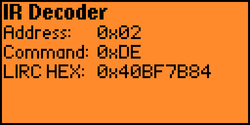

# f0

My Flipper Zero stuff. (Not to be confused with any of my projects pertaining to my cat, Flipper).

## Apps

### IR Decoder

Shows the same address and command values as the standard IR app, but without any of that silly remote nonsense!
Also shows a value that may be usable with [lirc](https://lirc.org/).
