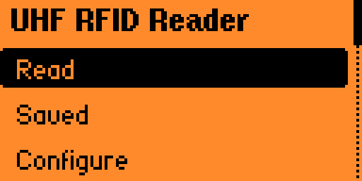
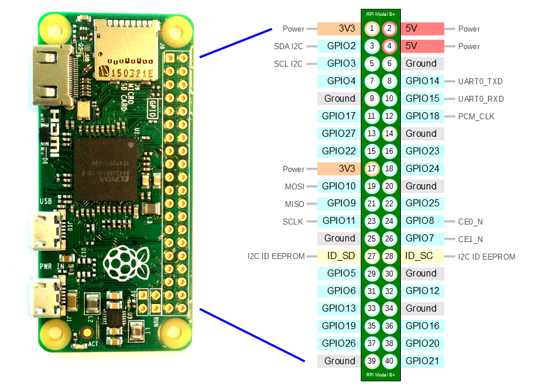
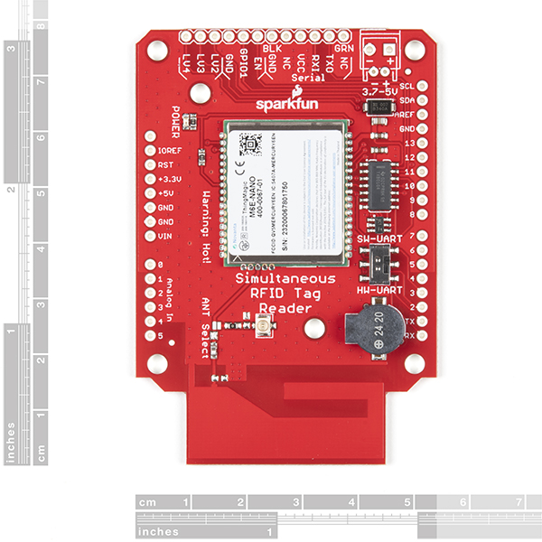
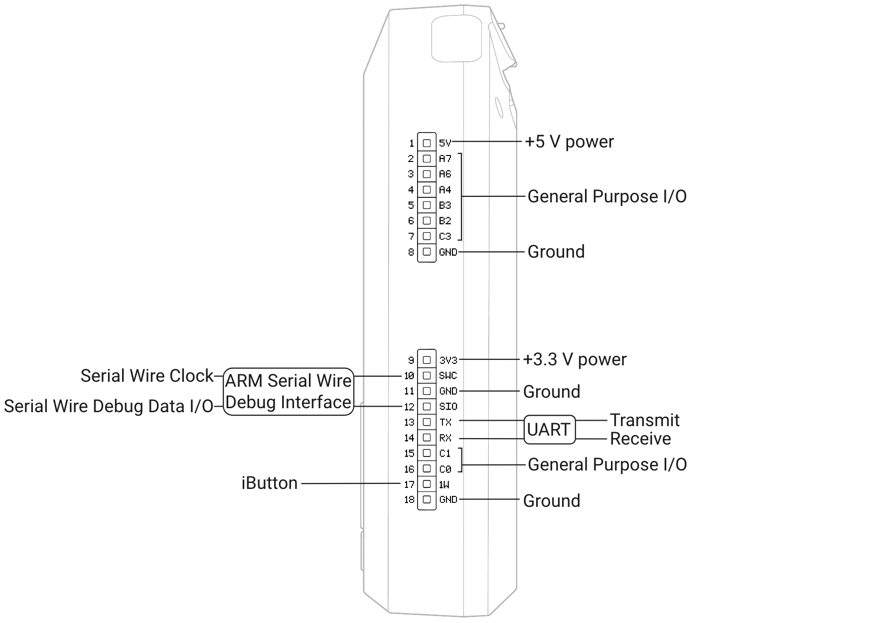

# Flipper Zero UHF RFID App
Now available on the official Flipper Zero [app catalog](https://github.com/flipperdevices/flipper-application-catalog)!

## Overview
This app is designed to work with the M6e Nano UHF RFID Reader and the Flipper Zero. This app supports reading up to 150 tags per second, writing to tags (EPC, TID, Reserved, and User Memory Banks), viewing all tag information, saving tags, and more!

**Please note that the EPC value scrolls across the screen.

**Please note that all values scroll across the screen.

## Coming Soon
In the future, I plan on developing a custom pcb that utilizes the M6e Nano module offering a powerful UHF Reader that plugs right into the Flipper Zero! Additionally, I plan to add support for other UHF RFID modules such as the YRM1001 module. Some other feature enhancements to the configuration menu will also be added including custom baud rate, power and antenna selection, UHF RFID module selection, and selecting/setting custom UHF RFID tag types (adjusting read/write size for memory banks).

## Features
- Read and view up to 150 UHF RFID tags at once!
  - EPC, TID, User, and Reserved Memory Banks
  - Can cycle through multiple tags from a single read!
- Save, rename, delete and view UHF tags on your flipper!
  - EPC, TID, User, and Reserved Memory Banks
- Write UHF tags 
  - EPC Memory Bank
  - TID Memory Bank (not supported if tag is locked)
  - User Memory Bank
  - Reserved Memory Bank 
- UHF RFID Reader Configuration
  - Set RF Power
  - Set antenna type (WIP)
- Features coming soon: 
  - Support for other UHF RFID Modules (YRM1001)
  - Support for custom baud rate, region, protocol, and more!
  - Set custom size for user/reserved memory banks to read
  - Custom PCB with M6e Nano module and external antenna support!

## Hardware Requirements

Currently, this Flipper Zero application requires an [M6e Nano](https://www.jadaktech.com/product/thingmagic-m6e-nano-uhf-rain-rfid/) compatible UHF RFID Reader. I recommend one of the following options:
- [SparkFun Simultaneous RFID Reader](https://www.sparkfun.com/products/14066)
- The [M7E Hecto](https://www.sparkfun.com/products/24738) that just came out should work too, however, this I haven't been able to test.

Additionally, a [Raspberry Pi Zero](https://www.adafruit.com/product/2885) is required in order to run the [ThingMagic Mercury API](https://github.com/gotthardp/python-mercuryapi)
- I hope to eliminate the need for the RPi, however, I thought having it could allow for easier adoption of different UHF RFID readers. 

Also, you need the Flipper Zero which is available from [Flipper Devices](https://www.flipperdevices.com).

## Setup and Installation

1. Clone this GitHub repository to the `applications_user` folder of your Flipper Zero using the firmware of your choice.
2. Using VSCode with the desired firmware:
     - Press `Ctrl+Shift+B` in VScode inside the simultaneous-rfid-reader folder
     - Select the `Launch App on Flipper` option
     - If you do not have VScode you can use the following command in your terminal `./fbt COMPACT=1 DEBUG=0 launch APPSRC=applications_user\simultaneous-rfid-reader`
3. Now that you have the app set up, you can follow the instructions below to get the Raspberry Pi Zero working correctly.

## UHF RFID Reader & Raspberry Pi Zero Setup

### Hardware Setup:
1. Connect the M6e/M7e Nano reader to the Raspberry Pi GPIO pins:
  - TX on the M6e/M7e should connect to GPIO pin 15 on the Raspberry Pi Zero
  - RX on the M6e/M7e should connect to GPIO pin 14 on the Raspberry Pi Zero
  - Ground on the M6e/M7e should connect to ground on the Raspberry Pi Zero

2. Connect the Flipper Zero to the Raspberry Pi GPIO Pins:
  - TX (pin 13) on the Flipper Zero should connect to GPIO pin 27 on the Raspberry Pi Zero
  - RX (pin 14) on the Flipper Zero should connect to GPIO pin 17 on the Raspberry Pi Zero
  - Ground on the Flipper Zero should connect to ground on the Raspberry Pi Zero

### Software Setup
1. Ensure that your Raspberry Pi Zero is flashed with a proper OS such as Raspberry Pi OS. 
2. Install the [Python wrapper](https://github.com/gotthardp/python-mercuryapi/blob/master/README.md) for the ThingMagic Mercury API on the Raspberry Pi Zero. 
3. Download the `pi-zero-uhf.py` program to your Raspberry Pi Zero. 
4. Install the `soft_uart` module using the instructions in the README from this [GitHub repository](https://github.com/adrianomarto/soft_uart).
5. Add the following lines to the end of your rc.local file using `sudo nano /etc/rc.local`:
  - `/sbin/insmod /Path/To/soft_uart.ko`
  - `sudo python /Path/To/pi-zero-uhf.py &`
6. Reboot the Raspberry Pi Zero and now the virtual serial port and UHF RFID program will run on boot!

## Acknowledgements

I found a few resources useful while developing this app:

1. The `uart_helper`, and `ring_buffer` source and header files from [Derek Jamison](https://github.com/jamisonderek/flipper-zero-tutorials/blob/main/gpio/uart_demo/uart_helper.c) made the communication process between the Flipper Zero and the Raspberry Pi Zero much easier. 

2. The entire Flipper Zero Tutorials [GitHub](https://github.com/jamisonderek/flipper-zero-tutorials/tree/main) was a great resource for learning how to develop a Flipper Zero application. 

3. The [Python Wrapper](https://github.com/gotthardp/python-mercuryapi/tree/master) for the ThingMagic Mercury API is a great tool for working with any ThingMagic readers. 

4. The `soft_uart` module was super helpful for creating another serial port on the [Raspberry Pi Zero](https://github.com/adrianomarto/soft_uart). 

## Contributions

Feel free to reach out, or open a PR for bug fixes, ideas, or new feature requests. This application is still a work in progress, so I am open to new ideas or areas for improvement!

## Disclaimer

- I am not responsible for any damage or loss caused by the usage of this app.
- This app will be updated in the future and may contain bugs that haven't been spotted due to my testing environment and hardware setup. 

## Contact

Riley Haffner
Haffnerriley@wustl.edu
