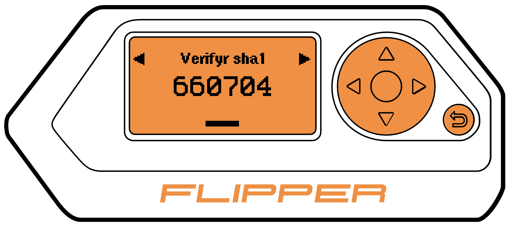

# Flipper Authenticator

## Description

Flipper Authenticator is a software-based authenticator that implements two-step verification services using the Time-based One-time Password (TOTP; specified in RFC 6238) and HMAC-based One-time Password algorithm.

It is like [Google Authenticator](https://play.google.com/store/apps/details?id=com.google.android.apps.authenticator2), but for [Flipper Zero](https://flipperzero.one/) device.

## Support

* Buy me a coffee [here](https://ko-fi.com/akopachov) or [here](https://buycoffee.to/akopachov)
* BTC: `bc1qu9k48q93uhvr9w5cn8fzz5yxuvh4e27c6hnczq`
* ETH: `0xa12163eD56e35d3B38F7087B573384E40b2785e1`
* DOGE: `DAa3nu1RCWwxZdAnGVga77bgxDFP1nhahj`

## Still have questions?

Checkout [FAQ](FAQ.md) or ask in [Discord channel](https://discord.com/channels/937479784148115456/1020428040636993536)
