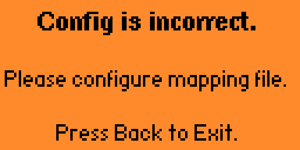
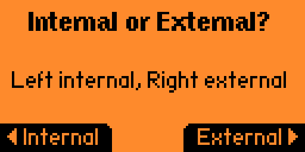

# Alternative Infrared Remote for Flipperzero

It is a plugin like [UniversalRF Remix](https://github.com/ESurge/flipperzero-firmware-unirfremix) but for infrared files. I do this plugin for convenience, because the main IR app need to navigate for different button abit troublesome (buttons like up,down,left,right,back). I found it useful for TV and TV box.

It supports short press and long press input for different ir remote buttons. Tested on the [unleashed firmware version unlshd-072](https://github.com/DarkFlippers/unleashed-firmware/releases/tag/unlshd-072)

## New features!
- Multiple remote in a config file (Max 11 different IR remotes)
- Can set to use internal or external IR in the config file
- Can choose use internal or external IR if not explicitly set in config file

## How to install

1. Update unleashed firmware to the version unlshd-072, then download the `ir_remote.fap` from [releases](https://github.com/Hong5489/ir_remote/tags)

2. Put the `ir_remote.fap` file in your flipper's SD card, under `apps/Infrared` folder

You also can install the [unleashed firmware with extra apps included](https://github.com/DarkFlippers/unleashed-firmware/releases/tag/unlshd-072)

## How to use

1. Similar to UniRF app, put the path of the ir file and the ir button for each button on flipper (UP,DOWN,LEFT,RIGHT,BACK)

The format With `HOLD` one is long press, without is short press

Example of the configuration file (Update: the string format can be in any order):
```
REMOTE: /ext/infrared/Philips_32PFL4208T.ir
UP: Up
DOWN: Down
LEFT: Left
RIGHT: Right
OK: 
BACK: Back
UPHOLD: VOL+
DOWNHOLD: VOL-
LEFTHOLD: Source
RIGHTHOLD: SmartTV
OKHOLD: POWER
```
2. Save it as `.txt` file, then create a new folder in your SD card `ir_remote`, put it inside the folder

3. Lastly, you can open the app, choose the configuration file, then you can try out the ir signal for each buttons

4. Hold the back button to exit the app

## How to disable repeat signal

You can add an extra line in the config txt file: `REPEATSIGNAL: false`, so it will not send repeating IR signal when you press the hold button.

Example:
```
REMOTE: /ext/infrared/Philips_32PFL4208T.ir
REPEATSIGNAL: false
UP: Up
DOWN: Down
LEFT: Left
RIGHT: Right
BACK: Back
UPHOLD: VOL+
DOWNHOLD: VOL-
LEFTHOLD: Source
RIGHTHOLD: SmartTV
OKHOLD: POWER
```

## How to add mulitple remotes
To add multiple remotes in a configuration file, just combine all remote configuration in a config file and seperate with a newline

Example of the config file with three remotes:
```
REMOTE: /ext/infrared/My_fan.ir
OKHOLD: ON/OFF
UP: SPEED 1
DOWN: SPEED 2
LEFT: SPEED 3
#
REMOTE: /ext/infrared/Panasonic_CWA75C4179.ir
OKHOLD: ON
OK: OFF
#
REMOTE: /ext/infrared/Deka_G3.ir
OK: OFF
UP: SPEED 1
DOWN: SPEED 2
LEFT: SPEED 3
EXTERNAL: true
```
Save it at the `ir_remote` folder and use it just like a single remote! 

Follow the example above when press OK button it will send the `OFF` signal from the 1st and 2nd remote. It will send the remote signals follow by ascending order (1st remote, 2nd remote then 3rd remote)

Using multiple remotes currently got some restriction:
- It will only show the first remote buttom name on the screen
- You can only add up to 11 remotes in a configuration file
- Repeat signal feature will not work

## How to set internal or external IR explicitly for each file
You can add an extra line in the config txt file: `EXTERNAL: true` or `EXTERNAL: false`, so it will change to **external IR and turn on 5V** when set to true, else it will change to internal IR.

Example:
```
REMOTE: /ext/infrared/Deka_G3.ir
OK: OFF
UP: SPEED 1
DOWN: SPEED 2
LEFT: SPEED 3
EXTERNAL: true
```
**Note: It will auto turn off 5V when the program exit to save battery**

## How to build 

You can clone this repo and put it inside the `applications_user` folder, then build it with the command:
```
./fbt fap_ir_remote
```
Or you can build and run it on your flipper with the command:
```
./fbt launch_app APPSRC=applications_user/ir_remote
```

## Screenshots

Choose config file to map


Config error when the remote or button is not found



Dialog to choose to use internal or external IR



Show all button name in the config file (If empty will show N/A). Upper part short press, Lower part long press


## Contributors
Special thanks to [friebel](https://github.com/RogueMaster/flipperzero-firmware-wPlugins/pull/535), [d4ve10](https://github.com/Hong5489/ir_remote/pull/4) and [polarikus](https://github.com/Hong5489/ir_remote/pull/2)
- Added auto create `ir_remote` directory
- Fixed string format 
- Added sending repeat signal for hold button
- Added config for disable sending repeat signal for hold button

## TODO
- Reduce the sending time when using mulitple remotes
- Implement repeat signal when using mulitple remotes
- Add configurable delay between signals