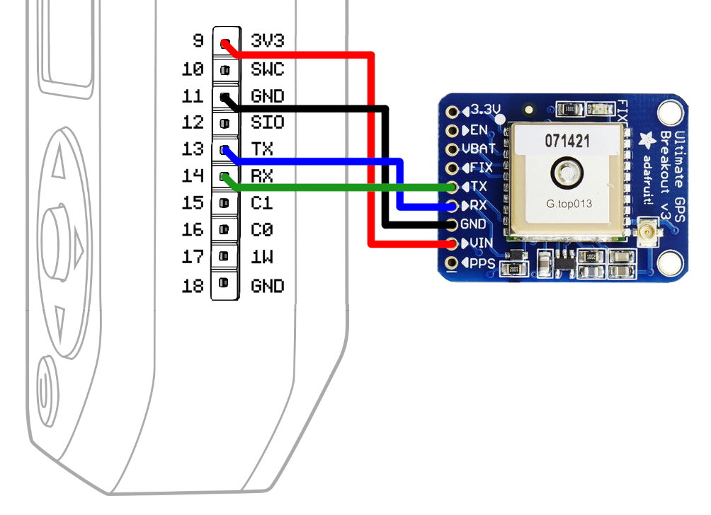

# GPS for Flipper Zero

A simple Flipper Zero application for NMEA 0183 serial GPS modules, such as the
[Adafruit Ultimate GPS Breakout].

Heavy lifting (NMEA parsing) provided by [minmea].

## Hardware Setup

Connect the GPS module to power and the USART using GPIO pins 9 (3.3V), 11
(GND), 13 (TX), and 14 (RX), as appropriate.

See the [tutorial video](https://www.youtube.com/watch?v=5vSGFzEBp-k) from
Lab401 by [RocketGod](https://github.com/RocketGod-git) for a visual guide to
the hardware setup.

### Confirmed Compatible Modules

* [Adafruit Ultimate GPS Breakout]
* Beitian BN-180
* [u-blox NEO-6M]

If you have verified this application working with a module not listed here,
please submit a PR adding it to the list.

[Adafruit Ultimate GPS Breakout]: https://www.adafruit.com/product/746
[minmea]: https://github.com/kosma/minmea
[flipperzero-firmware]: https://github.com/flipperdevices/flipperzero-firmware
[qFlipper]: https://flipperzero.one/update
[u-blox NEO-6M]: https://www.u-blox.com/en/product/neo-6-series
