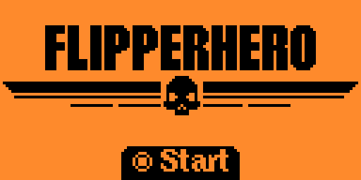
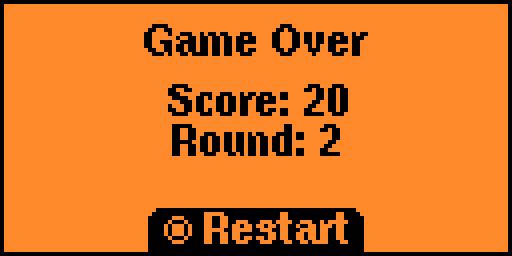

<!-- center title  -->
<p align="center">
  
    <h1 align="center">Flipper Hero</h1>
</p>
<!-- center bages -->
<p align="center">
  
  
  
  
    
</p>

Welcome to **Flipper Hero**, an engaging typing practice game ported for the Flipper Zero device!

[video](https://www.reddit.com/r/flipperzero/comments/1blydyo/i_recreated_the_stratagem_hero_from_helldivers_2/)

## Screenshots






## Introduction

**Flipper Hero** is inspired by the beloved minigame "Stratagem Hero, " found in the "Helldivers 2" universe. Situated on your Ship, this game becomes a crucial part of your journey, allowing you to practice typing Stratagem Codes flawlessly. The better you perform, the higher your score!

## Features

* **Typing Practice:** Enhance your typing skills by inputting codes.
* **Score Tracking:** Challenge yourself to beat your high score with each attempt.
* **Portable Gameplay:** Designed for Flipper Zero, play anywhere and anytime.

## Getting Started

1. Clone the repository to your local machine.

```bash
https://github.com/mentoster/Flipper-hero.git
```

2. Setup environment for development from [this guide](SetupEnv.md)

## Installation

1. Download the [latest release](https://github.com/mentoster/Flipper-hero/releases) of Flipper Hero from releases.
2. Place ``.fap`` file to games folder.
3. Play.

## Contributing

Love Flipper Hero? We welcome contributions from the community! Whether it's improving the code, adding new features, or reporting bugs, your help makes a big difference.

## Support

Encounter a bug or have a question? Please open an issue on our GitHub repository, and we'll get back to you as soon as possible.

## License

Flipper Hero is released under the ``MIT license``, which allows for personal use, modification, and distribution.

## Acknowledgements

* A special thanks to Arrowhead for creating "Helldivers 2" and inspiring this project. Flipper Hero is a fan-made project intended for practice and entertainment purposes only.
* Huge thanks to [u/theblackhole08](https://www.reddit.com/user/theblackhole08/) ([@theblackhole](https://github.com/theblackhole/) on github)  for tips to fix api mismatch.
