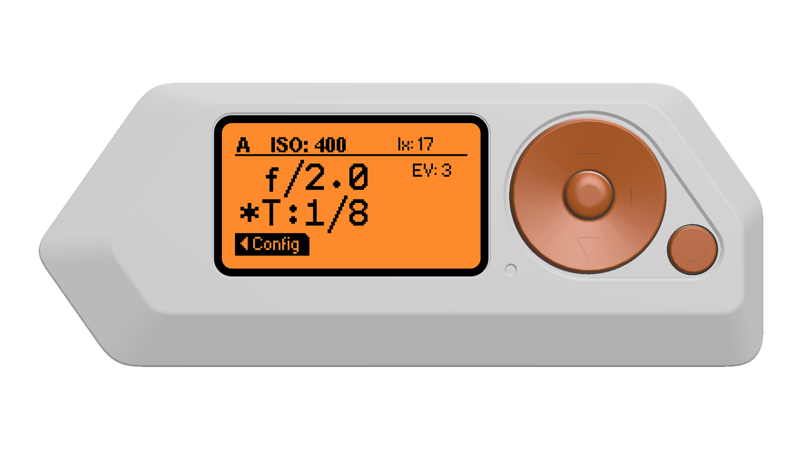

# flipperzero-lightmeter

[](https://github.com/oleksiikutuzov/flipperzero-lightmeter/actions/workflows/build.yml)



## Wiring

```
VCC -> 3.3V
GND -> GND
SCL -> C0
SDA -> C1
```

## Sensor module


## TODO
- [ ] Save settings to sd card

## References
App inspired by [lightmeter](https://github.com/vpominchuk/lightmeter) project for Arduino by [vpominchuk](https://github.com/vpominchuk).
