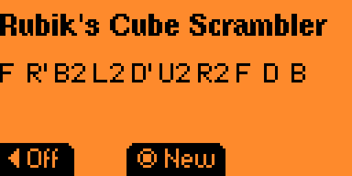

# Rubik's Cube Scrambler FAP

## Where to start?
Install the .fap file and put it in your apps folder

## What does what?
The On/Off button toggles the vibration notification on and off. The "New" button generates a new scramble.

# A special thanks to Tanish for their c scrambler example :)
https://github.com/TanishBhongade/RubiksCubeScrambler-C/
