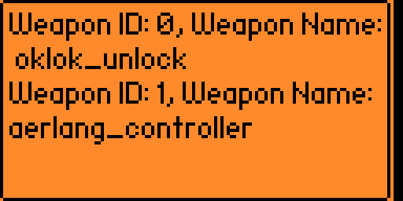

# Intro

基于 flipper zero的蓝牙扩展板（ble ext），实现周围低功耗蓝牙设备的扫描以及集成的蓝牙设备控制器（当前自带oklok ble蓝牙挂锁的控制方式），flipper zero和扩展板之间使用串口通信。

立创开源项目地址：xx

## 编译 && 安装

需要安装两个程序，一个是flipper zero的app，也就是.fap格式，另外一个是ble扩展板的程序（基于esp32）。

### flipper zero fap应用

程序基于Xtreme-Firmware固件的固件编译，首先clone官方的Xtreme-Firmware固件：

```bash
git clone --recursive --jobs 8 https://github.com/Flipper-XFW/Xtreme-Firmware.git
cd Xtreme-Firmware/applications/external
```

新建目录，将ble_killer源码和application.fam放在同一目录下，使用ufbt命令进行编译：

```bash
➜  ble_killer git:(0cfdb530a) ✗ ls
application.fam ble_killer.c    dist            icon.png        uart.h
➜  ble_killer git:(0cfdb530a) ✗ ufbt
scons: Entering directory `/Users/h4lo/.ufbt/current/scripts/ufbt'
        INSTALL /Volumes/T7/dev/Xtreme-Firmware/applications/external/ble_killer/dist/ble_killer.fap
        INSTALL /Volumes/T7/dev/Xtreme-Firmware/applications/external/ble_killer/dist/debug/ble_killer_d.elf
        CDB     /Volumes/T7/dev/Xtreme-Firmware/applications/external/ble_killer/.vscode/compile_commands.json
        APPCHK  /Users/h4lo/.ufbt/build/ble_killer.fap
                Target: 7, API: 54.0
```

- ufbt可以使用pip进行安装：

  ```
  pip3 install ufbt
  ```

或者使用ufbt launch命令直接将编译后的fap程序在flipper zero中跑起来。

### ble扩展板

基于arduino开发，在arduino IDE中，新建项目，将esp32目录下的.ino源代码复制进去，选择Board类型为ESP32 DEV Module，同时安装BLEDevice库，找一个usb转ttl工具，接上tx、rx、gnd，再点击编译上传即可。

## 用法

### 波特率配置

可以配置选择115200、38400、9600，默认情况下fap应用和ble扩展板的通信波特率为9600。


### 扫描

点击OK按钮扫描周围ble设备，目前默认屏幕只显示5个。


### Weapon

左右按钮切换weapon payload，默认配置了oklok蓝牙挂锁的解锁payload。


### Console

esp32输出的串口信息。



## 视频参考

blibili链接：https://www.bilibili.com/video/BV1Dw4m197BL/?spm_id_from=333.999.0.0&vd_source=3959ff98419cda515c7f13dab0f2f564

## 参考

https://github.com/Flipper-XFW/Xtreme-Firmware