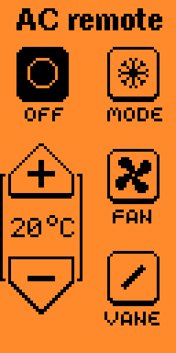

# Metronome

A metronome for the [Flipper Zero](https://flipperzero.one/) device. Goes along perfectly with my [BPM tapper](https://github.com/panki27/bpm-tapper).



## Features

- BPM adjustable, fine and coarse (hold pressed)
- Selectable amount of beats per bar
- First bar is pronounced
- Selectable note length
- LED flashes accordingly

## Compiling

```
./fbt firmware_metronome
```
