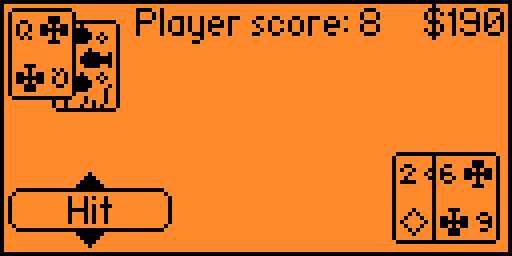

# Blackjac for Flipper Zero

## Blackjack

## Build using the build.sh script
* Clone the repository recursively `git clone REPO_URL --recursive`
    * if needed checkout a different release for the firmwares inside the firmware folder, I'll try to keep the up-to-date
* Make sure that the build script has the executable flag set
* build all the applications with `./build {firmware}`
    * accepted firmware types are:
        * unleashed
        * vanilla
        * all

## Custom build
> The app should be compatible with the official and custom flipper firmwares. If not, follow these steps to build it
> yourself
* Download your firmware's source code
* Copy the common directory inside the chosen game's folder
* Put the chosen application folder inside the firmware's applications_user folder
* Make sure you can use
  the [Fipper build tool](https://github.com/flipperdevices/flipperzero-firmware/blob/dev/documentation/fbt.md)
* To build the project, type this into your console:
  #### Linux
  > ./fbt fap_{APP_NAME}
  #### Windows
  > fbt.cmd fap_{APP_NAME}
* the finished build will be in the following location, copy this into your SD card:
  > build\f7-firmware-D\.extapps\blackjack.fap
