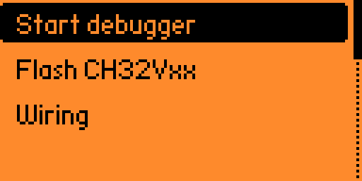
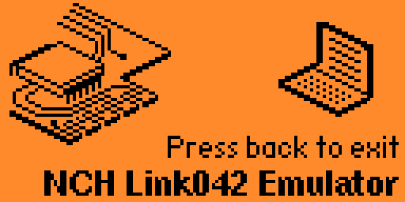
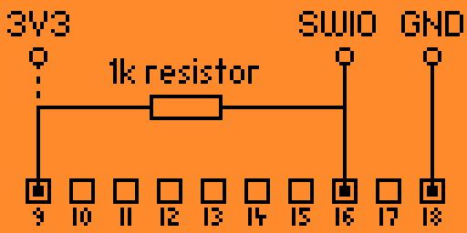

# Flipper Zero WCH SWIO Flasher and debugger

WCH SWIO debugger and flasher emulated on Flipper Zero tool - tool for flashing and debugging CH32V003 chip.

> tested only on CH32V003

## Features

- [minichlink](https://github.com/cnlohr/ch32v003fun/tree/master/minichlink) compatible flasher/debugger
    - emulated NCH Link042 via bulk USB device (vid = 0x1986, pid = 0x0034)
    - **WARNING:** there is a bug when minichlink uses this emulated NCH Link042 and not properly close bulk transfer. In that case, data on incoming bulk endpoint is buffered in USB driver and not readed by minichlink application before exit. Next minichlink session will fail. Solution is reset USB communication (unplug/plug USB or exit/enter emulator in Flipper app), or patch minichlink app (see chapter Usage/Examples).
- Erase and write program code to ch32v003fun (named as `Flash CH32Vxx` in menu) without connection to computer. Supported is:
    - Check wiring along with your chip idenficiation.
    - Erase whole chip.
    - Program bin file from Flipper Memory into chip Flash memory (limited to 32kB due to my laziness).

## Documentation

In emulation mode, Flipper Zero act just as NCH Link042 programmer HW. All commands towards chip are driven from your computer via USB, even reset and debug session init.

In programmer mode, Flipper Zero act as all-in-one device and initiate debug session with chip at his own. This allows some usable hacks with chip. Most important one is hard reset before any operation towards CH32Vxx chip. It is helpful when you using sleepmodes or low clock mode (in sleep mode or low clock frequency is not possible to establish debug session, so you can't simply program chip).

Be care, SWIO is driven as open-drain bus with pull-up with high clock freqency (around 8MHz). It means, SWIO pin is sensitive to wire/pcb line capacity. In case of bad designs, Flipper Zero can not be able to 'catch' all bits from chip and communication will fail. But it is not that bad, with 1k - 5k resistor as external pull-up it work well even with dupont wires. Just be aware about that.

### Components

#### SWIO bit bang emulation

Main SWIO magic. Mostly written in ARM Assembler, not realy nice code and definitely not portable to other platform without huge rework.

See: [RISC-V QingKeV2 Microprocessor Debug Manual](https://github.com/openwch/ch32v003/blob/main/RISC-V%20QingKeV2%20Microprocessor%20Debug%20Manual.pdf) and
[RISC-V Debug Specification](https://github.com/riscv/riscv-debug-spec?tab=readme-ov-file#risc-v-debug-specification)

    - src/helpers/swio.c
    - src/helpers/swio_pin_magic.c

#### WCH flasher & debugger

> code based on [aappleby/PicoRVD](https://github.com/aappleby/PicoRVD)

Used for for '*Erase and write program code*' feature. Code allows to control debug interface directly from Flipper Zero.

    - src/helpers/wch_flasher.c
    - src/helpers/riscv_debug.c

#### CH32V003 (RiscV) programs

Utility programs used to run in target RiscV chip. Mostly originated from [aappleby/PicoRVD](https://github.com/aappleby/PicoRVD).

- src/helpers/programs/*

#### Minichlink and NCH Link042 emulator

Code responsible for emulation USB bulk communication with [minichlink](https://github.com/cnlohr/ch32v003fun/tree/master/minichlink).

    - src/nhc_link042_emulator.c
    - src/minichlink_debugger.c


## Usage/Examples

Read chip info
```bash
user@awesomemachine minichlink % ./minichlink -i
Found NHC-Link042 Programmer
Interface Setup
USER/RDPR  : e817/5aa5
DATA1/DATA0: ff00/ff00
WRPR1/WRPR0: 00ff/00ff
WRPR3/WRPR2: 00ff/00ff
Flash Size: 16 kB
R32_ESIG_UNIID1: xxxxxxxx
R32_ESIG_UNIID2: xxxxxxxx
R32_ESIG_UNIID3: ffffffff
```

Erase chip
```bash
user@awesomemachine minichlink % ./minichlink -E
Found NHC-Link042 Programmer
Interface Setup
Whole-chip erase
```

minichlink patch (file `minichlink/nhc-link042.c`, function `TryInit_NHCLink042`)
```c
// After line:
    libusb_claim_interface(hdev, 0);

// Paste this:
    int readed;
    do{
        status = libusb_bulk_transfer(hdev, 0x81, buff, 64, &readed, 10);
    } while(readed > 0 && status == 0);

```
## Screenshots

### Applications / Utils


### WCH SWIO Flasher main menu



### NCH Link042 emulator



### WCH SWIO Flasher screen 


### WCH SWIO Flasher screen - Get chip info


### WCH SWIO Flasher screen - Erase


### WCH SWIO Flasher screen - Program chip done (Flash)


### Wiring



### About


## Acknowledgements

 - [aappleby/PicoRVD](https://github.com/aappleby/PicoRVD)
 - [cnlohr/ch32v003fun](https://github.com/cnlohr/ch32v003fun)
 - [A Visual Guide to Flipper Zero GUI Modules](https://brodan.biz/blog/a-visual-guide-to-flipper-zero-gui-components/)


## License

[MIT](https://choosealicense.com/licenses/mit/)

