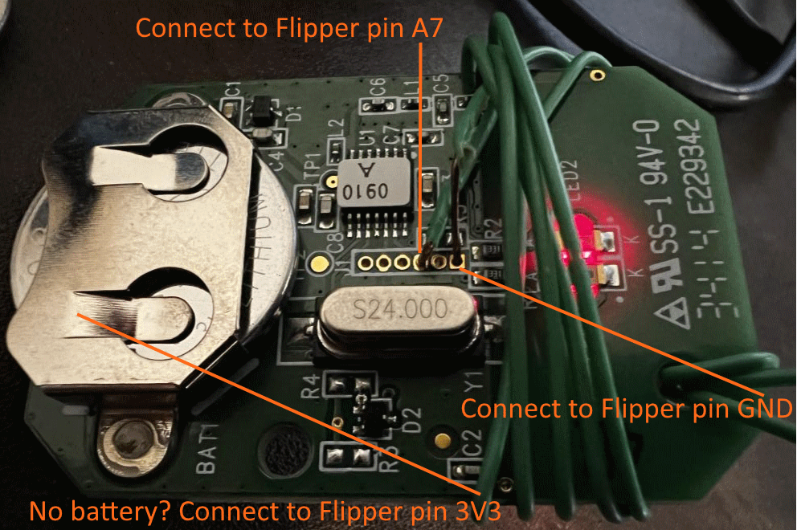

# Genie garage door recorder

Watch this [YouTube video](https://youtu.be/C-TnlVM4Ahs) for a demo of installing and running this application.

* You MUST need to edit ``lib\subghz\protocols\keeloq.c`` to change the timing values; or else the application will not work!
* NOTE: You no longer have to edit ``api_symbols.csv`` file.  

## Description
This program was written to allow the Flipper Zero to press buttons on a Genie garage door opened and record the rolling code. The goal is to capture all 65,536 signals (which hopefully repeats when it gets to the end).  Our click speed is current 2000ms per click + however long it takes to get the signal.  So if we assume it's 1000-1500/hr = about 3 days?

## Connecting to remote

You only need to connect two wires between the Flipper and the remote.  One wire is GND on the Flipper. It should connect to the pin that is the same as the battery negative pad on the remote.  The second wire is the signal wire, it should connect to A7 on the Flipper Zero.  On the remote side, it should connect to a pin that transmits the signal.  If you remove the wires from the Flipper Zero and touch the two wires together, the remote should send a signal.

In my testing, a new CR2032 battery was able to send all 65,536 codes & still had power left over! IF YOU WANT TO USE THE FLIPPER 3V3 FOR A POWER SOURCE, THEN YOU MUST MAKE SURE THAT GND ON THE FLIPPER IS GOING TO GND ON THE REMOTE (and not the signal pin).  IN YOU ARE 100% SURE, THEN YOU CAN REMOVE THE BATTERY FROM YOUR REMOTE AND CONNECT 3V3 PIN ON THE FLIPPER TO THE BATTERY POSITIVE BAR ON THE REMOTE.

WARNING -- For my remote, the codes wrapped after 65,536 codes were sent.  I'm not sure if this is the case for all remotes.  If it doesn't wrap, it's possible that the remote could stop working (if the manufacture implemented OVR bits).

WARNING -- This could desync your remote from the receiver.

WARNING -- Don't run this near your garage.  There is no reason to open the physical garage door & you will likely burn out the motor.

## Running
- Step 1. Copy [these files](https://github.com/jamisonderek/flipper-zero-tutorials/tree/main/subghz/apps/genie-recorder) into your firmware ``applications_user\genie-recorder`` folder. 
- Step 2. Build your firmware (``./fbt vscode_dist`` & ``./fbt`` -- "[Debug] Build Firmware").  You may get a build error.
- Step 3. Edit ``lib\subghz\protocols\keeloq.c`` so it have te_short=200, te_long=400, te_delta=70.  NOTE: This will no longer be able to receive signals from other KeeLoq devices.
- Step 4. Build your firmware & deploy onto Flipper  ``./fbt FORCE=1 flash_usb_full`` -- "[Debug]Flash (USB, with Resources)".
- Step 5. On your Flipper Zero, load ``Sub-GHz`` app.
- Step 6. Choose ``Read`` to start scanning.
- Step 7. Press the LEFT button to edit the Config.
- Step 8. Change the ``Frequency`` to 315000000.
- Step 9. Press the BACK button to continue scanning on the new frequency.
- Step 10. Press a button on your remote to see if it is detected.
- Step 11. If it is NOT detected, try 390000000.

- Step 12. Open the case off of your garage door remote.
- Step 13. Connect the remote to pins A7 and GND.
- Step 14. Edit FREQUENCY if 315MHz is not correct (in genie.c).
- Step 15. Run the Genie Recorder application
- Step 16. Choose "Start" to start recording signals.
  - You should see the current broadcast count (how many times the button was pressed)
  - You should see the received signal count (how many times the signal was received)
  - You should see the most recent Keeloq code received
- Step 17. Every time a signal is recevied, it is written to the log file.  If the application exits and restarts, it will resume the counters where it left off.
- Step 18. Let it run for three days (the goal is to capture at least 65,536+ signals)
- Step 19. Press the BACK button twice to exit the application.
- Step 20. Copy the file "\apps_data\genie\keys.txt" from the SD card to your computer.
- Step 21. Edit ``lib\subghz\protocols\keeloq.c`` so it has original values of te_short=400, te_long=800, te_delta=140.
- Step 22. Build your firmware & deploy onto Flipper.

Now that you have the keys.txt file, you can use the [Genie.py script](https://github.com/jamisonderek/flipper-zero-tutorials/tree/main/subghz/samples/genie-girud-1t/README.md) to generate a genie.sub file that will transmit the key.
