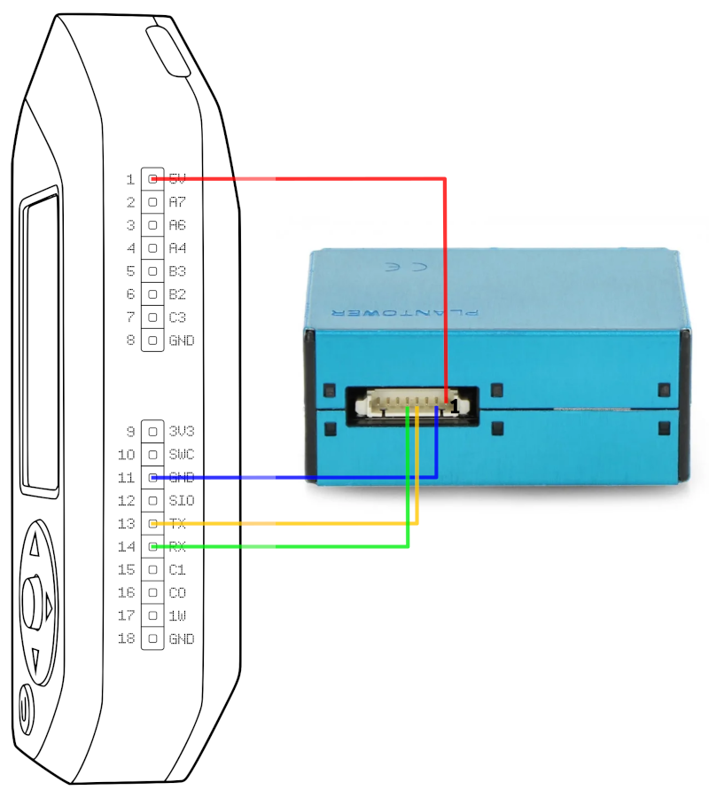

# Airmon for Flipper Zero

A simple Flipper Zero air quality monitoring application. 
It displays measured PM1.0/PM2.5/PM10 [Particulate Matter] concentrations 
and calculated [Air Quality Index (AQI)].

## Hardware setup

Connect the Plantower PMS5003/PMS7003/PMS9003 sensor according to the wiring diagram below.

| Flipper Pin | Sensor Pin |
|:-----------:|:----------:|
| 1 (5V)      | 1 (5V)     |
| 11 (GND)    | 2 (GND)    |
| 13 (TX)     | 4 (RX)     |
| 14 (RX)     | 5 (TX)     |

## Building and installing

1. Clone `airmon` repository using `git clone https://github.com/3cky/flipperzero-airmon` command.
2. Install [uFBT] Flipper Build Tool.
3. Compile application running `ufbt` command in the cloned directory root.
4. Install and start `airmon` application on Flipper attached over USB using `ufbt launch` command.

## Application controls

Use left/right arrows for PM/AQI display mode switching. 
Flipper LED will blink green once every successful sensor reads.

## License

Airmon is available under the GPL 3 license. See the [LICENSE](LICENSE) file for more info.

[Particulate Matter]: https://www.epa.gov/pm-pollution/particulate-matter-pm-basics
[Air Quality Index (AQI)]: https://www.airnow.gov/aqi/aqi-basics/
[uFBT]: https://github.com/flipperdevices/flipperzero-ufbt