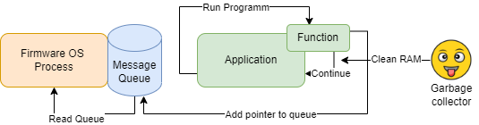

# Problems with Null Pointer References

One of the most occuring reasons for my Apps to crash on the Fipper is the "null pointer reference". While most problems get detected by the compiler while building the program, these little problems manage to slip by and only show themselves when actually running the program, resulting in a crash

## The General Error Definition

What happens when this error appears is that the device is trying to read a value that does not exist in RAM. There are many reasons for this to happen, a typical example is that you unset some value, forgot to set it but have it in definition etc. But the most common one is that the value no longer exists when the program actually needs it. 
<br><br>
And this can often be due to Async code execution. 

## The Problem with Garbage Colletion

Real code Example
```
void color_guess_color_set_set_led(void* context, ColorGuessColorSetModel* model) {
    furi_assert(context);
    ColorGuess* app = context;
    ...
    const NotificationSequence notification_sequence = {
        &notification_led_message_1,
        &notification_led_message_2,
        &notification_led_message_3,
        &message_do_not_reset,
        NULL,
    };
    notification_message(app->notification, &notification_sequence);
    furi_thread_flags_wait(0, FuriFlagWaitAny, 10); //Delay, prevent removal from RAM before LED value set
}
```
1. The function color_guess_color_set_set_led is called. This deposites a pointer into the firmware OS message queue using the <b>notification_message()</b> function<br>
2. Later the firmware OS will get values from the queue and execute them (outside the app)<br>
3. The function inside the app will however be finished before this happens. The garbage collection process will free up any RAM used by the function, meaning that the pointer sent to the queue no longer references an object, but instead points to NULL. <br>
4. If now the process from the Firmware tries to process the next message from the queue, it will find nothing, not know what to do and therefore crash the device<br>
<br>
This is why I added a delay at the end of the function

```
furi_thread_flags_wait(0, FuriFlagWaitAny, 10); //Delay, prevent removal from RAM before LED value set
```

I cannot say how long it will take the Firmware OS to process my message, but 10ms is not noticable for humans, but far more than enough for the async process to catch up and process the message from the queue, before my function ends and the values set are removed from RAM. 


<br><br>
