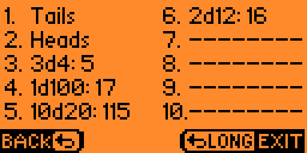

# Flipper Zero DnD Dice 
Version: 1.1 ([Changelog](https://github.com/Ka3u6y6a/flipper-zero-dice/blob/main/CHANGELOG.md))

 

**DnD Dice** is a dice rolling application for your **Flipper Zero**.

Dice types: Coin, d4, d6, d8, d10, d12, d20, d100

## Screenshots

 

 

## Compiling

1. Go to [https://flipc.org/Ka3u6y6a/flipper-zero-dice](https://flipc.org/Ka3u6y6a/flipper-zero-dice?branch=main)
2. Click **Install** or **Download** button

OR

1. Clone the [flipperzero-firmware](https://github.com/flipperdevices/flipperzero-firmware) repository or another firmware that you use (for example [unleashed-firmware](https://github.com/DarkFlippers/unleashed-firmware)).
2. Create a symbolic link in `applications_user` named **dice**, pointing to this repository.
3. Compile by command `./fbt fap_dice_dnd_app`
4. Copy `build/f7-firmware-D/.extapps/dice_dnd_app.fap` to **apps/Games** on the SD card or by [qFlipper](https://flipperzero.one/update) app.
