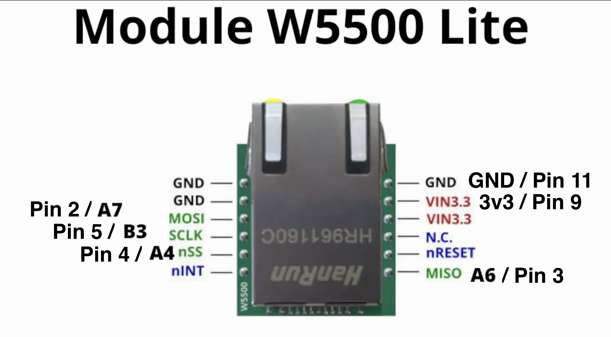
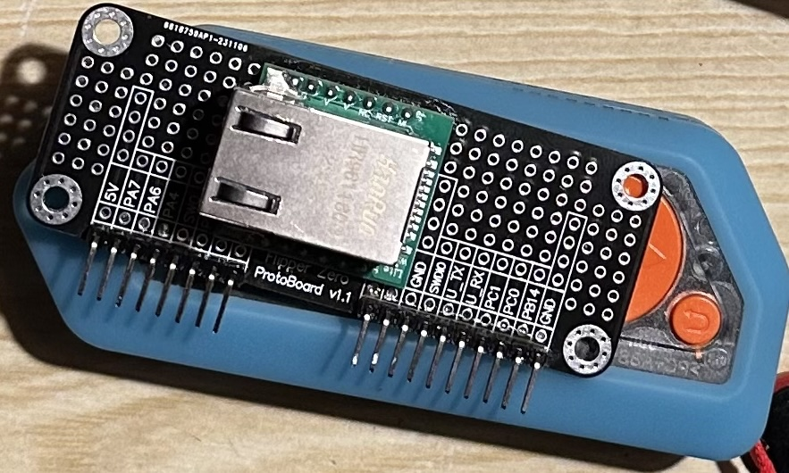

# Flipper Zero Ethernet Troubleshooter

This is a small helper that lets you connect your Flipper via RJ45 to your network
You can then set the interface-mac and test if you can get an IP via DHCP and the ping addresses.

## Prerequisites

To get started you will need a specific module called the W5500 Lite with a chiop from WHIZnet Co., Ltd.
You can find those modules on AliExpress etc. [Find Module here](https://www.google.com/search?q=WS5500+Ethernet)
The second thing you will need is a proto-board for the Flipper Zero, which you can get [here](https://shop.flipperzero.one/products/proto-boards).

## Assembly

If you got those things, you can get started.
You will need to solder the board yourself, but don't worry. It's not that complicated.
First we will need to know the pinout of the W5500-Lite-Module.

here is the Flipper-Pinout to see where you will have to connect everything:

and if you have correctly soldered you will end up with something like:

