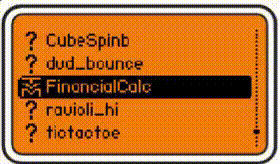

# Flipper-Financial-Calculator
**Very basic TVM calculator for Flipper Zero**

Have you ever thought to yourself "Man, I wish I could figure out the Future Value of a $12,000 investment, over the span of 3 years, with a 7.5% interest rate, in which I pay another $3,500 into each year, but all I have is my Flipper Zero"?

Neither have I, and please get help if you have.

Nonetheless, if you find yourself in this precarious siutation, Here's the tool to do this.

## Instructions
- Press the arrow keys to move around the pinpad.
- Press the OK button to use the highlighted button.
- Select the - key when a number is typed to turn it negative.
    - e.g. type 4000, then press '-' to make -4000. 
- Press the BACK key shortly to erase the current inputted value.
- Select the UP or DOWN arrow buttons to traverse the TVM values.
    - The current selected value is indicated by a small hollow rectangle.
- Select the CPT button to solve for the highlighted value.
    - The value being calculated will be indicated by a small solid rectangle.

## Limitations
- Numbers can only be 9 digits long.
- All calculations are presumed to be End of Period.
