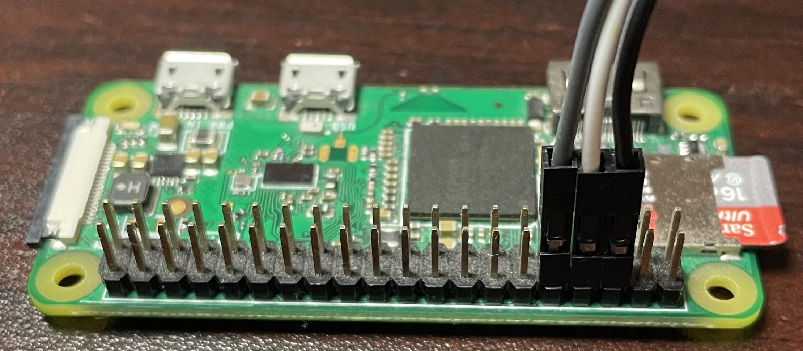

# Hardware Communication (v1.0.1)
## Flipper
- Through UART
	- Tx: 13
	- Rx: 14
	- GND: 18

## RPI 0 W
- Through UART (full or mini)
	- Tx: GPIO 14
	- Rx: GPIO 15
	- GND: 6

## Interface
| Flipper | Jumpers | RPI    |
| ------- | ------- | -------|
| Tx      | Gray    | Rx     |
| Rx      | White   | Tx     |
| GND     | Black   | GND    |

#### Flipper Wiring

#### RPI Wiring
