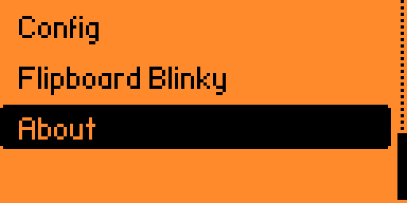
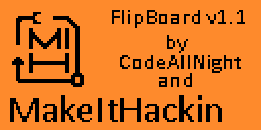
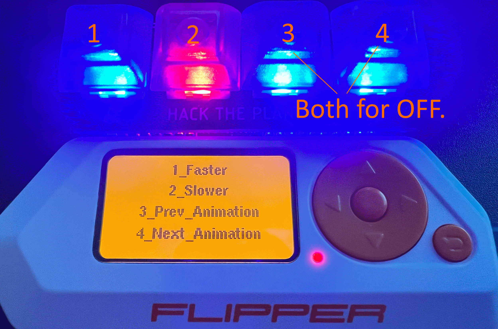
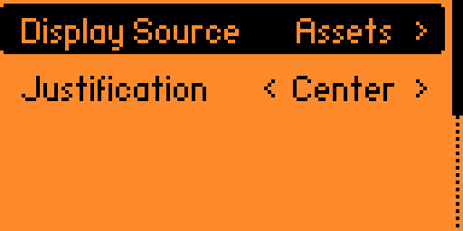

# FlipBlinky

## Overview

The FlipBlinky application turns your Flipper Zero + FlipBoard into a blinky badge for wearing at conferences.  The application is written in C and uses the FlipBoard common code for the majority of the functionality.

You can order your FlipBoard from [@MakeItHackin](https://www.youtube.com/makeithackin) using [tindie](https://www.tindie.com/products/32844/) or [Etsy](https://www.etsy.com/listing/1601295558/).  Be sure to also join our [Discord server](https://discord.gg/KTThkQHj5B).

- [Running the app](#running-the-app)
- [Using the app](#using-the-app)
- [Configuration](#configuration)
  - [Display Source = Assets](#display-source--assets)
  - [Display Source = FXBM](#display-source--fxbm)
  - [Display Source = Text](#display-source--text)
- [Tutorials](#tutorials)
  - [Video tutorials](#video-tutorials)
  - [Written tutorials](#written-tutorials)
    - [Adding a new nametag](#adding-a-new-nametag)
    - [Adding new colors](#adding-new-colors)
    - [Adding a new effect](#adding-a-new-effect)
- [Updates](#updates)
- [Support](#support)

## Running the app

Make sure your FlipBoard is connected to your Flipper Zero.  On your Flipper Zero, press the `Ok` button.  Scroll down to `Apps` and click the `Ok` button.  Select the `GPIO` folder.  Select the `FlipBoard Blinky` application. You should see startup splash screen for a few seconds reminding you to connect the FlipBoard and then the FlipBoard LEDs will do their start-up sequence.

## Using the app

Make sure your FlipBoard is connected to your Flipper Zero.  Choose the `Start application` option to launch the app.  You should see the FlipBoard LEDs light up and start animating.

Press the leftmost button to decrease the delay between frames.  Press the adjacent button to increase the delay between frames. 

Press the rightmost button to change the animation.  Press the adjacent button to decrease the animation id.  Press both buttons to run the off animation.

## Configuration

Choose `Configure application` to change the configuration of the app.  The `Display Source` can be either `Assets`, `FXBM` or `Text`.  The `Justification` can be either `Left`, `Center` or `Right`.

### Display Source = Assets

The Display Source of `Assets` will use the file that is in [assets/nametag.png](./assets/nametag.png).  You can replace this file with your own 128x64 black and white image; but this file is hard-coded into the application, so you will need to recompile the app to use your own Assets image.  (See the [Display Source = FXBM](#display-source--fxbm) section for a way to use your own image without recompiling the app).

### Display Source = FXBM

The Display Source of `FXBM` will use a file located on the SD card.  The file should be `SD Card/apps_data/flipboard/blinky.fxbm`.  This is a Flipper XBM format (which is a binary file).

Instructions for generating and copying the `blinky.fxbm` file to the SD card are below:
- Copy the [blinky_png_to_fxbm.py](./blinky_png_to_fxbm.py) script to your computer.
- Copy a 128x64 (or smaller) black and white image to your computer named `blinky.png`.
- Run the python script: `python blinky_png_to_fxbm.py`  (you may need `python3` instead of `python` depending on your system).
- Copy the resulting `blinky.fxbm` file to the SD card in the `SD Card/apps_data/flipboard` folder.

### Display Source = Text

The Display Source of `TEXT` will use the text that was set in the `Line 1`-`Line 4` fields.  You can change the text to whatever you want.  Choose the line to edit and click OK to be prompted for the new text.

This uses your default Flipper Zero keyboard.  In some firmware, long-pressing the `Ok` button will change the case of the letters.  You cannot save when the text is empty (but you can select a single space; next to the save button; and the line will appear empty).

## Tutorials

### Video tutorials

 [Flipper Zero: FlipBlinky app customization](k6hK6LpdXTM)

### Written tutorials

See the general [FlipBoard tutorials readme](../README.md) for more information on how to setup your development environment and how to compile the app.

#### Adding a new nametag
The `nametag.png` in the Assets folder is hardcoded into the application.  You can replace the [assets/nametag.png](./assets/nametag.png) file with your own 128x64 black and white image, but you will need to recompile the app.  An alternative is to convert your file to FXBM format and use the `Display Source = FXBM` option.

#### Adding new colors
The [common/config_colors.h](../common/config_colors.h) file contains the color definitions for the app.  You can add new colors by adding a new entry to the `color_names` array.  Then in the `LedColors` enum, add a new color entry; the hex value is the amount of red [00-FF], green [00-FF] & blue [00-FF].  Finally, add a new entry to the `color_values` array.  NOTE: The order of the color_values must match the same order as the `color_names`.

Once you have added the colors, you are ready to edit the [app.c](./app.c) file.  Find the `flipboard_reset_effect` function and replace the colors for the various effects with your new colors!

#### Adding a new effect
You will need to edit the [app.c](./app.c) file.  First find the `flipboard_blinky_model_alloc` and increase the `max_effect_id` value, so that it contains all of the effects you want to add.

Find `flipboard_reset_effect` and scroll to the bottom of the function, just before the `default:` statement.  You will want to add your new case statement here.  The case number should be for one bigger than the previous case number.  You can set colors[0..3], which are the LED colors that will scroll by default for this effect. colors[4 and 5] are additional colors that can be used if you create your own effect code.

If you choose to have a different effect than just scrolling, find `flipboard_do_effect` and scroll the the bottom of the function, just before the `default:` statement.  You will want to add your new case statement here.  The case number **must match** the number you used in `flipboard_reset_effect`.  If you need to define variables, be sure to wrap your code in `{ ... }`.  Your routine should set fbm->colors[0..3] to the correct hex RGB values.

## Updates

- Version 3.5 : Common code update
- Version 3.4 : Common code update
- Version 3.3 : Common code update
- Version 3.2 : Save/Load settings
- Version 3.1 : Added display source and justification configuration
- Version 2.4 : Added Splash screen
- Version 2.3 : Improved LED driver
- Version 2.2 : QR Code for github link
- Version 2.1 : Overlay message displays when buttons are clicked for a couple seconds.

## Support

If you have need help, we are here for you.  Also, we would love your feedback on cool ideas for future FlipBoard applications!

Please visit my Flipper Zero Discord server [Flipper Zero Tutorials (Unofficial)](https://discord.gg/KTThkQHj5B) and ask your questions in the `#flipboard` or `#general` channel.
