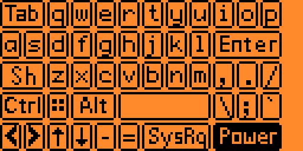

# Tutorial: Adding a new row of buttons to the Keystrokes keyboard

BEFORE: 



AFTER (added new row of buttons -- `Mute`, `VolDn`, `VolUp`, `NumLk`): 


## Overview

The FlipKeyboard configuration supports two methods for sending keystrokes to the computer.  The first method is to use the "Message" option.  The second method is to use the "Add Keystroke" option.  The "Add Keystroke" option allows you to send a sequence of keystrokes to the computer.  In the configuration setting for an action, you can use `Left` and `Right` buttons on the Flipper Zero to scroll thru all of the available keystrokes when a `Keystroke` is selected, or you can press the `Ok` button to see a custom keyboard.  The custom keyboard only has a subset of the available `Keystrokes`. This tutorial will show you how to add a new row if keys to the custom keyboard.

## Step 1: Decide where you want to add the new row of keys

For this tutorial, we will be adding the new row of keys just below the row with the space bar.

## Step 2: Decide which keys you want to add (Up to 12 keys per row)

A row of keys must be 12 slots wide.  A key can occupy multiple adjacent slots.  The icons are 5x10 for single slot, 15x10 for 2-wide slot and 25x10 for a 3-wide slot.

For this tutorial we will do 4 keys, each 3 wide: 
- Mute (HID_KEYBOARD_MUTE), mute_25x10.png
- VolDown (HID_KEYBOARD_VOLUME_DOWN), vol_down_25x10.png 
- VolUp (HID_KEYBOARD_VOLUME_UP), vol_up_25x10.png
- NumLock (HID_KEYBOARD_LOCK_NUM_LOCK), num_lock_25x10.png 

NOTE: The values we choose must be listed in the `keystroke_values[]` array in the `flipkeyboard\common\config_keystroke.h` file.  The `config_keystroke.h` file contains the list of all of the keystrokes that are displayed using the `VariableItemList` when the selecting with the left/right arrow keys.  The `VariableItemList` module from `#include <gui/modules/variable_item_list.h>` has a limit of around 255 items (which are all being used) so if you want to add a new value in `keystroke_values[]` you also need to remove a value.  Be sure that `keystroke_names[]` lists the items in the same order as `keystroke_values[]`.

## Step 3: Create the icon files (if not using a character)

The icon file is a black and white PNG file.  Since we are using 3-key wide, our image should be 25x10 pixels.  The PNG images are stored in `flipkeyboard/assets` and will be converted later into code.  I typically copy an existing file of the proper dimensions (like sysreq_25x10.png) and then rename it to `mute_25x10.png`.  You can use any image editor to edit the icon file, but a handy VS Code extension is called `Luna Paint - Image Editor` which allows you to edit the image from within VS Code.

## Step 4: Run the icons process

I typically recommend opening `flipkeyboard\app.c` then pressing `Ctrl+Shift+B` and selecting `[Debug] Build App`.  This will end up running the ICONS program, which will convert all of the PNGs into a `flipboard_keyboard_icons.h` and  `flipboard_keyboard_icons.c` file in the build output folder.  At this point, a new variable `I_mute_25x10`, `I_vol_down_25x10`, `I_vol_up_25x10`, `I_num_lock_25x10` will be available for use (The `I_` is because the PNG was converted into an `Icon` object).

## Step 5: Add the new row in keys[] (app_keyboard_layout.h)

Open `flipkeyboard\app_keyboard_layout.h` and scroll down until you find the row you are adding.  Make sure you add 12 entries in `keys[]`.

First we will find the row with `{.code = HID_KEYBOARD_SPACEBAR, .ch = ' ', .icon = NULL},` in it.  The row's 12th entry should be ``{.code = HID_KEYBOARD_GRAVE_ACCENT, .ch = '`', .icon = NULL},``

Add a new set of 12 entries...
```c
    {.code = HID_KEYBOARD_MUTE, .ch = 0, .icon = &I_mute_25x10},
    {.code = HID_KEYBOARD_MUTE, .ch = 0, .icon = &I_mute_25x10},
    {.code = HID_KEYBOARD_MUTE, .ch = 0, .icon = &I_mute_25x10},
    {.code = HID_KEYBOARD_VOLUME_DOWN, .ch = 0, .icon = &I_vol_down_25x10},
    {.code = HID_KEYBOARD_VOLUME_DOWN, .ch = 0, .icon = &I_vol_down_25x10},
    {.code = HID_KEYBOARD_VOLUME_DOWN, .ch = 0, .icon = &I_vol_down_25x10},
    {.code = HID_KEYBOARD_VOLUME_UP, .ch = 0, .icon = &I_vol_up_25x10},
    {.code = HID_KEYBOARD_VOLUME_UP, .ch = 0, .icon = &I_vol_up_25x10},
    {.code = HID_KEYBOARD_VOLUME_UP, .ch = 0, .icon = &I_vol_up_25x10},
    {.code = HID_KEYBOARD_LOCK_NUM_LOCK, .ch = 0, .icon = &I_num_lock_25x10},
    {.code = HID_KEYBOARD_LOCK_NUM_LOCK, .ch = 0, .icon = &I_num_lock_25x10},
    {.code = HID_KEYBOARD_LOCK_NUM_LOCK, .ch = 0, .icon = &I_num_lock_25x10},
```

## Step 6: Add the new row in shift_keys[] (app_keyboard_layout.h)

In `flipkeyboard\app_keyboard_layout.h` you need to add 12 entries for `shift_keys[]`.  We are not actually adding any shifted buttons, so we will just use `{}`.

Our new row goes immediately after the entry `{.code = HID_KEYBOARD_GRAVE_ACCENT | KEY_MOD_LEFT_SHIFT, .ch = '~', .icon = NULL},`.  It is recommended to put a comment separator so it is easier to see where the new rows start.

```c
    //
    {},    {},    {},
    {},    {},    {},
    {},    {},    {},
    {},    {},    {},
    //
``` 

## Step 7: Build the firmware & launch the app

  - Step 7a: Make sure the Flipper is connected and that nothing is using the serial port (close qFlipper, CLI windows, etc.)
  - Step 7b: Open a build task window in Visual Studio Code by pressing `Ctrl+Shift+B`.
  - Step 7c: Choose `[Debug] Launch App on Flipper`

## Step 8: Your new button should display & choose the correct option when selected!


NOTE: For testing, be sure to check that rows after you added still work, including the `shifted` rows. Click the `Sh` shift button, it should still make the rows show their shifted symbols (so '-' should show up as '_' and '=' should show up as '+'.)