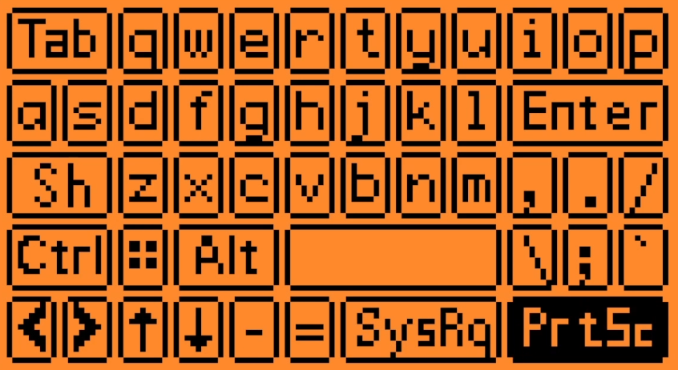

# Tutorial: Changing a keystroke button


## Overview

The FlipKeyboard configuration supports two methods for sending keystrokes to the computer.  The first method is to use the "Message" option.  The second method is to use the "Add Keystroke" option.  The "Add Keystroke" option allows you to send a sequence of keystrokes to the computer.  In the configuration setting for an action, you can use `Left` and `Right` buttons on the Flipper Zero to scroll thru all of the available keystrokes when a `Keystroke` is selected, or you can press the `Ok` button to see a custom keyboard.  The custom keyboard only has a subset of the available `Keystrokes`. This tutorial will show you how to change the keys that are shown on the custom keyboard.

## Step 1: Decide which button you want and what to swap out.

For this tutorial, we will swap out the `Power` button.  Each row of keys on the custom keyboard is 12 keys wide.  A button can be multiple keys wide.  The `Power` button is 3-keys wide.  A button can use either a single character to render or an icon file.  For a 1-key wide icon the icon dimensions are 5x10.  A 2-key wide is 15x10 & 3-key wide icon is 25x10.  When replacing a multi-key wide button, you can create multiple smaller buttons (but the total width must be the same as the original button) or you can create a single button that is the same width as the original button.

For this tutorial, we will be adding the `PrtSc` button.  We will create a single button that is 3-keys wide and uses an icon with the text `PrtSc`, but we could also draw an icon.

## Step 2: Create the icon file

The icon file is a black and white PNG file.  Since we are using 3-key wide, our image should be 25x10 pixels.  The PNG images are stored in `flipkeyboard/assets` and will be converted later into code.  I typically copy an existing file of the proper dimensions (like sysreq_25x10.png) and then rename it to `prtsc_25x10.png`.  You can use any image editor to edit the icon file, but a handy VS Code extension is called `Luna Paint - Image Editor` which allows you to edit the image from within VS Code.

## Step 3: Run the icons process

I typically recommend opening `flipkeyboard\app.c` then pressing `Ctrl+Shift+B` and selecting `[Debug] Build App`.  This will end up running the ICONS program, which will convert all of the PNGs into a `flipboard_keyboard_icons.h` and  `flipboard_keyboard_icons.c` file in the build output folder.  At this point, a new variable `I_prtsc_25x10` will be available for use (The `I_` is because the PNG was converted into an `Icon` object).

## Step 4: Find the button we are replacing in the code

Open `flipkeyboard\app_keyboard_layout.h` and scroll down until you find the key you are replacing.  The first block of code are all of the rows of shifted keys.  The second block of code are all of the non-shifted keys.  Since we are replacing the Power button, we should see something like the following...

```c
    {.code = HID_KEYBOARD_POWER, .ch = 0, .icon = &I_power_25x10},
    {.code = HID_KEYBOARD_POWER, .ch = 0, .icon = &I_power_25x10},
    {.code = HID_KEYBOARD_POWER, .ch = 0, .icon = &I_power_25x10},
```

## Step 5: Replace the button with the new button

If you don't know the HID name, place your cursor after HID_KEYBOARD_ and press `Ctrl+Space` to see a list of all of the HID names.  In this case, we want to replace the `HID_KEYBOARD_POWER` with `HID_KEYBOARD_PRINT_SCREEN`.  The new value you choose must be listed in the `keystroke_values[]` array in the `flipkeyboard\common\config_keystroke.h` file.  The `config_keystroke.h` file contains the list of all of the keystrokes that are displayed using the `VariableItemList` when the selecting with the left/right arrow keys.  The `VariableItemList` module from `#include <gui/modules/variable_item_list.h>` has a limit of around 255 items (which are all being used) so if you want to add a new value in `keystroke_values[]` you also need to remove a value.  Be sure that `keystroke_names[]` lists the items in the same order as `keystroke_values[]`.

We also want to replace the icon `I_power_25x10` with `I_prtsc_25x10`.  

The final code should look like the following...

```c
    {.code = HID_KEYBOARD_PRINT_SCREEN, .ch = 0, .icon = &I_prtsc_25x10},
    {.code = HID_KEYBOARD_PRINT_SCREEN, .ch = 0, .icon = &I_prtsc_25x10},
    {.code = HID_KEYBOARD_PRINT_SCREEN, .ch = 0, .icon = &I_prtsc_25x10},
```

NOTE: If you want to use a character instead of an icon, set the **.icon** to `NULL` and set the **.ch** to the character enclosed in single quotes.

## Step 6: Build the firmware & launch the app

  - Step 6a: Make sure the Flipper is connected and that nothing is using the serial port (close qFlipper, CLI windows, etc.)
  - Step 6b: Open a build task window in Visual Studio Code by pressing `Ctrl+Shift+B`.
  - Step 6c: Choose `[Debug] Launch App on Flipper`

## Step 7: Your new button should display & choose the correct option when selected!


