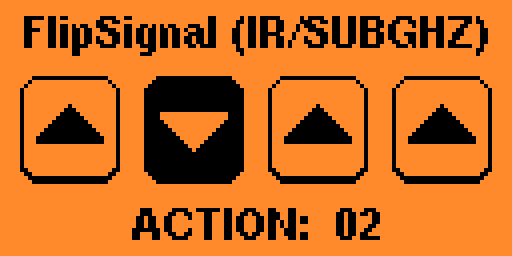

# FlipSignal

## Overview

The FlipSignal application turns your Flipper Zero and FlipBoard into an Infrared and Sub-GHz signal sender.  Turn on/off devices using the buttons on your FlipBoard, or send a sequence of IR signals. The application is written in C and uses the FlipBoard common code for the majority of the functionality.

The application sends a Sub-GHz signal (RAW or Protocol) and then it sends any IR signals.  Configuration of signals is done by saving files using a specific file name.

You can order your FlipBoard from [@MakeItHackin](https://www.youtube.com/makeithackin) using [tindie](https://www.tindie.com/products/32844/) or [Etsy](https://www.etsy.com/listing/1601295558/).  Be sure to also join our [Discord server](https://discord.gg/KTThkQHj5B).

- [Running the app](#running-the-app)
- [Configuration](#configuration)
  - [Action configuration](#action-configuration)
  - [Sub-GHz files](#sub-ghz-files)
  - [Infrared files](#infrared-files)
- [Using the app](#using-the-app)
- [Tutorials](#tutorials)
  - [Video tutorials](#video-tutorials)
- [Updates](#updates)
- [Support](#support)

## Running the app

Make sure your FlipBoard is connected to your Flipper Zero.  On your Flipper Zero, press the `Ok` button.  Scroll down to `Apps` and click the `Ok` button.  Select the `GPIO` folder.  Select the `FlipBoard Signal` application. You should see startup splash screen for a few seconds reminding you to connect the FlipBoard and then the FlipBoard LEDs will do their start-up sequence.

## Configuration

### Action configuration

Go to `Configure application` in the app menu to setup how each action works. You’ll see all of the different button combos listed (for example "Action 3" is pressing button 1 and button 2 at the same time). Press `Ok` to select the Action to configure.

The `Press color` option changes the button color when it’s pressed. If you pick a combo button, all the buttons in that combo will change color.

The `Release color` option changes the button color when it’s not pressed. This option doesn’t work for combo buttons.

The `Music note` option changes the sound to play when the button is pressed. You can pick "Off" if you don’t want any sound.

### Sub-GHz files
You need to copy your Sub-GHz files into your `SD Card/subghz` folder.  Your files should be named `Flip1.sub`, `Flip2.sub`, `Flip4.sub` and `Flip8.sub` to correspond to the 4 buttons.  You can also create files for button combinations, for example, `Flip3.sub` would be for when button 1 and button 2 are pressed at the same time.

### Infrared files
You need to copy your `flipboard.ir` file into your `SD Card/infrared` folder.  The `name:` field should be `Flip1`, `Flip2`, `Flip4` & `Flip8` for the 4 actions!!!  The actions are case-sensitive; so they must start with a capital F and then lowercase the remaining letters.  You can have multiple entries named the same, and they will be replayed in order.

If the file is not created or no matching name exists, then a fallback file of `SD Card/infrared/assets/tv.ir` will be used along with default names (Power, Mute, Ch_prev and Ch_next).

- Action 1 will run `Flip1.sub` and then send IR signal `Flip1`.  If IR signal does not exist, it will send IR TV signal "Power".
- Action 2 will run `Flip2.sub` and then send IR signal `Flip2`.  If IR signal does not exist, it will send IR TV signal "Mute".
- Action 4 will run `Flip4.sub` and then send IR signal `Flip4`.  If IR signal does not exist, it will send IR TV signal "Ch_prev".
- Action 8 will run `Flip8.sub` and then send IR signal `Flip8`.  If IR signal does not exist, it will send IR TV signal "Ch_next".

## Using the app

Make sure your FlipBoard is connected to your Flipper Zero. Choose the `Start application` option to launch the app. Press the leftmost button and it should send the Flip1 signal.  If you did not configure any signals, then it will send the IR TV signal "Power".  The green status LED in the FlipBoard will blink as it sends the various signals that have a matching entry `name:` field.  Once every signal has been sent, the green status LED will turn off.

## Tutorials

### Video tutorials

 [Flipper Zero: FlipSignal send IR/SUB with your FlipBoard](https://youtu.be/uDaISCAcKpk)

## Updates

- Version 3.10 : Common code update.
- Version 3.9 : Show "FlipSignal (IR/SUBGHZ)".
- Version 3.8 : Common code update.
- Version 3.7 : Common code update.
- Version 3.6 : Allow building with uFBT tool.
- Version 3.5 : Default colors.
- Version 3.4 : Splash screen.
- Version 3.3 : Improved LED driver.
- Version 3.2 : Allow combo buttons
- Version 3.1 : Fix bug with second button not working.
- Version 3.0 : Renamed files AGAIN.  :(   `Flip1.sub`, `Flip2.sub`, `Flip4.sub`, `Flip8.sub` and the IR entries to `Flip1`, `Flip2`, `Flip4`, `Flip8`.
- Version 2.0 (was called v1.1): Flipper keyboard doesn't have a dash, so renamed the files to `Flip1.sub`, `Flip2.sub`, `Flip3.sub`, `Flip4.sub` and the IR entries to `Flip1`, `Flip2`, `Flip3`, `Flip4`.

## Support

If you have need help, we are here for you.  Also, we would love your feedback on cool ideas for future FlipBoard applications!

Please visit my Flipper Zero Discord server [Flipper Zero Tutorials (Unofficial)](https://discord.gg/KTThkQHj5B) and ask your questions in the `#flipboard` or `#general` channel.
