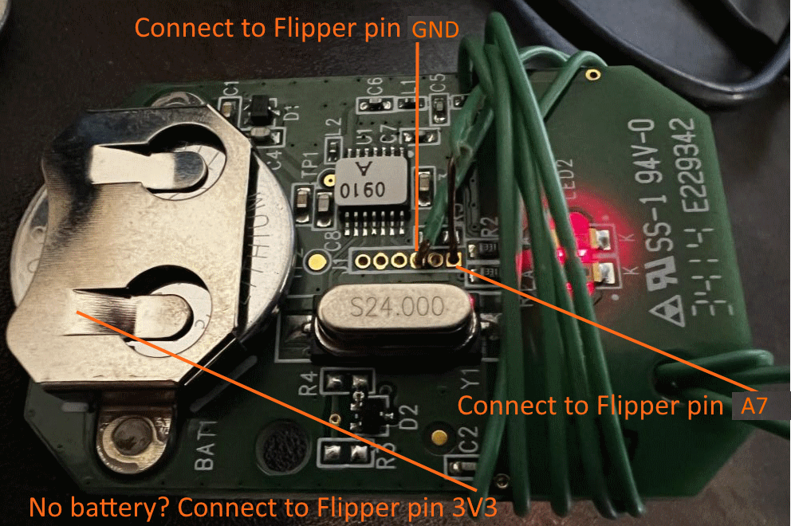

# Genie garage door recorder

IMPORTANT: This project currently **requires changes to the firmware** to be able to detect Genie signals.  Please see the [Installing](#installing) section for more details.

WARNING: For my remote, the codes wrapped after 65,536 codes were sent.  I'm not sure if this is the case for ALL Genie brand remotes.  If it doesn't wrap, it's possible that the remote could stop working (if the manufacture implemented OVR bits).

WARNING: This could desync your remote from the receiver.  Be sure you know the process to sync the remote back to the receiver.  For my remote, I had to press the learn button on the receiver, then press the button on the remote.

WARNING: Don't run this app near your garage.  There is no reason to open the physical garage door & you will likely burn out the motor.

Document sections:
- [Description](#description)
- [Installing](#installing)
- [Determine Genie Frequency](#determine-genie-frequency)
- [Connecting to remote](#connecting-to-remote)
- [Capture codes](#capture-codes)
- [Sub-GHz Read](#sub-ghz-read)
- [Sub-GHz Saved](#sub-ghz-saved)
- [Troubleshooting](#troubleshooting)
- [Sub-GHz application](#sub-ghz-application)
  - [Read](#read)
  - [Details](#details)
  - [No Keys](#no-keys)
  - [Key Missing](#key-missing)
- [.GNE file format](#gne-file-format)

## Description
This program was written to allow the Flipper Zero to press buttons on a Genie garage door opened and record the rolling code. The goal is to capture all 65,536 signals (which hopefully repeats when it gets to the end).  Our click speed is current 2000ms per click + however long it takes to get the signal.  In practice, it typically takes 2 days to record all of your signals.

Once completed, the built-in Sub-GHz Read application will know how to playback your Genie garage door remote.

## Installing
- Step 1. Clone a firmware repro using ``git clone --recursive``.
- Step 2. Copy [these files](https://github.com/jamisonderek/flipper-zero-tutorials/tree/main/subghz/apps/genie-recorder) into your firmware ``applications_user\genie-recorder`` folder. 
- Step 3. Move the files from ``applications_user\genie-recorder\lib\subghz\protocols`` to ``lib\subghz\protocols`` folder. 
- Step 4. Add ``&subghz_protocol_genie,`` below the line ``&subghz_protocol_keeloq,`` in the ``lib\subghz\protocols\protocol_items.c`` file.  (NOTE: You can add it lower in the file if you prefer.)
- Step 5. Add ``#include "genie.h`` below the line ``#include "keeloq.h`` in the ``lib\subghz\protocols\protocol_items.h`` file.
- Step 6. Build your firmware & deploy onto Flipper  ``./fbt FORCE=1 flash_usb_full`` -- "[Debug]Flash (USB, with Resources)".

## Determine Genie Frequency
- Step 1. On your Flipper Zero, load ``Sub-GHz`` app.
- Step 2. Choose ``Read`` to start scanning.
- Step 3. Press the LEFT button to edit the Config.
- Step 4. Change the ``Frequency`` to 315000000.
- Step 5. Press the BACK button to continue scanning on the new frequency.
- Step 6. Press a button on your remote to see if it is detected.
- Step 7. If it is NOT detected, try 390000000.

## Connecting to remote

WARNING: Do this **at your own risk**.  You could damage your remote if done improperly or if your remote doesn't support capturing all of the signals.

- Step 1. Open the case off of your garage door remote.
- Step 2. Connect GND from Flipper to GND pin on the remote (Shown in green traces).
- Step 3. Connect A7 from Flipper to the signal pin on the remote (Shown in orange traces - top button, cyan - middle button).
- Step 4. Put in a fresh battery.
  - Risky Option: Remove the battery and connect 3V3 from Flipper to the battery positive bar on the remote.  Be 100% sure that GND on the Flipper is going to GND on the remote (and not the signal pin) and that no wires are shorting.  If you are not 100% sure, then DON'T DO THIS!  You could damage the remote and the Flipper Zero.

## Capture codes
- Step 1. Be sure you have followed the steps in the [Installing](#installing) section.
- Step 2. Be sure you have followed the steps in the [Connecting to remote](#connecting-to-remote) section.
- Step 3. Be sure you are not near your garage door (or that the door is unplugged).  The application will be pushing the button many times and could burn out the motor.
- Step 4. Run the Genie Recorder application
- Step 5. Choose "Config" and set the frequency to the frequency you determined above.
- Step 6. Choose "Start" to start recording signals.
  - You should see the current broadcast count (how many times the button was pressed)
  - You should see the received signal count (how many times the signal was received)
  - You should see how many codes still need to be received.
  - Every time a signal is recevied, it is written to a log file.  If the application exits and restarts, it will resume the counters where it left off, but be sure to NOT press the remote because the counter will be off.
- Step 7. Let it run for 2-3 days (the goal is to capture between 49,160-65,536 signals).  If you capture less, it will still work but when it wraps back to the beginning those codes will be rejected by your garage door opener.  To successfully wrap, the remote needs 49,160 button presses ("16,380 remaining codes" or less).  To be near-sync with the remote, it is recommended you capture all of the codes.
- Step 8. Press the BACK button twice to exit the application.

## Sub-GHz Read
- Step 1. Be sure you have followed the steps in the [Capturing codes](#capture-codes) section.
- Step 2. On your Flipper, press the BACK button until you are at the Desktop.
- Step 3. On your Flipper, press the OK button and choose "Sub-GHz".
- Step 4. Choose "Read" to start scanning.
- Step 5. Press the LEFT button to edit the Config.
- Step 6. Change the ``Frequency`` to the frequency you determined above.
- Step 7. Press the BACK button to continue scanning on the new frequency.
- Step 8. Press a button on your Genie remote.  If read successfully you should hear a beep and see "Genie" followed by some code.
- Step 9. Press the OK button to see the details of the code.
- Step 10. Most firmware will have a "Save" button.  Press "Save" to save the code to the SD Card.  Press "Send" to send the code to the garage door opener.
- Step 11. If you press "Send", it should generate the next code and open the garage door.

## Sub-GHz Saved
- Step 1. Be sure you have followed the steps in the [Capturing codes](#capture-codes) section.
- Step 2. On your Flipper, press the BACK button until you are at the Desktop.
- Step 3. On your Flipper, press the OK button and choose "Sub-GHz".
- Step 4. Choose "Saved".
- Step 5. Select the file that you saved during the [Sub-GHz Read](#sub-ghz-read) section steps.
- Step 6. Choose "Emulate".
- Step 7. Press the OK button to generate the next code and open the garage door!
  - NOTE: If the receiver is out of sync, but within the 16K window, you may need to press the OK button twice.  This will open the garage door and resync the counter on the receiver.

## Troubleshooting

- If the LED on the remote is not blinking, be sure you have followed the steps in the [Connecting to remote](#connecting-to-remote) section.

- If the application is not detecting the remote, but the LED on the remote is blinking, then perhaps you missed the step in [Installing](#installing) section or the frequency is incorrect.

## Sub-GHz application
### Read

If the frequency is correct, then you should see the "Genie" entry when you press a button on your remote.  If the frequency is correct (typically 315MHz or 390MHz) then perhaps you missed the step in [Installing](#installing) where you copy the files into the ``lib\subghz\protocols`` directory, or the step where you edit the ``protocol_items`` files?

### Details

When a code and the next code is found in the .GNE file, you should see the KEY and the NEXT CODE.  Official firmware does not support the "Send" feature for rolling codes.

### No Keys

When the .GNE file does not exists, you will get the "No Keys" error message.  You need to make sure you run the Genie Recorder application to capture the codes first.

### Key Missing

When the .GNE file exists, but the key is not found (or the next code is not found), you will get the "Key Missing" error message.  You need to make sure you run the Genie Recorder application to capture the codes first.

## .GNE file format
The file format is as follows:
- 2 bytes: "G*" (0x47 0x2A)
- 1 byte: Major version (0x02)
- 1 byte: Minor version (e.g. 0x05)
- 4 bytes: Fix code from remote (matches filename.GNE)
- 2 bytes: Last sent index
- 2 bytes: Last saved index (0xFFFF and contents at 0xFFFF indicates full capture)
- 4 bytes: Reserved for future use.
- 4 bytes x 65536: The dynamic part of the code (0x00000000 if no code has been received)

The file can be found in the ``SD Card\apps_data\genie`` folder on your Flipper Zero.  The name of the file will match the ending 8 characters of the fix code.