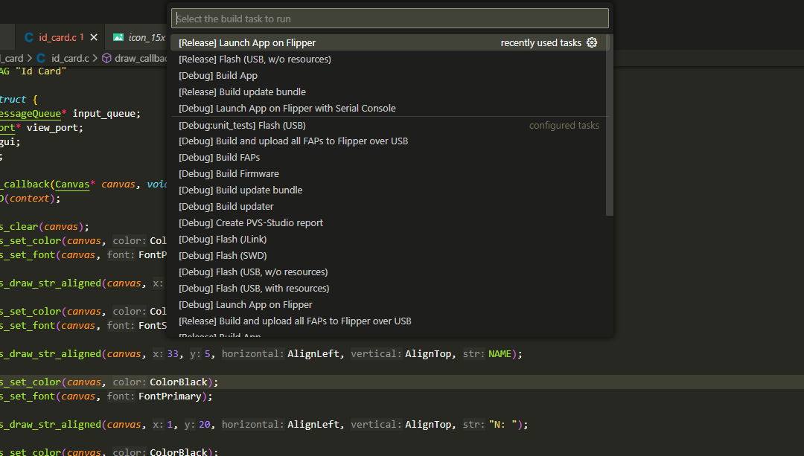

# Prerequisite
You don't need to be an engineer in embedded systems to understand this article.
But here is a short list of the requirements to follow this tutorial:
- C programming basics
- no fear about Command line interfaces
- A Flipper Zero
- Interest in embedded development

You will need to flash the Flipper Zero and this article don't aim to troubleshoot your installation especially with windows drivers.
If you have any problems with the connection between your computer and your device, please refer to the [documentation](https://docs.flipper.net/qflipper/windows-debug).

# Introduction


You heard about the [Flipper Zero](https://flipperzero.one/) and bought it for fun.
You played with it and now you want to develop your first application to take the full advantage of the device.
You are entering in a beautiful world with awesome capabilities.

The Flipper Zero is a device which target cybersecurity enjoyers.
It is a fully open-source project which is highly inspired by the [pwnagotchi](https://pwnagotchi.ai/).
You can, with some knowledge, build your own Flipper Zero from scratch.
All the [hardware schematics](https://docs.flipper.net/development/hardware/schematic), [case](https://docs.flipper.net/development/blueprints/flipper-zero) and [firmware](https://github.com/flipperdevices/flipperzero-firmware) are available.
Moreover, the community has very important part in the Flipper Zero, for example there are several [awesome lists on Github](https://github.com/djsime1/awesome-flipperzero).

## Features

The Flipper Zero is packaged with several [features](https://docs.flipper.net/).
- [Sub-GHz](https://docs.flipper.net/sub-ghz): Interact with devices which communicate with radio signals like key of cars, gates, smart lights...
- [RFID](https://docs.flipper.net/rfid): Read, save or emulate RFID tag like access cards, animal microchips...
- [NFC](https://docs.flipper.net/nfc): Read, save or emulate NFC technologies like access cards, phones data transfer...
- [Infrared](https://docs.flipper.net/infrared): Interact with technologies that use infrared to control it like TV screens, LED stripes, multimedia systems...
- [GPIO](https://docs.flipper.net/gpio-and-modules): Can be used to develop electronic circuits or use [debug modules](https://docs.flipper.net/development/hardware/wifi-developer-board) and [external modules](https://github.com/eried/flipperzero-mayhem).
- [Ibutton](https://docs.flipper.net/ibutton): Read, save or emulate Ibutton
  access control, meteo measurement...
- [Bad USB](https://docs.flipper.net/bad-usb): A [rubber ducky](https://shop.hak5.org/products/usb-rubber-ducky) like feature, perform keyboard typing when the device plugged by USB.
- [U2F](https://docs.flipper.net/u2f): Acting like a USB universal 2nd-factor.
- [Controler](https://docs.flipper.net/apps/controllers): Can be used as a keynote or a keyboard, it is connected by bluetooth.

## Firmware and Softwares
### Firmware

The [official firmware of the Flipper Zero](https://github.com/flipperdevices/flipperzero-firmware) is fully open-source and starts to be well documented.
The [documentation](https://github.com/flipperdevices/flipperzero-firmware/tree/dev/documentation) consists in several Markdown files on all the interesting subjects and a doxygen.

There are [other firmwares](https://github.com/djsime1/awesome-flipperzero#firmwares--tweaks) powered by the community which are available on Github. 
These firmwares aim to add animations, games and more efficient hacking applications.

### Software

A desktop and a mobile application will help you to interact with your Flipper Zero.

The [QFlipper](https://flipperzero.one/update) is the desktop application which let you upgrade the firmware with a USB-C connection.
It is a pretty simple application but it also allow you to debug your applications.

The [mobile application](https://docs.flipper.net/mobile-app) is more complete.
It has a builtin hub to install applications on your device.
You can also save your files that you registered on your Flipper Zero. 

# Tutorial
## Tools and Installations

### Requirements

A quite recent system is needed to build and flash your applications.

- Windows 10+ with PowerShell and Git
- macOS 12+ with Command Line tools
- Ubuntu 20.04+ with build-essential and Git

If you want more information, please refer to the [documentation](https://github.com/flipperdevices/flipperzero-firmware#requirements).

### Firmware

The first step is to clone the [firmware repository](https://github.com/flipperdevices/flipperzero-firmware) in order to have all the tools needed and the good version of the firmware.
The recursive flag is required because this project uses submodules.

```
git clone --recursive https://github.com/flipperdevices/flipperzero-firmware.git
cd flipperzero-firmware
```

### Visual Studio Code (Optional)

In this tutorial we will use [Visual Studio Code](https://code.visualstudio.com/)(VScode) to edit and flash your application.
The Flipper Zero has a great integration with it.

Then, to configure your VScode you have to launch this command.

```
./fbt vscode_dist
```

Now if you launch VScode in this directory, it will notify you to install all the needed plugins.

Now you can use the binding  `Ctrl + Shift + B` to get a contextual menu to build and flash the firmware and your applications.



### Build and Flash

The first step is to get a recent version of the firmware, so you have to select the version to develop on.
By default, you are on the `dev` branch which is not the most stable.
If you want more stability, the `release` branch is better candidate.

Once you selected the vesion, let's plug you flipper zero and flash the firmware by USB:

```
./fbt flash_usb_full
```

For VScode users, you need to select `[Release] Flash (USB, with resources)`.

Now, the only command to launch your application on your Flipper Zero is:

```
./fbt launch APPSRC=applications_user/path/to/app
```

## Create your application
### Overview

In this tutorial, we will build together a simple id card application with a minimalist icon.
It is a good first application to learn how to use the GUI with some texts and images and simple inputs.
The application will display your name, your phone number and your e-mail.


All the code and resources are available on my [Github](https://github.com/alanretgue/Flipper_Zero-id_card/tree/master).

For this tutorial, I use windows because of several troubles with the `fbt` script on Ubuntu 20.04. 

### Application manifest

Let's start your project.
The first file to create is the `application.fam`.
It is a manifest file which will help the compiler to build correctly the application.
Here you can find a first minimal example:

```
App(
    appid="id_card",
    name="Id Card",
    apptype=FlipperAppType.EXTERNAL,
    entry_point="id_card_main",
    cdefines=["APP_ID_CARD"],
    requires=["gui"],
    stack_size=1 * 1024,
    fap_icon_assets="images",
    fap_icon="images/icon_10x10.png",
    fap_category="Misc",
)
```

- `appid`: Id of the application, used to compile and flash it.
- `name`: Name of the application, displayed menus.
- `apptype`: Type of the application, `EXTERNAL` specify to the compiler to make a `.fap` application.
- `entry_point`: The entry point of your application, like your `main` function in C.
- `cdefines`: C Preprocessor definitions to declare it globally.
- `requires`: Applications required by your application, specify the app ID.
- `stack_size`: Stack size allocated to your application.
- `fap_icon_assets`: Directory for your images and assets. Mandatory if you want to use images in your application.
- `fap_icon`: Icon for your application, must be 10x10 px.
- `fap_category`: Category of your application, your executable will be placed in this subdirectory.

The [Official documentation](https://github.com/flipperdevices/flipperzero-firmware/blob/dev/documentation/AppManifests.md) can give you more information about this file.

### Source code
#### Include files
##### Regular headers

In order to use the resources available on the Flipper Zero like the Screen or the SD card, you have include some headers.
All the usefull headers are placed in the `application/sevices` directory.

For this example, we will only use three headers specific for the Flipper Zero.
```
#include <furi.h>           # Used to have a message queue and log
#include <gui/gui.h>        # Handle all the GUI utils
#include <input/input.h>    # Handle the Inputs
```

##### Image assets

If you want to insert images in your application, you have to specify the directory of your image in the `fap_icon_assets` of your `application.fam`.
Then, include it as a header file like that: `{app_id}_icon.h`.
For example, if you want to include an image in your application `example`, you have to put this in your code:
```c
#include "example_icons.h"
```

This line will do some magic for you, generate all necessary variables and initialize it with image's values.
All you have to do is accessing to your image's variable with this pattern: `I_{image_name}`.
For istance, if your image is named `icon.png`, the generated variable is `I_icon`.

##### Usefull structure

It is a good practice to have a internal data structure where all the necessary assets are stored.
In our case we will define an `Id_card` structure that store everything we need:
- `FuriMessageQueue` pointer to store the user inputs.
- `ViewPort` pointer to handle the display.
- `GUI` pointer to the current GUI.

```c
typedef struct {
    FuriMessageQueue* input_queue;
    ViewPort* view_port;
    Gui* gui;
} Id_card;
```

#### Main function

The entrypoint of the application needs to have the same name specified in the manifest file and has to match this signature:
```c
int32_t id_card_main(void* p) {
    UNUSED(p);
    return 0;
}
```

In this main function, we have to do 3 things:
- Allocation and initialization
- Main loop and input handling
- Free structures and exit the application

##### Logging

It can be very useful to log the execution of your application to trace it and know exactly what happened.
To do that some macros are available easily.

For example:
```c
FURI_LOG_I("Id_card", "Example");
```

To receive the logs, you have to launch the application in debug mode with the Serial console.
Select the `[Debug] Launch App on Flipper with Serial Console` in VScode.

If you are using CLI tools, you can also debug the `./fbt debug` command.

##### Allocation and initialization

This section depends on the assets you use, but this article will show you the minimum required for a simple application.

To store all the data structures, we will use the previously defined structure.

```c
Id_card app;
```

Then, we have to allocate a `ViewPort` and a `FuriMessageQueue`.
The `ViewPort` will handle your display in the GUI and the `FuriMessageQueue` will be used to handle user inputs.

After that, we need to set callbacks functions to draw on the GUI and the inputs.
```c
view_port_draw_callback_set(app.view_port, draw_callback, &app);
view_port_input_callback_set(app.view_port, input_callback, &app);
```
Those callbacks will be defined later in this tutorial.

The next step is to add a GUI to the allocated `ViewPort`.
```c
app.gui = furi_record_open("gui");
gui_add_view_port(app.gui, app.view_port, GuiLayerFullscreen);
```

##### Main loop and input handling

In this part, we will look at the way to handle user inputs and its behaviour.

The structure of this part is pretty simple.
```c
InputEvent input;
uint8_t exit_loop = 0;

while(1) {

    // We will add the logic of the application in this scope.

    if(exit_loop) {
        break;
    }

    view_port_update(app.view_port);
}
```
The `veiw_port_update` function call the callback function to draw the updated GUI.

In this main loop, we have to get the last user input and check the error code.
```c
furi_check(
    furi_message_queue_get(app.input_queue, &input, FuriWaitForever) == FuriStatusOk);
```
In this line we wait the next user input and store it in the input variable.
Then, we check if there is an error with the `furi_check` function.

The next step is to get the user entry type and do the application's logic.
In our case, we want to exit the application whatever the key is entered by
setting the `exit_loop` variable to 1.
```c
switch(input.key) {
    case InputKeyLeft:
    case InputKeyRight:
    case InputKeyOk:
    case InputKeyUp:
    case InputKeyDown:
    case InputKeyBack:
        exit_loop = 1;
        break;
    default:
        break;
}
```
This is the minimal way to handle user inputs.

##### Free structures and exit the application

The final step of the main function is to free all the data structures to exit properly of the application.
Firstly, you need to disable your `ViewPort`, remove the the GUI from the `ViewPort`and close the furi record.
Then, you can free the `ViewPort`.
```c
view_port_enabled_set(app.view_port, false);
gui_remove_view_port(app.gui, app.view_port);
furi_record_close("gui");
view_port_free(app.view_port);
```

#### Callbacks

An important part of the application is the implementation of callbacks to let the Flipper Zero know how you want it to behave. 
Those callbacks are simply functions which are called by an handler.
In our case, we will use a draw and an input callbacks as specified below.

##### Draw

The goal of this callback is to draw the GUI of your application.
It will be called each times the GUI needs to be refreshed.

```c
void draw_callback(Canvas* canvas, void* context);
```

- `canvas`: An internal variable that you will use to draw on the GUI.
- `context`: A variable which you can define and use to get some data in your callbacks.

The first step is to clear the screen:
```c
canvas_clear(canvas);
```

Now, you can add everything you want to your GUI.
###### Texts

There are several given functions to configure and write text.
For example, you can set the color of the font with the line below.

```c
canvas_set_color(canvas, ColorBlack);
```

To set the font of the text, you can do:
```c
canvas_set_font(canvas, FontSecondary);
```

Then, to draw the text the function is:
```c
canvas_draw_str_aligned(
        canvas,     // Callback variable
        1,          // x coordinate
        1,          // y coordinate
        AlignLeft,  // Horizontal alignement
        AlignTop,   // Vertical alignement
        "example"   // Text to display
        );
```

###### Image

Display images is very simplified by the build system.
It generate and initialize the variables for you and you only have to give this variable to a function.

```c
canvas_draw_icon(
        canvas,     // Callback variable
        10,         // x coordinate
        10,         // y coordinate
        &I_icon     // Image to display
        );
```

##### Inputs

The inputs callback is pretty simple because the only thing to do is to put the new `InputEvent` into the message queue. 
This event will be handle by the main function written before.
```c
Id_card* app = context;
furi_message_queue_put(app->input_queue, event, 0);
```

# Conclusion

# Going further
## Use the Flipper Zero hardware

A good way to start developping an application with hardware usage as NFC or infrared is to find [examples](https://github.com/djsime1/awesome-flipperzero) and understand how it work.
Another way to learn how to develop an application like that is to explore the [firmware source code](https://github.com/flipperdevices/flipperzero-firmware/tree/dev/applications/services) and try to find interesting functions.

## Use rust

If you are a rust enjoyer and want to try it on Flipper Zero, you can try it with this [Github account](https://github.com/flipperzero-rs).
