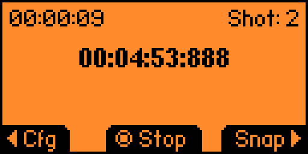
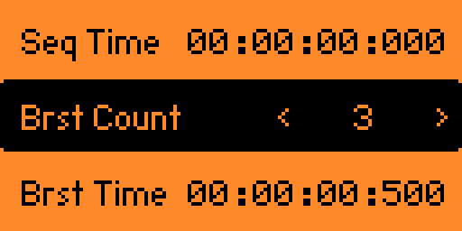

# An Intervalometer App For Flipper Zero

This is a simple configurable valometer app for Sony cameras. It provides a
configurable shutter timer and uses the IR blaster to trigger the camera
shutter.

## Configuration

The default configuration functions just as a 2 second self timer.

This can be easily configured to do something like a 12 shot timelapse over 1 hour.

Scrolling down the settings page, there is also the option to shoot a "burst"
of images at each interval.

# Building

1. Download the Flipper firmware repo at: https://github.com/flipperdevices/flipperzero-firmware
2. Inside the Flipper fw repo, copy this repo into `./applications_user/intervalometer/`
3. Run `./fbt fap_intervalometer`
4. Read the output of `fbt` to find the `.fap` in `./build/`

# TODO

1. Add support for additional trigger types, such as bluetooth and other cameras.
2. Add support for using more advanced camera controls like exposure compensation
   to allow for shooting an exposure bracket.
3. Add github actions for CI.
3. Refactor the codebase to be cute.

