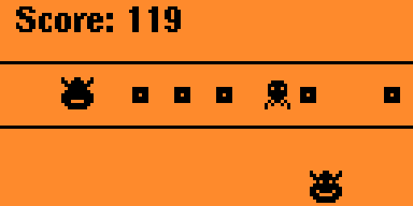

# KC Line

A one line/row version of the game where a character eats little bits and
gets chased around the screen by a ghost. It's pretty obvious where the
inspiration for this game came from, but if you have questions, hit me up
on my Github page.

Directions are pretty simple, use OK button to pause, left and right to
navigate the player, back to exit.

2024 Andrew Diamond
Distributed under the MIT license.
#### License
[MIT LICENSE](LICENSE)
