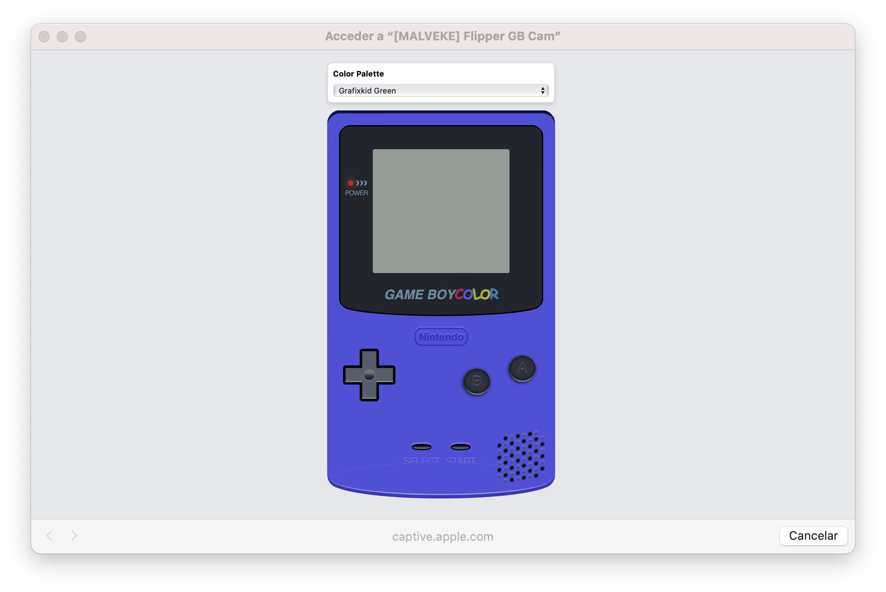

# ***GAME BOY*** Link Camera MALVEKE

## Introduction

**Official** | **Unleashed** | **RogueMaster** | **Xtreme**
:- | :- | :- | :- 
|||

Extract your  ***GAME BOY*** Camera picture via WIFI, so they can be easily shared with your phone, tablet or pc. Easy to use, just hook up to your ***GAME BOY*** and print as usual, the device will store the images and share them on a web server via WIFI. You will need a printer cable or gameboy Color link cable.
 

## Instructions for use.

These instructions assume that you are starting at the Flipper Zero desktop. Otherwise, press the Back button until you are at the desktop.

- Press the `OK` button on the Flipper to open the main menu.
- Choose `Applications` from the menu.
- Choose `GPIO` from the submenu.
- Choose `GAME BOY Link-Camera MALVEKE`
- The Flipper Zero will show the loading screen of the application. 

    

         
        
         
    

- If the **MALVEKE** board is not connected, the following message will appear. You must connect it and press `OK`.

    

         
        
         
    

- **MALVEKE** will create a Wi-Fi network using the data displayed on the screen.
    

         
        
         
    

- On your computer or phone, search for the network and connect using the provided access credentials.
    

         
        
         
    

    

         
        
         
    

- When you connect, it will automatically open a browser window with the host. If this doesn't happen, you should manually enter the IP provided on the Flipper Zero as the **host** in your browser.
    

         
        
         
    

- Now, on your ***GAME BOY***, connect the Link Cable to **MALVEKE** `EXT2` port and proceed to print images as usual; they will appear in the web browser.

    

         
        
         
    

    

         
        
         
    

    

         
        
         
    

- In web you can Change palette and with button `A` Download image

## Acknowledgements
- [@brundonsmith](https://github.com/brundonsmith) for [GAME BOY Color in CSS](https://codepen.io/brundolf/pen/beagbQ).
- [@mofosyne](https://github.com/mofosyne) Code to emulate a gameboy printer via the gameboy link cable.
- [@HerrZatacke](https://github.com/HerrZatacke) I extracted many ideas from their repositories.

## TODO
- [ ] Refactor Code
- [ ] Documentation
- [ ] Save transfered imagen in Flipper Zero

 
 
From Talcahuano 🇨🇱 with ❤ 

