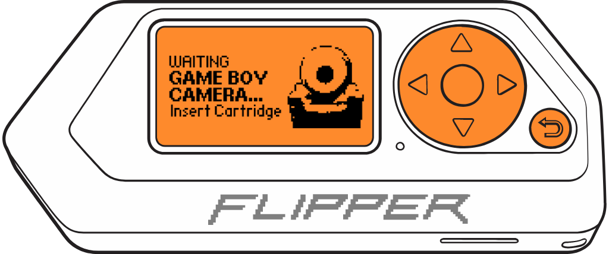
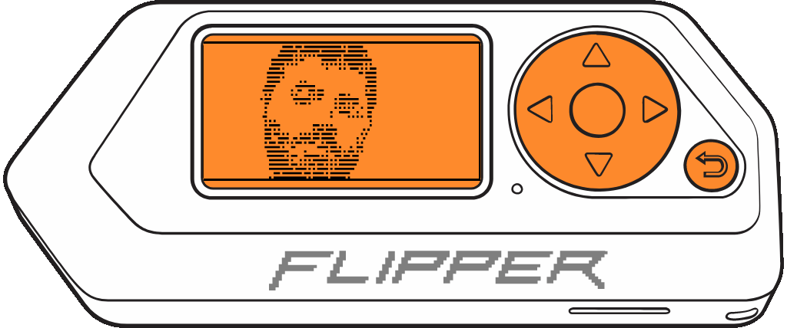

# ***GAME BOY*** Live Camera MALVEKE

<figure>
    
    <figcaption>MALVEKE Prototype V2.3</figcaption>
</figure>

<div align="center">

https://github.com/EstebanFuentealba/MALVEKE-Flipper-Zero/assets/442927/8c11cb8a-2a05-47e2-a0e0-1d3a1fe386ea

</div>

## Introduction

<div align="center">

**Official** | **Unleashed** | **RogueMaster** | **Xtreme**
:- | :- | :- | :- 
[](https://flipc.org/EstebanFuentealba/MALVEKE-Flipper-Zero?branch=main&root=flipper_companion_apps%2Fapplications%2Fexternal%2Fmalveke_gb_live_camera&firmware=official)|[](https://flipc.org/EstebanFuentealba/MALVEKE-Flipper-Zero?branch=main&root=flipper_companion_apps%2Fapplications%2Fexternal%2Fmalveke_gb_live_camera&firmware=unleashed)|[](https://flipc.org/EstebanFuentealba/MALVEKE-Flipper-Zero?branch=main&root=flipper_companion_apps%2Fapplications%2Fexternal%2Fmalveke_gb_live_camera&firmware=roguemaster)|[](https://flipc.org/EstebanFuentealba/MALVEKE-Flipper-Zero?branch=main&root=flipper_companion_apps%2Fapplications%2Fexternal%2Fmalveke_gb_live_camera&firmware=xtreme)
</div>

<p align='center'>
<a href="https://www.tindie.com/stores/efuentealba/?ref=offsite_badges&utm_source=sellers_efuentealba&utm_medium=badges&utm_campaign=badge_large"></a>
</p>

## Installation Directions

This project is intended to be overlayed on top of an existing firmware repo,  in my case the **Release 0.79.1** version.

- Clone the [Flipper Zero firmware repository](https://github.com/flipperdevices/flipperzero-firmware). Refer to [this tutorial](https://github.com/jamisonderek/flipper-zero-tutorials/tree/main/firmware/updating/README.md) for updating the firmware.
- Copy the "malveke_gb_live_camera" folder into the `/applications_user/malveke_gb_live_camera` folder in your firmware.
- Run the command `ufbt launch` to run it on your Flipper Zero.

```
./ufbt launch
```

- NOTE: If you only want to generate the fap file, you must run the following command.

```bash
./ufbt 
```

And use [**qFlipper**](https://flipperzero.one/update) to copy the generated **malveke_gb_live_camera.fap** file to the `SD Card/apps/GPIO` folder.

<p align='center'>
<br />
</p>

## Instructions for use.

These instructions assume that you are starting at the Flipper Zero desktop. Otherwise, press the Back button until you are at the desktop.

- Press the `OK` button on the Flipper to open the main menu.
- Choose `Applications` from the menu.
- Choose `GPIO` from the submenu.
- Choose `GAME BOY Live Camera MALVEKE`
- The Flipper Zero will show the loading screen of the application. 

    <p align='center'>
        <br />
        
        <br />
    </p>

- If the **MALVEKE** board and the **GAME BOY Camera** cartridge are connected, an image will be displayed.

    <p align='center'>
        <br />
        
        <br />
    </p>

- Press the `LEFT`/`RIGHT` buttons to change the exposure value.
- Press the `OK` button to take a picture. The image will be saved in the `SD Card/apps_data/malveke/photos` folder. 


## TODO
- [ ] Add automatic exposure calculation.
- [ ] Refactor Code

## Acknowledgements
- [**@AntonioND**](https://github.com/AntonioND/) for his documentation on [reverse engineering the Game Boy Camera](https://github.com/AntonioND/gbcam-rev-engineer/) and for his assistance in understanding some aspects.
- [**@eried**](https://github.com/eried) for his implementation of [ESP32-Camera](https://github.com/eried/flipperzero-mayhem/tree/next/flipper_companion_apps/applications/external/esp32cam_camera) (This is based on it.)
- [**@furrtek**](https://github.com/furrtek/) for his projects [GBCameraProjects](https://github.com/furrtek/GBCameraProjects)


<p align='center'>
<br />
<br />
From Talcahuano 🇨🇱 with ❤ 
</p>
