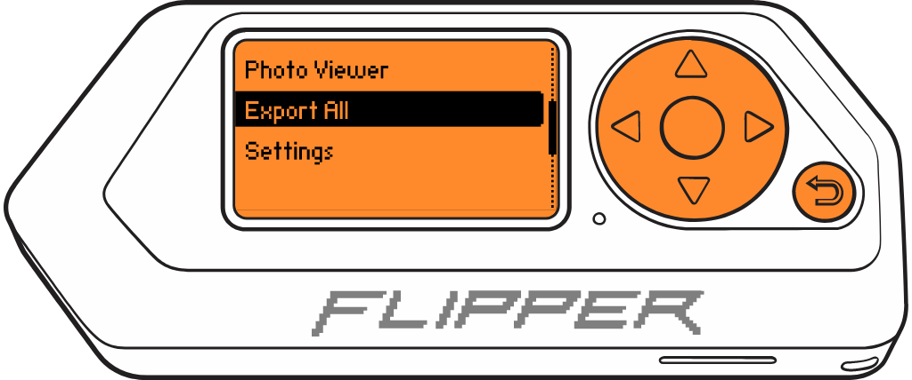
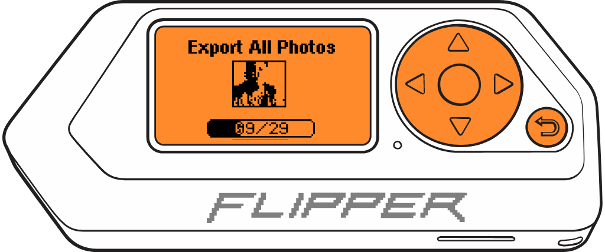

# ***GAME BOY*** PHOTO MALVEKE

**Official** | **Unleashed** | **RogueMaster**
:- | :- | :-
||

 

## Introduction

## Features
- Extract "large" photos of 4 colors (128x112) into .BMP format.
- Extract a single photo or batch extract all photos.
- Implement a Photo Viewer within Flipper Zero.
- Restore deleted photos.
- Modify the Color Palette.

## Instructions for use.

These instructions assume that you are starting at the Flipper Zero desktop. Otherwise, press the Back button until you are at the desktop.

- Press the `OK` button on the Flipper to open the main menu.
- Choose `Applications` from the menu.
- Choose `GPIO` from the submenu.
- Choose `[GB] GAME BOY PHOTO`

    

         
        
         
    

- For the next step, you'll need a `.SAV` file extracted from the GAME BOY Camera's RAM. If you don't have one, you can use the [**GAME BOY Cartridge (GB/GBC) MALVEKE**](/flipper_companion_apps/applications/external/malveke_gb_cartridge/README.md#instructions-for-use) app to save the RAM.

    

         
        
         
    

- Press the `OK` to enter to menu, After selecting the `.SAV` file, it will display the main menu. 
    

         
        
         
    

- **Photo Viewer**, a simple image viewer where you navigate between photos using `LEFT`/`RIGHT`. Since the images are 128x112, you scroll vertically using the `UP` and `DOWN` keys.

    

         
        
         
    

    - You can save the currently displayed image to the Flipper Zero's SD card by pressing the `OK` button. The image will be saved in the `SD Card/apps_data/malveke/photos` folder. 

    

         
        
         
    

- **Export all** allows you to export all the images. Simply press the `OK` button and wait for the transfer of all images. 
    

         
        
         
    

    - The images will be saved in the `SD Card/apps_data/malveke/photos` folder. 

    

         
        
         
    

    

         
        
         
    

- **Settings**: General application configurations.
    

         
        
         
    

    - `Palette`: Configure the color palette; there are over 50 palettes to choose from. By default, it's set to Black and White.
    - `Info`: displays which images have been deleted.

    

         
        
         
    

- Press the `Back` to back to principal menu.

## TODO
- [ ] Refactor Code
- [ ] Reading images directly from the cartridge (without opening a .SAV file).
- [ ] For BMP, avoid using memory to generate images; write directly to files.
- [ ] Exhibit and view images through a Web Server interface.
- [ ] Add frames to images.
- [ ] Configure dimension upscaling.
- [ ] Export to other file formats.
- [ ] Extract Game Faces.

## Acknowledgements
- [**@raphnet**](https://github.com/raphnet/gbcam2png/) command-line tool for extracting Game Boy Camera photos from a save ram (.sav) file and writing them in the PNG format.
- [**@HerrZatacke**](https://github.com/HerrZatacke/gb-printer-web/) Several ideas drawn from your Gameboy Printer Web.

 
 
From Talcahuano 🇨🇱 with ❤ 

