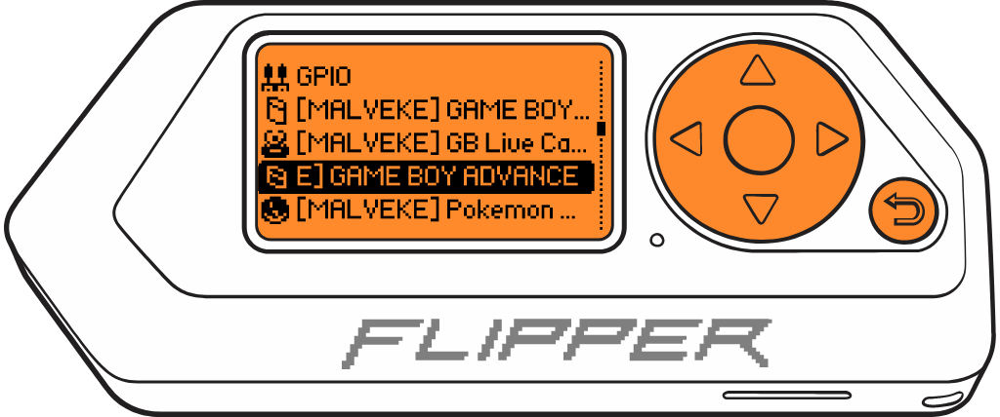

# ***GAME BOY*** ADVANCE Cartridge MALVEKE

<figure>
    
    <figcaption>MALVEKE Prototype V2.3</figcaption>
</figure>

**Official** | **Unleashed** | **RogueMaster**
:- | :- | :- | :- 
||

 

### Features
- Read info from GAME BOY ADVANCE Cartridges
- Backing up and restoring your saves (RAM) (WIP)
- Backing up and restoring your games (ROM) (WIP)

## Instructions for use.

These instructions assume that you are starting at the Flipper Zero desktop. Otherwise, press the Back button until you are at the desktop.

- Press the `OK` button on the Flipper to open the main menu.
- Choose `Applications` from the menu.
- Choose `GPIO` from the submenu.
- Choose `GAME BOY ADVANCE Cartridge MALVEKE`

    

         
        
         
    

- If the **MALVEKE** board and the cartridge are connected, The Flipper Zero will show the loading screen of the application.

    

         
        
         
    

- Press the `OK` to enter to menu.

    

         
        
         
    

    
    - Select `Cartridge Information` to view details about the inserted cartridge.

    
    

         
        
         
    

- WIP...
- Press the `Back` to back to principal menu.

 
 
From Talcahuano 🇨🇱 with ❤ 

