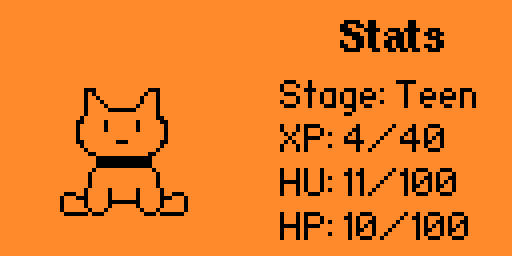
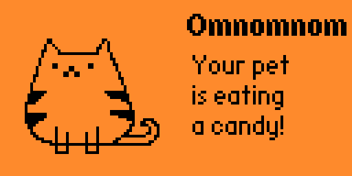

# Matagotchi
Tamagotchi(R) like game for Flipper Zero

## Supported features
### Life stages
The pet grows from an egg to an adult and then dies of old age.

The stages are  ->  ->  ->  ->  -> 

What? Who said that a cat can't come from an egg? I must have missed some biology lessons.

### Save game
The pet continues living while the game is not running.
The game is saved when exiting and restored when reopening
the application.
The time progress even when the game is not running.
Don't forget to feed your pet!

If you want to start the game again, you can reset the
state from the settings.

### Experience

The pet periodically gains experience (XP). Once he reaches
the maximum experience for the current life stage,
he passes to the next stage.

### Hunger

You have to feed the pet or he will starve.
You can give him candies.

### Health

When the pet is hungry he starts losing health.
You need to cure him with a pill.
He can also get sick.

# Disclamer
Tamagotchi is a trademark of Bandai Co., Ltd.. We are not affiliated with,
endorsed by, or sponsored by Bandai Co., Ltd., and the use of their trademark
is solely for descriptive purposes within this application.

# TODO
* Add animations for stage up
* Add happyness feature
