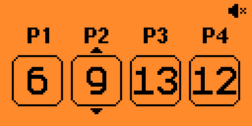

# Flipper Multi Counter
This is a simple external application for the [Flipper Zero](https://www.flipperzero.one) modified from [VS Counter](https://github.com/JadePossible/Flipper-Versus-Counter) version.
The app give you access to up to 4 counters to count your scores for tabletop games for example.

# How To Use ?
The UP and DOWN buttons are for adding or subbing one from the selected player
And de LEFT and RIGHT to switch between players
You can also (un)toggle the sound with the OK key

# How to install this?
You can either compile it yourself or intall the .fap from the dist folder
