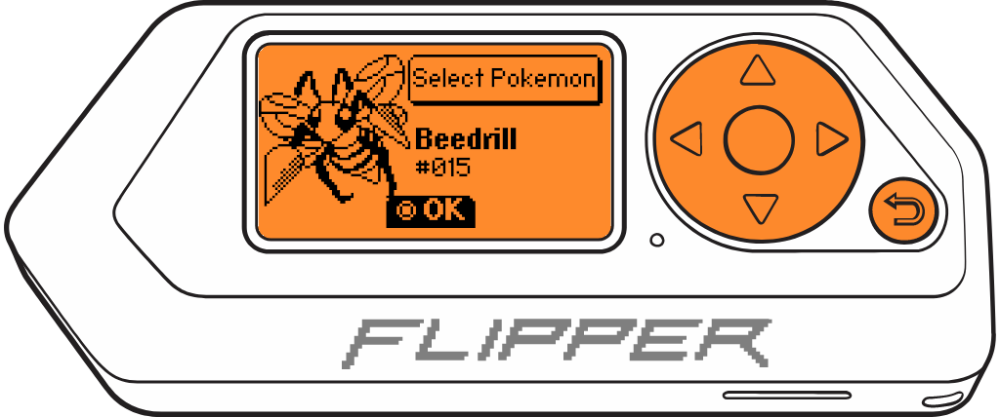
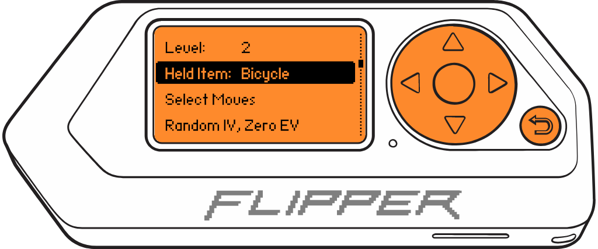
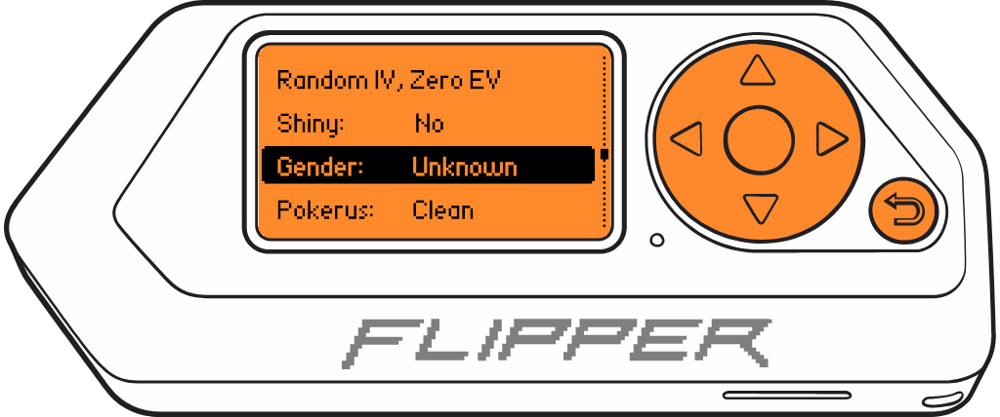
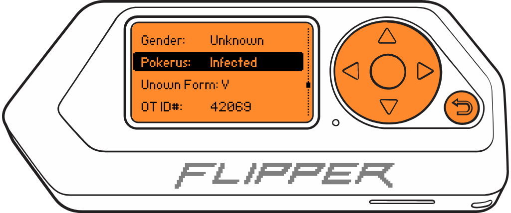

# GAME BOY Pokemon Trading MALVEKE

## Watch it in Action
The video below trades a Bulbasaur from the Flipper to a Game Boy Color with Pokemon Silver. The Game Boy trades its Cyndaquil. The Flipper is then used to modify the Cyndaquil to infect it with Pokerus, modify its EVs and IVs, and have the Cyndaquil hold an Antidote before it is traded back to the Game Boy.

## Contents
- [Introduction](#introduction)
- [Hardware Interface](#hardware-interface)
- [Installation Directions](#installation-directions)
- [Instructions for Use](#instructions-for-use)
  - [Main Menu](#main-menu)
    - [Pinout](#pinout)
    - [Customizing Pokemon](#customizing-pokemon)
  - [Trade](#trade-pkmn)
    - [Modifying Traded Pokemon](#modifying-traded-pokemon)
- [How it Works / Build your own Interface](#how-does-it-work)

## Introduction

This is a Pokemon exchange application from Flipper Zero to Game Boy supporting Generation I and II games; Red, Blue, Yellow, Gold, Silver, and Crystal (all non-Japanese regions[^JPN]). It allows trading Pokemon to and from a Game Boy; allowing for customization and/or modification of Pokemon.

[^JPN]: Japanese releases of all Generation I and II games use a different data layout, this application implements the data layout used in all other global regions. Attempting to trade between a Japanese cartridge and the Flipper [risks corrupting or erasing save data](https://web.archive.org/web/20221009111851/http://www.nintendo.com/consumer/systems/gameboy/trouble_specificgame.jsp#erasing)

Generation I customization options:

- Pokemon
- Nickname
- Level
- Move set
- Types[^TYPES]
- EV/IV[^EVIV]
- OT ID Number[^OT]
- OT Name[^OT]

Generation II customization options:

- Pokemon
- Nickname
- Level
- Held item
- Move set
- EV/IV[^EVIV]
- Shininess[^IV]
- Gender[^IV]
- Pokerus
- Unown form[^IV]
- OT ID Number[^OT]
- OT Name[^OT]

Once a Pokemon is traded between the Flipper and a Game Boy the Pokemon is kept in memory on the Flipper. This allows a user to back out of the trade screen on the Flipper, modify the Pokemon, and trade it back. Any of the above customization can be modified and the Pokemon traded back to the Game Boy for updated game play. Want a Pokemon to learn a move before it should? Make a Pokemon Shiny? Change its OT ID/Name to get an exp boost? This is how you do it!

[^TYPES]: Types are overwritten with the defaults when a Pokemon evolves or at the end of a battle where a Pokemon used a move that would temporarily change its types
[^EVIV]: EV/IV can be configured in combinations of the following: Random IV, Max IV, Max EV, Max EV for the current level, Zero EV
[^OT]: Setting this to match the trainer details of the Pokemon game will cause the game to treat the Pokemon as if it were caught by the player rather than traded
[^IV]: Changing this option will modify the Pokemon's IVs and may affect other attributes that are calculated from IVs

## Hardware Interface
The Game Boy is connected to the Flipper Zero's GPIO pins via a GBC style Game Link Cable. The [Flipper GB Link module](https://www.tindie.com/products/kbembedded/game-link-gpio-module-for-flipper-zero-game-boy/) is an easy way to connect a Game Boy via a Game Link Cable to the Flipper Zero.

  

Additionally, the [MALVEKE - GAME BOY Tools for Flipper Zero](https://www.tindie.com/products/efuentealba/malveke-game-boy-tools-for-flipper-zero/) is supported by this tool. As of version 2.0 of the Pokemon Trading tool, older style MALVEKE pinouts can be used without affecting the OK button after a trade -- this allows users to customize and modify traded Pokemon and there is no need to hard reset the flipper after a trade!

Details on the hardware interface, as well as how to create your own adapter board, can be found in the [How Does It Work](#how-does-it-work) section below.

## Installation Directions

This application can be installed through the [Flipper Application Catalog](https://lab.flipper.net/apps/pokemon), the [Flipper Mobile Application](https://docs.flipper.net/mobile-app), or a pre-compiled application binary can be found on the [Releases](https://github.com/EstebanFuentealba/Flipper-Zero-Game-Boy-Pokemon-Trading/releases) page of this repo.

The application can also be built from source using [ufbt](https://github.com/flipperdevices/flipperzero-ufbt) or compiling the application against a firmware of choice using [fbt](https://github.com/flipperdevices/flipperzero-firmware/blob/dev/documentation/AppsOnSDCard.md). This will install the application to the `apps/GPIO/` folder on the Flipper's SD card.

Manually built application can be copied to the SD card using [qFlipper](https://docs.flipper.net/qflipper).

 

## Instructions for Use
### Main Menu
From the main menu, select the generation of Pokemon game to trade with, first changing the `Pinout` if needed. Note that Gen I can trade with Gen I games as well as to Gen II games using Time Capsule trade. Gen II can only trade with Gen II games.

     
    
     

### Pinout

If you're using a MALVEKE PCB that is Rev. 2.5.1 or newer, a Flipper-GB-Link PCB, or a custom wired interface based on the [wiring diagram listed here](#how-does-it-work), then there is no need to worry about setting the pinout; the application default is for these devices. If you're using a MALVEKE PCB Rev. 2.5 or older, select the `MLVK2.5` pinout. For custom wired interfaces that don't follow either standard, select the `Custom` pinout and set each pin individually.

- If you're using a MALVEKE PCB version, verify the **Pinout** configuration:

    

         
        
         
    

    - MALVEKE **2.5** PCB Version: If you're using this version, select the `MLVK2.5` configuration.
        

             
            
             
        

    - MALVEKE **2.5.1** PCB Version: If you're using this version, select the `ORIGINAL`
        

             
            
             
        

### Customizing Pokemon
- [Select Pokemon](#select-pokemon-gen-i--gen-ii) (Gen I & II)
- [Nickname](#nickname-gen-i--gen-ii) (Gen I & II)
- [Level](#level-gen-i--gen-ii) (Gen I & II)
- [Held Item](#held-item-gen-ii-only) (Gen II only)
- [Select Moves](#select-moves-gen-i--gen-ii) (Gen I & II)
- [Select Types](#select-types-gen-i-only) (Gen I only)
- [Stats](#stats-gen-i--gen-ii) (Gen I & II)
- [Shiny](#shiny-gen-ii-only) (Gen II only)
- [Gender](#gender-gen-ii-only) (Gen II only)
- [Pokerus](#pokerus-gen-ii-only) (Gen II only)
- [Unown Form](#unown-form-gen-ii-only) (Gen II only)
- [OT ID# / Name](#ot-id--name-gen-i--gen-ii) (Gen I & II)

#### Select Pokemon (Gen I / Gen II)
To select a Pokemon, use `LEFT` and `RIGHT` buttons to select the Pokemon; `UP` and `DOWN` are used to page up/down by 10 Pokemon. Press `OK` to confirm selection, or `BACK` to cancel selection. If a different Pokemon is selected, the remaining customization options are set to the default for that Pokemon.

     
    
     

     
     

---

#### Nickname (Gen I / Gen II)
The selected Pokemon's nickname can be set. When a Pokemon is selected, the nickname defaults to the species name in all caps. This mimics a Pokemon without a customized nickname. In order to reset this nickname to its default, clear the text entry field, press `OK` on the `Save` button. This will fill the text box with the default name. Press `Save` again to set this name.

> [!IMPORTANT]
> Nidoran♀ and Nidoran♂ names will not properly render. This is because the Flipper currently cannot print Unicode characters to screen. Following the above instructions will fill the text entry field with `NIDORAN ` with a space after it. This space is the unrenderable ♀/♂ symbol. Once traded, it will be correctly named.

> [!NOTE]
> (Gen II only) The hyphen in `HO-OH` cannot be selected on the Flipper's keyboard input; however resetting the name as noted above will restore the default name.

> [!NOTE]
> Only English alphabetical characters are supported in the Pokemon's nickname at this time.

     
    
     

---

#### Level (Gen I / Gen II)
Set the Pokemon's level from `2` to `100`. This will recalculate the Pokemon's stats based on the new level and the current EV/IV settings.

> [!TIP]
> Levels below 2 cause an underflow glitch in Gen I and II games that would cause the level to jump to 100, so if you want this just set the Pokemon's level to 100.

     
    
     

---

#### Held Item (Gen II only)
The traded Pokemon can be given an item to hold. All of the valid items (including items a Pokemon can normally not be given to hold) are listed in alphabetical order.

     
    
     

---

#### Select Moves (Gen I / Gen II)
The `Select Moves` menu is used to modify the traded Pokemon's moves. They are pre-populated with the moveset that the Pokemon would know at level 1. Selecting a move slot will bring up an alphabetical index of moves. Additionally, `No Move` and `Default` can be quickly selected.

> [!NOTE]
> Any move in the moveset after the first `No Move` is ignored and is treated as `No Move` by the game.

     
    
     

     
    
     

---

#### Select Types (Gen I only)
The `Select Types` menu can change the traded Pokemon's types. The type(s) are pre-set to what the selected Pokemon normally is. Gen II games do not store temporary types alongside the Pokemon, therefore they are not kept during trades.

> [!NOTE]
> Unlike other menus, changing either type immediately saves it. Pressing `Back` will keep any changes. This will be addressed in a later version. If you need to revert to the default types, a different Pokemon can be selected and the desired Pokemon re-selected.

> [!NOTE]
> When changing the type(s), the Pokemon's in-game stats will _NOT_ reflect the chosen type(s). Additionally, these will be overwritten back to default in-game if the Pokemon uses a move that affects types (e.g. `Transform`) or the Pokemon evolves.

> [!TIP]
> Pokemon with a single type will have the same type set for both types.

     
    
     

---

#### Stats (Gen I / Gen II)

The Pokemon's stats can also be influenced. The current settings are:
- `Random IV, Zero EV` Mimics stats of a caught wild Pokemon.
- `Random IV, Max EV / Level` IV is randomized, but EV is set to the maximum a trained Pokemon could be for its current level.
- `Random IV, Max EV` IV is randomized, EV is set to the absolute max for a perfectly trained Pokemon.
- `Max IV, Zero EV` Mimics stats of a caught wild Pokemon, but with the maximum IV possible.
- `Max IV, Max EV / Level` IV is max, EV is set to the maximum a trained Pokemon could be for its current level.
- `Max IV, Max EV` Absolutely perfect and overly powerful Pokemon.
 

     
    
     

---

#### Shiny (Gen II only)
The Pokemon can be modified to be shiny or not. 

> [!NOTE]
> Modifying this option will affect the IV, but this will not be visible anywhere in the current application. For example, if any of the `Max IV` settings are selected, this will never result in a shiny Pokemon; but modifying the Pokemon to be shiny will adjust the IVs until the Pokemon is shiny. The Stats will still list `Max IV` however.

     
    
     

---

#### Gender (Gen II only)
The Pokemon's gender can be selected.

> [!NOTE]
> Modifying this option will affect the IV, but this will not be visible anywhere in the current application. For example, if any of the `Max IV` settings are selected and the Pokemon's gender is modified, the IVs will be adjusted so the Pokemon is the desired gender. The Stats will still list `Max IV` however.

> [!TIP]
> Some Pokemon are always a specific gender, `Miltank` for example is always female. Other Pokemon are gender-less (officially stated in-game as `Unknown`) and this is reflected if such a Pokemon is selected. In both of these cases, it is not possible to modify the Pokemon's gender.

     
    
     

---

#### Pokerus (Gen II only)

The traded Pokemon can have its [Pokerus](https://bulbapedia.bulbagarden.net/wiki/Pok%C3%A9ru) status modified. There are 4 in-game strains, the only effect is their default infection days remaining. However, it is possible to select an arbitrary strain, or none, as well as the number of days remaining. The days remaining can be set all the way up to `15`, which is not naturally occurring. In-game, strain `D` randomly infecting a Pokemon has the highest number of days remaining, `4`. If a strain is set and the number of days remaining is `0`, the Pokemon is cured and will no longer infect other Pokemon.

The three states listed in the trade menu are `Clean` (having never been infected), `Infected` (any strain with a non-zero number of days remaining and is infectious), and `Cured` (any strain with 0 days remaining and is no longer infectious).

     
    
     

     
    
     

---

#### Unown Form (Gen II only)
When the Pokemon `Unown` is selected, this option appears. The Pokemon can be set to any single letter of the English alphabet.

> [!NOTE]
> Modifying this option will affect the IV, but this will not be visible anywhere in the current application. For example, if any of the `Max IV` settings are selected and Unown's form is modified, the IVs will be adjusted so the Pokemon is the desired form. The Stats will still list `Max IV` however.

> [!TIP]
> In Gen II games, only two Unown forms, `I` and `V` are able to be shiny due to how both the form and shininess are based on the Pokemon's IVs.

     
    
     

---

#### OT ID# / Name (Gen I / Gen II)

The `OT ID#` and `OT Name` of the Pokemon can also be set. The `OT ID#` must be between `0` and `65535`. Setting the `OT ID#` and `OT Name` to the same as your current trainer's causes the game to believe it was a wild caught Pokemon and not one that was traded. This means high level Pokemon will still obey you without badges, but, will not get the experience boost of a traded Pokemon.

> [!NOTE]
> Only English alphabetical characters are supported in the OT Name at this time.

     
     

     
     

---

### Trade PKMN
The last option in both generations is to start the trade. The first time this is entered the Flipper will prompt to connect a Link Cable to the Game Boy. On the Game Boy, enter a **Pokemon Center** and speak with the NPC at the **Cable Club** to start a trade. Once the Game Boy goes through the prompts to enter a trade, the Flipper will say `READY` and the Game Boy will enter the trade room.

> [!NOTE]
> At any point the Flipper says `READY`, the back button on the Flipper can be pressed to go back to the customization menu. Re-entering the trade screen from there will remain connected to the Game Boy.

On the Game Boy, approaching the trade table and pressing `A` will start a trade. The Flipper will display `WAITING` while the Game Boy is on the screen showing both parties.

> [!NOTE]
> At any point the Flipper says `WAITING`, the `BACK` button on the Flipper can be pressed to request to cancel the trade. The Flipper will display `CANCEL` and will remain there until the Game Boy selects `CANCEL` as well (attempts to trade from the Game Boy will just be aborted) and the Flipper will revert to the `READY` state. If the Flipper displays `WAITING` and the Game Boy selects `CANCEL`, the Flipper will return to the `READY` state.

On the Game Boy, select a Pokemon to trade with the Flipper. Confirming the trade will begin the trade animation on both the Flipper and Game Boy. Once the trade is complete, both the Game Boy and the Flipper will return to the `WAITING` state. If the Game Boy selects `CANCEL` at this point, the Flipper will return to the `READY` state. The `BACK` button can be pressed to return to the main menu.

> [!WARNING]
> At any point while on the trade screen on the Flipper, it is possible to return to the customization menu by holding the `BACK` button. However doing this risks desyncing the trade state between the Flipper and Game Boy.

---

#### Modifying Traded Pokemon
Once a trade is complete, the Pokemon traded from the Game Boy to the Flipper is kept in the Flipper's memory. It is possible to go back from the trade screen to the Gen I/II customization menu. There, the Pokemon can be modified; e.g. adjust the EV/IV, levels, move set, nickname, OT ID#/Name, etc. and traded back by re-entering the `Trade PKMN` option.

The Game Boy should remain on and in the trade room. When the Flipper re-enters the `Trade PKMN` option, the Game Boy can re-select the trade table by pressing `A` at it and the whole trade process can be restarted. If the Game Boy is turned off, then the Flipper currently must back all the way out to reset the trade status so the Game Boy can re-establish the initial connection.

---

#### Special Note on MALVEKE PCB Rev. <= 2.5
Version 2.0 of the Pokemon Trade tool fixes a bug on MALVEKE boards that are Rev. 2.5 or lower where after a trade is completed the `OK` button no longer functions. However, while on the trade screen the `OK` button will continue to not function. For example, if you try to press the `OK` button to turn the backlight on, the Flipper will not respond. The `OK` button functionality will be restored once the Flipper leaves the Trade screen.

## How Does it Work?

The method used to communicate 2 Game Boys is based on the SPI protocol, which is a very simple serial communication protocol in which a master device communicates with one or more slave devices. The protocol is bidirectional and synchronous, and uses three basic signals:

- A clock signal (CLK).
- An output signal (Serial Out or SO).
- An input signal (Serial In or SI).

In the Game Boy, games store data in an internal shift register that is used to send and receive information. The SPI protocol used by the Game Boy uses the clock signal to indicate when data is being transferred.

The Game Boy link protocol is synchronous and requires the slave device to respond at the same rate as the master device. The master device supplies an 8KHz clock (data transfer rate of 1KB/s). The time window for responding is only **~120μs**. However, the slave device has no restrictions and can respond when it receives data. The clock can vary and there is no lower limit.

 
 

_An example GB SPI transfer. Here, the master sends 0xD9 (217) and the slave sends 0x45 (69)._

 

You can learn more about it in the following video. [**Analyzing the Different Versions of the Link Cable**](https://youtu.be/h1KKkCfzOws?t=151).

## Board for Flipper Zero with PortData EXT Link.

For the Flipper Zero board, a [PortData EXT Link](https://s.click.aliexpress.com/e/_Dm3EqlR) and a 2x8  [prototype board](https://s.click.aliexpress.com/e/_DETrjpL) were used.

 
 

_PortData EXT Link for Game Boy Color, Game Boy Pocket, GBC, GBP, GBL._

 
 

 
 

I used 33kΩ resistor on CLK, but it's optional, it can be connected directly.

## Connection: Flipper Zero GPIO - Game Boy

The pins should be connected as follows:

 
 

<picture>
    <source media="(prefers-color-scheme: dark)" srcset="./docs/images/GPIO-GBPIN_light-v2.png">
    <source media="(prefers-color-scheme: light)" srcset="./docs/images/GPIO-GBPIN-v2.png">
    
</picture>

| Cable Game Link (Socket) | Flipper Zero GPIO |
| ------------------------ | ----------------- |
| 6 (GND)                  | 8 (GND)           |
| 5 (CLK)                  | 6 (B2)            |
| 3 (SI)                   | 7 (C3)            |
| 2 (SO)                   | 5 (B3)            |

## Connect to Flipper Zero without Socket PortData EXT Link

It's possible to cut a cable directly without using a socket, but it's important to note that the cable is a crossover cable SI-SO.

 
 

*"Cable Game Link" cut and directly connected to the Flipper Zero pins.*

**NOTE**: Don't rely on the cable colors as they may vary depending on the manufacturer. Use a multimeter to measure continuity and identify which cable corresponds to each pin.

## GUI

To generate the graphical interface, the [**FUI-Editor**](https://ilin.pt/stuff/fui-editor/) tool was used.

The sprites for each Pokemon were hand-made for the monochrome screen of the Flipper. The source models are based on sprites from a selection of all Gen I and Gen II games; the ones used we're our favorites. Huge thanks to [ProteanReverie](https://github.com/ProteanReverie) for all of the help and support!

##  Tested In
- Game Boy Color (GBC)
- Game Boy Advance (GBA)
- Game Boy Advance SP (GBA SP)
- Analogue Pocket

## Contributors

## Links

- [Flipper Zero firmware source code](https://github.com/flipperdevices/flipperzero-firmware)
- Adan Scotney's Pokemon [trade protocol specification](http://www.adanscotney.com/2014/01/spoofing-pokemon-trades-with-stellaris.html) and implementation
- Derek Jamison - [Youtube Channel](https://www.youtube.com/@MrDerekJamison)
- Matt Penny - [GBPlay Blog](https://blog.gbplay.io/)
- [Pokémon data structure (Generation I)](<https://bulbapedia.bulbagarden.net/wiki/Pok%C3%A9mon_data_structure_(Generation_I)>)
- [Disassembly of Pokemon Yellow](https://github.com/pret/pokeyellow)
- [Arduino-Spoofing-Gameboy-Pokemon-Trades](https://github.com/EstebanFuentealba/Arduino-Spoofing-Gameboy-Pokemon-Trades)
- [🎮 Gameboy link cable breakout PCB](https://github.com/Palmr/gb-link-cable)

 
 
From Talcahuano 🇨🇱 with ❤ 

