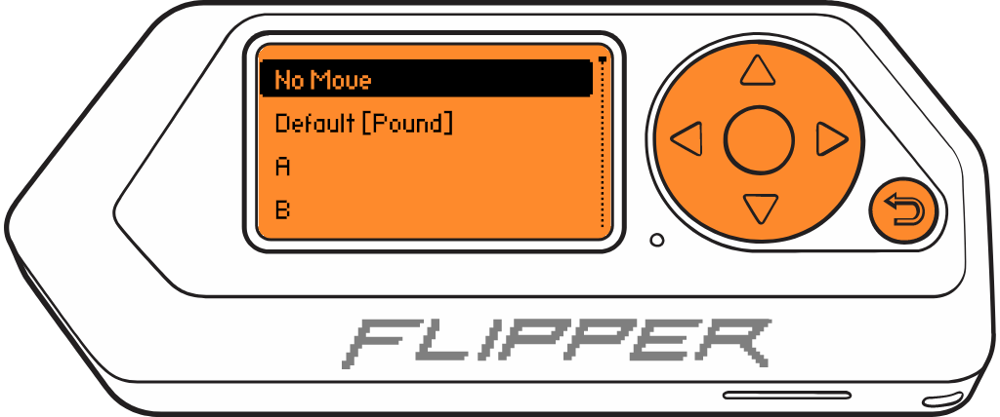
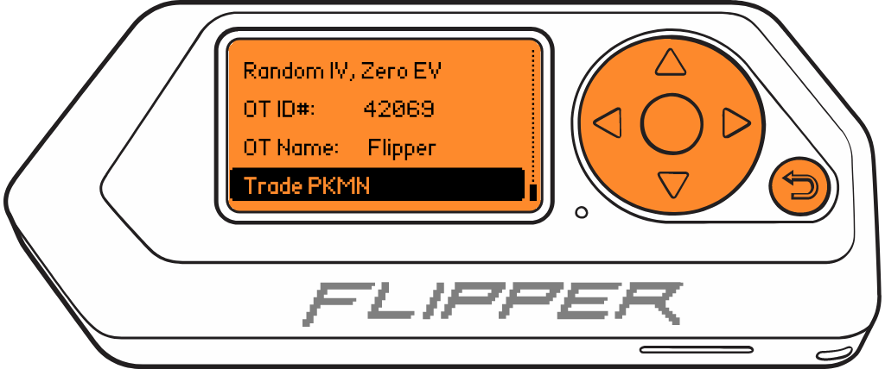

# 🐬 Flipper Zero - Pokemon Trading in Game Boy

<p align="center">
<a target="_blank" href="https://www.reddit.com/r/flipperzero/comments/121ncot/flipper_zero_game_boy_pokemon_trading/">
  
  <br />
</p>
<div align="center">

**FW Official** | **FW Unleashed** | **FW RogueMaster**
:- | :- | :- 
[](https://flipc.org/EstebanFuentealba/Flipper-Zero-Game-Boy-Pokemon-Trading?branch=main)|[](https://flipc.org/EstebanFuentealba/Flipper-Zero-Game-Boy-Pokemon-Trading?branch=main&firmware=unleashed)|[](https://flipc.org/EstebanFuentealba/Flipper-Zero-Game-Boy-Pokemon-Trading?branch=main&firmware=roguemaster)
</div>

## Introducción

Esta es una aplicación de intercambio de Pokemon's desde de Flipper Zero a Game Boy [(Generación I)](https://bulbapedia.bulbagarden.net/wiki/Generation_I). Flipper Zero emula un Game Boy "Esclavo" conectado a **Cable Game Link** para poder intercambiar cualquier Pokemon de la Primera Generación (Red, Blue, Yellow) a un Game Boy Real.

Es una Prueba de concepto (POC) para utilizar vistas, GPIO y FURI (Flipper Universal Registry Implementation).

## Instrucciones de instalación

Este proyecto está destinado a ser superpuesto encima de un repositorio de firmware existente, en mi caso la versión **Release 0.79.1**.

- Clona el [Repositorio del firmware de Flipper Zero](https://github.com/flipperdevices/flipperzero-firmware). Consulta este [tutorial](https://github.com/jamisonderek/flipper-zero-tutorials/tree/main/firmware/updating/README.md) para actualizar el firmware.
- Copia la [carpeta "pokemon"](..) en la carpeta `/applications_user/pokemon` del firmware que clonaste.
- Corre el comando `fbt launch` para correr en tu Flipper Zero.

```bash
./fbt launch APPSRC=pokemon
```

- NOTA: Si sólo quieres generar el archivo `fap` debes correr el siguiente comando.

```bash
./fbt fap_pokemon
```

y usa [**qFlipper**](https://flipperzero.one/update) para copiar el archivo **pokemon.fap** generado a la carpeta `SD Card/apps/Game Boy`.

<p align='center'>
<br />
</p>

## Instrucciones de Uso

Estas instrucciones asumen que estás comenzando desde el escritorio de Flipper Zero. De lo contrario, presiona el botón Atrás hasta que estés en el escritorio.

- Presiona el botón `OK` en Flipper para abrir el menú principal.
- Elige `Applications` en el menú.
- Selecciona `GPIO` en el submenú.
- Selecciona `Pokemon Trading`.
- Flipper Zero mostrará el menú principal de la aplicación. La primera opción es seleccionar el Pokémon a intercambiar.

  <p align='center'>
      <br />
      
      <br />
  </p>
- Presiona los botones `IZQUIERDA`/`DERECHA` para paginar la selección de Pokémon de a 1.
- Presiona los botones `ARRIBA`/`ABAJO` para paginar la selección de Pokémon de a 10.
- Presiona el botón `OK` para seleccionar el Pokémon a intercambiar y volver al menú principal.

  <p align='center'>
       <br />
      <br />
  </p>
- El nombre del Pokémon intercambiado se puede establecer. Cuando se selecciona un Pokémon, el nombre por defecto es el nombre de la especie en mayúsculas. Esto imita a un Pokémon sin un nombre personalizado. Para restablecer este nombre a su valor predeterminado, borra el campo de entrada de texto, presiona `OK` en el botón `Save`. Esto llenará el cuadro de texto con el nombre predeterminado. Presiona `Save` nuevamente para establecer este nombre.

    - **Nota**: Los nombres de Nidoran♀ y Nidoran♂ no se renderizan correctamente. Esto se debe a que Flipper actualmente no puede imprimir caracteres Unicode en la pantalla. Siguiendo las instrucciones anteriores, se llenará el campo de entrada de texto con `NIDORAN ` con un espacio después. Este espacio es el símbolo no renderizable ♀/♂. Una vez intercambiado, se mostrará correctamente.

    - **Nota**: Solo se admiten caracteres alfanuméricos en el nombre del Pokémon en este momento.

    <p align='center'>
        <br />
        
        <br />
    </p>
- También se puede ajustar el nivel del Pokémon presionando `OK` en la opción de nivel. El nivel mínimo es `2` y el máximo es `100`. El nivel se ingresa a través de un cuadro de texto. (Los niveles por debajo de 2 causan una falla de desbordamiento en los juegos de Gen I que haría que el nivel saltara a 100, así que si deseas esto, simplemente establece el nivel del Pokémon en 100).

  <p align='center'>
      <br />
      
      <br />
  </p>
- El menú `Select Moves` se utiliza para elegir los movimientos del Pokémon intercambiado. Están predefinidos con el conjunto de movimientos que el Pokémon conocería al nivel 1. Seleccionar una ranura de movimiento mostrará un índice alfabético de movimientos. Además, se pueden seleccionar rápidamente `No Move` y `Default`. Ten en cuenta que cualquier movimiento después del primer `No Move` se ignora.

  <p align='center'>
      <br />
      
      <br />
  </p>
  <p align='center'>
      <br />
      
      <br />
  </p>
- El menú `Select Types` puede cambiar los tipos del Pokémon intercambiado. Los tipos están predefinidos según lo que normalmente es el Pokémon seleccionado.

  - Los Pokémon con un solo tipo tendrán el mismo tipo establecido para ambos tipos.

  - **Nota**: A diferencia de otros menús, cambiar cualquiera de los tipos lo guarda inmediatamente. Presionar `Back` mantendrá los cambios. Esto se abordará en una versión posterior. Si necesitas volver a los tipos predeterminados, puedes seleccionar un Pokémon diferente y luego volver a seleccionar el Pokémon deseado.

  - **Nota**: Al cambiar los tipos, las estadísticas del Pokémon en el juego NO reflejarán los tipos elegidos. Además, estos pueden sobrescribirse de nuevo en el juego si el Pokémon usa un movimiento que afecta a los tipos (por ejemplo, `Transform`) o el Pokémon evoluciona.

    <p align='center'>
        <br />
        
        <br />
    </p>
- Las estadísticas del Pokémon también se pueden influir. Las configuraciones actuales son:

  - `Random IV, Zero EV`  Imita las estadísticas de un Pokémon salvaje atrapado.
  - `Random IV, Max EV / Level` IV es aleatorio, pero EV se establece en el máximo que un Pokémon entrenado podría tener para su nivel actual.
  - `Randon IV, Max EV` IV es aleatorio, EV se establece en el máximo absoluto para un Pokémon perfectamente entrenado.
  - `Max IV, Zero EV` Imita las estadísticas de un Pokémon salvaje atrapado, pero con el IV máximo posible.
  - `Max IV, Max EV / Level` IV es máximo, EV se establece en el máximo que un Pokémon entrenado podría tener para su nivel actual.
  - `Max IV, Max EV` Máximo Pokémon absolutamente perfectos y poderosos.

    <p align='center'>
        <br />
        
        <br />
    </p>

- También se puede configurar el `OT ID#` y el `OT Name` del Pokémon. El `OT ID#` debe estar entre `0` y `65535`. Establecer el `OT ID#` y el `OT Name` igual que tu entrenador actual hace que el juego crea que fue un Pokémon capturado en estado salvaje y no uno que se intercambió. Esto significa que los Pokémon de alto nivel seguirán obedeciéndote sin medallas, pero no obtendrán el aumento de experiencia de un Pokémon intercambiado.

  <p align='center'>
      <br />
      <br />
  </p>
  <p align='center'>
      <br />
      <br />
  </p>
- Finalmente, selecciona Intercambiar PKMN para iniciar el proceso de intercambio.

  <p align='center'>
      <br />
      <br />
  </p>
  <p align='center'>
      <br />
      <br />
  </p>
- En tu Game Boy, debes conectar el **Game Link Cable** a la Game Boy y, en el juego, ve al **Pokemon Center** más cercano.

  <p align='center'>
      <br />
      <br />
  </p>
- Habla con la chica en el mostrador de la derecha. La chica nos dirá que tenemos que guardar el juego antes de jugar, responderemos **YES** presionando el botón **A**.

  <p align='center'>
      <br />
      <br />
  </p>
- Flipper Zero mostrará que estamos conectados.

  <p align='center'>
      <br />
      <br />
  </p>
- En la Game Boy, se nos preguntará qué opción queremos, y seleccionamos **TRADE CENTER**.

  <p align='center'>
      <br />
      <br />
  </p>
- Ingresarás al Centro de Intercambio donde debes presionar el botón A en la Game Boy en tu lado de la mesa.

  <p align='center'>
      <br />
      <br />
  </p>
- Flipper Zero permanecerá en una pantalla de espera con el Pokémon que seleccionaste.

  <p align='center'>
      <br />
      <br />
  </p>
- Verás tu Pokémon y el Pokémon que seleccionaste en Flipper Zero, en este caso, `Mew`. Debes seleccionar el Pokémon que deseas intercambiar y presionar **TRADE**.

  <p align='center'>
      <br />
      <br />
  </p>
- Debes confirmar el intercambio seleccionando **TRADE**.

  <p align='center'>
      <br />
      <br />
  </p>
- Flipper Zero permanecerá en una pantalla de espera con el Pokémon que seleccionaste.

  <p align='center'>
      <br />
      <br />
  </p>
- Finalmente, el intercambio de Pokémon comenzará desde **Flipper Zero** hacia la **Game Boy**.

  <p align='center'>
      <br />
      <br />
  </p>
- Si Flipper Zero se queda atascado al final del intercambio, debes reiniciarlo presionando la combinación de teclas  `IZQUIERDA` +  `ATRÁS`.

  <p align='center'>
      <br />
      <br />
  </p>

## ¿Cómo trabaja?

El método utilizado para comunicar 2 Game Boy se basa en el protocolo SPI, que es un protocolo de comunicación serial muy simple en el que un dispositivo maestro se comunica con uno o más dispositivos esclavos. El protocolo es bidireccional y sincrónico, y utiliza tres señales básicas:

- Una señal de reloj (CLK).
- Una señal de salida (Serial Out o SO).
- Una señal de entrada (Serial In o SI).

En el Game Boy, los juegos almacenan los datos en un registro de cambio interno que se utiliza para enviar y recibir información. El protocolo SPI utilizado por el Game Boy utiliza la señal de reloj para indicar cuándo se transfieren los datos.

El protocolo de enlace de Game Boy es síncrono y requiere que el dispositivo esclavo responda al mismo ritmo que el dispositivo maestro. El dispositivo maestro suministra un reloj de 8KHz (velocidad de transferencia de datos de 1KB/s). La ventana de tiempo para responder es de solo **~120μs**. Sin embargo, el dispositivo esclavo no tiene restricciones y puede responder cuando recibe los datos. El reloj puede variar y no hay un límite inferior.

<p align='center'>
<br />
<br />
</p>

_Una transferencia de ejemplo de GB SPI. Aquí, el maestro envía 0xD9 (217) y el esclavo envía 0x45 (69)._

<br />

Se puede conocer mas al respecto en el siguiente Video [**Analyzing the Different Versions of the Link Cable**](https://youtu.be/h1KKkCfzOws?t=151).

## Placa para Flipper Zero con Socket PortData EXT Link

Para la placa del Fipper Zero se utilizó un [PortData EXT Link](https://es.aliexpress.com/item/1005004116983895.html) y una [place de prototipo](https://es.aliexpress.com/item/32478242317.html) de 2x8.

<p align='center'>
<br />
<br />
</p>

_PortData EXT Link para Game Boy Color, Game Boy Pocket, GBC, GBP, GBL._

<p align='center'>
<br />
<br />
</p>
<p align='center'>
<br />
<br />
</p>
Usé una resistencia de 33kΩ en CLK, pero es opcional, se puede conectar directamente.

## Conexión: Flipper Zero GPIO - Game Boy

Se deben conectar los Pines de la siguiente manera

<p align='center'>
<br />
<br />
</p>

<picture>
    <source media="(prefers-color-scheme: dark)" srcset="./docs/images/GPIO-GBPIN_light-v2.png">
    <source media="(prefers-color-scheme: light)" srcset="./docs/images/GPIO-GBPIN-v2.png">
    
</picture>

| Cable Game Link (Socket) | Flipper Zero GPIO |
| ------------------------ | ----------------- |
| 6 (GND)                  | 8 (GND)           |
| 5 (CLK)                  | 6 (B2)            |
| 3 (SI)                   | 7 (C3)            |
| 2 (SO)                   | 5 (B3)            |


## Conectar a Flipper Zero sin Socket PortData EXT Link

Pudes cortar un cable directamente sin usar el socket pero debes tener en cuenta que el es un cable cruzado SI-SO.

<p align='center'>
<br />
<br />
</p>

*"Cable Game Link" cortado y conectado directamente a los pines de Flipper Zero.*


**NOTA**: No guiarse por los colores porque dependiendo del fabricante estos pueden cambiar, con un multímetro medir continuidad e identificar que cable es de que pin


## GUI

Para generar la Interfaz gráfica se utilizó la herramienta [**FUI-Editor**](https://ilin.pt/stuff/fui-editor/).
Además se utilizaron los sprites originales del juego _Pokemon Yellow_ que se encuentran en el repositorio [**Disassembly of Pokemon Yellow**](https://github.com/pret/pokeyellow/tree/master/gfx/pokemon/front).

De cada imagen se transformó el color `#aaa` a `#fff` para que Flipper Zero la renderizara bien. Para eso se utilizó un **Batch** para [Photopea](https://www.photopea.com/), el editor de imagenes online.

##  Implementado en
- Game Boy Color (GBC)
- Game Boy Advance (GBA)

## Contribuidores
<a href="https://github.com/EstebanFuentealba/Flipper-Zero-Game-Boy-Pokemon-Trading/">EstebanFuentealba</a><br />
<a href="https://github.com/R4g3D/Flipper-Zero-Game-Boy-Pokemon-Trading/">R4g3D</a><br />
<a href="https://github.com/kbembedded/Flipper-Zero-Game-Boy-Pokemon-Trading/">kbembedded</a>

## Links

- [Flipper Zero firmware source code](https://github.com/flipperdevices/flipperzero-firmware)
- Adan Scotney's pokemon [trade protocol specification](http://www.adanscotney.com/2014/01/spoofing-pokemon-trades-with-stellaris.html) and implementation
- Derek Jamison - [Youtube Channel](https://www.youtube.com/@MrDerekJamison)
- Matt Penny - [GBPlay Blog](https://blog.gbplay.io/)
- [Pokémon data structure (Generation I)](<https://bulbapedia.bulbagarden.net/wiki/Pok%C3%A9mon_data_structure_(Generation_I)>)
- [Disassembly of Pokemon Yellow](https://github.com/pret/pokeyellow)
- [Arduino-Spoofing-Gameboy-Pokemon-Trades](https://github.com/EstebanFuentealba/Arduino-Spoofing-Gameboy-Pokemon-Trades)
- [🎮 Gameboy link cable breakout PCB](https://github.com/Palmr/gb-link-cable)

<p align='center'>
<br />
<br />
Desde Talcahuano 🇨🇱 con ❤ 
</p>
