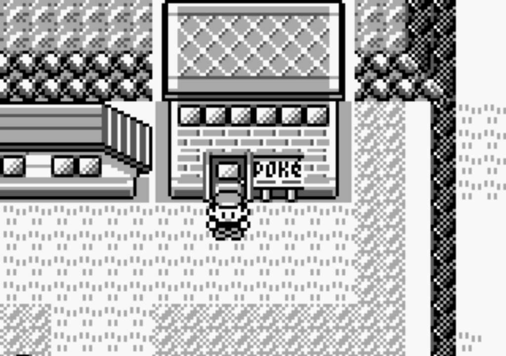
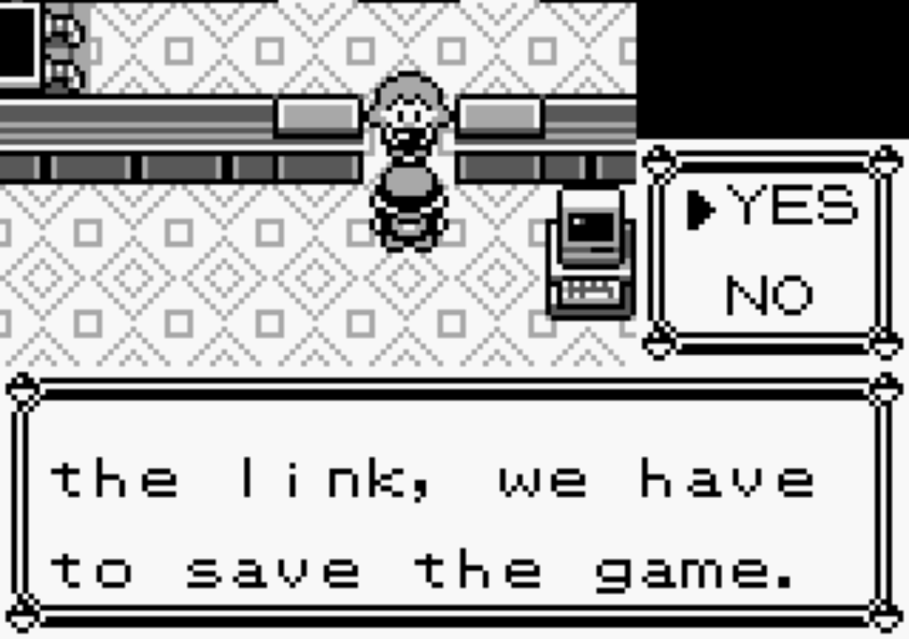
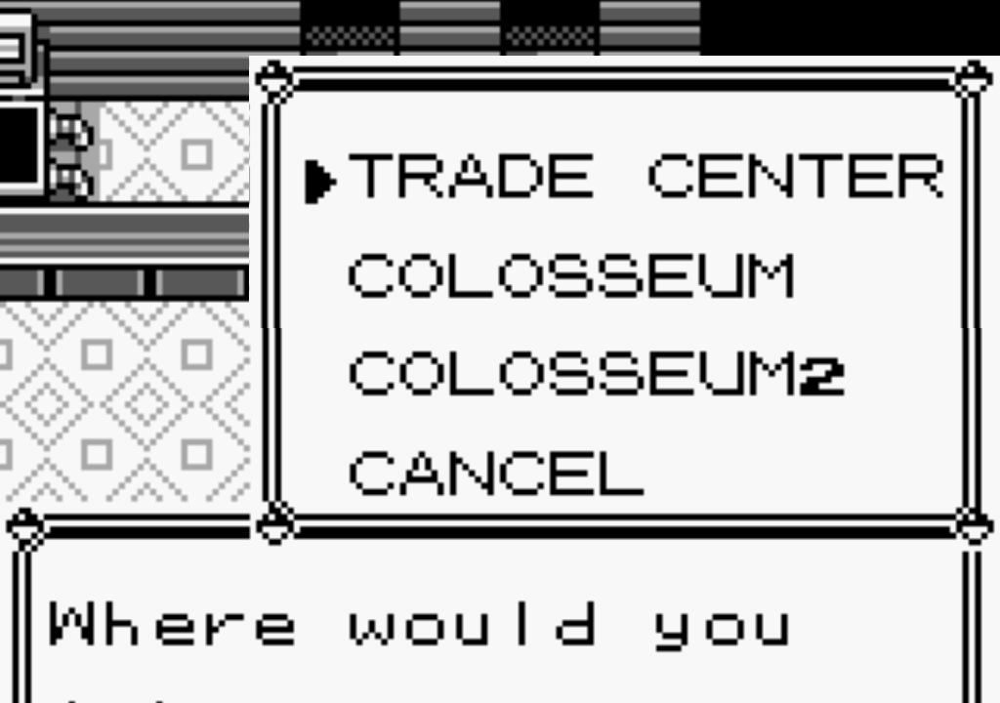
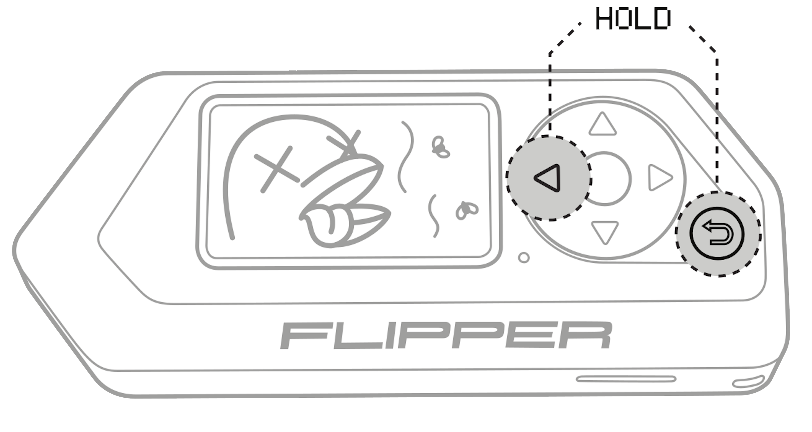
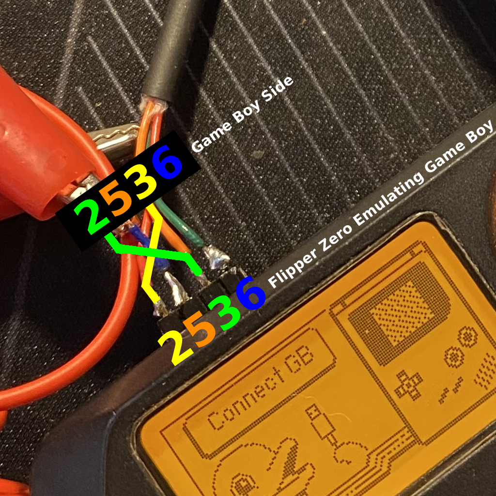

# 🐬 Flipper Zero - Pokemon Trading in Game Boy

<p align="center">
<a target="_blank" href="https://www.reddit.com/r/flipperzero/comments/121ncot/flipper_zero_game_boy_pokemon_trading/">
  
  <br />
</p>
<div align="center">

**FW Official** | **FW Unleashed** | **FW RogueMaster**
:- | :- | :- 
[](https://flipc.org/EstebanFuentealba/Flipper-Zero-Game-Boy-Pokemon-Trading?branch=main)|[](https://flipc.org/EstebanFuentealba/Flipper-Zero-Game-Boy-Pokemon-Trading?branch=main&firmware=unleashed)|[](https://flipc.org/EstebanFuentealba/Flipper-Zero-Game-Boy-Pokemon-Trading?branch=main&firmware=roguemaster)
</div>

## Introducción

Esta es una aplicación de intercambio de Pokemon's desde de Flipper Zero a Game Boy [(Generación I)](https://bulbapedia.bulbagarden.net/wiki/Generation_I). Flipper Zero emula un Game Boy "Esclavo" conectado a **Cable Game Link** para poder intercambiar cualquier Pokemon de la Primera Generación (Red, Blue, Yellow) a un Game Boy Real.

Es una Prueba de concepto (POC) para utilizar vistas, GPIO y FURI (Flipper Universal Registry Implementation).

## Instrucciones de instalación

Este proyecto está destinado a ser superpuesto encima de un repositorio de firmware existente, en mi caso la versión **Release 0.79.1**.

- Clona el [Repositorio del firmware de Flipper Zero](https://github.com/flipperdevices/flipperzero-firmware). Consulta este [tutorial](https://github.com/jamisonderek/flipper-zero-tutorials/tree/main/firmware/updating/README.md) para actualizar el firmware.
- Copia la [carpeta "pokemon"](..) en la carpeta `/applications_user/pokemon` del firmware que clonaste.
- Corre el comando `fbt launch_app` para correr en tu Flipper Zero.

```bash
./fbt launch_app APPSRC=pokemon
```

- NOTA: Si sólo quieres generar el archivo `fap` debes correr el siguiente comando.

```bash
./fbt fap_pokemon
```

y usa [**qFlipper**](https://flipperzero.one/update) para copiar el archivo **pokemon.fap** generado a la carpeta `SD Card/apps/Game Boy`.

<p align='center'>
<br />
</p>

## Instrucciones de Uso

Estas instrucciones asumen que está comenzando en el escritorio de Flipper Zero. De lo contrario, presione el botón Atrás hasta que esté en el escritorio.

- Presione el botón `OK` en el flipper para abrir el menú principal.
- Elija `Aplicaciones` en el menú.
- Elija `Game Boy` en el submenú.
- Elija `Pokemon Trading`
- El Flipper Zero debe mostrar la selección de Pokemon que se desea intercambiar y por defecto parece bulbasaur.

    <p align='center'>
        <br />
        
        <br />
    </p>

- Pulse los botones `IZQUIERDA`/`DERECHA` para paginar de 1 en 1 la selección de Pokemon.
- Pulse los botones `ARRIBA`/`ABAJO` para paginar de 10 en 10 la selección de Pokemon.
- Pulse el botón `OK` para seleccionar el Pokemon a Intercambiar.
    <p align='center'>
         <br />
        <br />
    </p>
- En el Flipper Zero se muestra la vista para conectar el Game Boy.
    <p align='center'>
        <br />
        <br />
    </p>
- En tu Game Boy debes conectar el **Cable Game Link** al Game Boy, en el juego dirigirte a un **Centro Pokémon** que tengas más cercano.
    <p align='center'>
        <br />
        <br />
    </p>
- Habla con la chica que está en el mostrador de la derecha. La chica nos dirá que para poder jugar antes tendremos que salvar el juego, le contestaremos que _SI_ pulsando el botón _A_.
    <p align='center'>
        <br />
        <br />
    </p>
- El Flipper Zero nos mostrará que estámos conectados.
    <p align='center'>
        <br />
        <br />
    </p>
- En el Game Boy nos preguntará que opción queremos y Seleccionamos **CENT. CAMBIO**.
    <p align='center'>
        <br />
        <br />
    </p>
- Entrarás a la sala de Intercambio donde debes presionar el botón A del Game Boy en el lado de tu mesa.
    <p align='center'>
        <br />
        <br />
    </p>
- Flipper Zero quedará en una pantalla de espera con el Pokemon que seleccionaste.
    <p align='center'>
        <br />
        <br />
    </p>
- Se te mostrarán tus Pokemon y el Pokemon que seleccionaste en el Flipper Zero, en este Caso **Mew**. Debes seleccionar el pokemon que quieres intercambiar y presionar **TRATO**.
    <p align='center'>
        <br />
        <br />
    </p>
- Debes confirmar el intercambio seleccionado **TRATO**.
    <p align='center'>
        <br />
        <br />
    </p>
- Flipper Zero quedará en una pantalla de espera con el Pokemon que seleccionaste.
    <p align='center'>
        <br />
        <br />
    </p>
- Finalmente comenzará el intercambio de Pokemon desde **Flipper Zero** al **Game Boy**.
    <p align='center'>
        <br />
        <br />
    </p>
- **NOTA**: Si al final del Intercambio se te bloquea el Flipper Zero debes Rebootear presionando la combinación de teclas  IZQUIERDA +  ATRAS
    <p align='center'>
        <br />
        <br />
    </p>

## ¿Cómo trabaja?

El método utilizado para comunicar 2 Game Boy se basa en el protocolo SPI, que es un protocolo de comunicación serial muy simple en el que un dispositivo maestro se comunica con uno o más dispositivos esclavos. El protocolo es bidireccional y sincrónico, y utiliza tres señales básicas:

- Una señal de reloj (CLK).
- Una señal de salida (Serial Out o SO).
- Una señal de entrada (Serial In o SI).

En el Game Boy, los juegos almacenan los datos en un registro de cambio interno que se utiliza para enviar y recibir información. El protocolo SPI utilizado por el Game Boy utiliza la señal de reloj para indicar cuándo se transfieren los datos.

El protocolo de enlace de Game Boy es síncrono y requiere que el dispositivo esclavo responda al mismo ritmo que el dispositivo maestro. El dispositivo maestro suministra un reloj de 8KHz (velocidad de transferencia de datos de 1KB/s). La ventana de tiempo para responder es de solo **~120μs**. Sin embargo, el dispositivo esclavo no tiene restricciones y puede responder cuando recibe los datos. El reloj puede variar y no hay un límite inferior.

<p align='center'>
<br />
<br />
</p>

_Una transferencia de ejemplo de GB SPI. Aquí, el maestro envía 0xD9 (217) y el esclavo envía 0x45 (69)._

<br />

Se puede conocer mas al respecto en el siguiente Video [**Analyzing the Different Versions of the Link Cable**](https://youtu.be/h1KKkCfzOws?t=151).

## Placa para Flipper Zero con Socket PortData EXT Link

Para la placa del Fipper Zero se utilizó un [PortData EXT Link](https://es.aliexpress.com/item/1005004116983895.html) y una [place de prototipo](https://es.aliexpress.com/item/32478242317.html) de 2x8.

<p align='center'>
<br />
<br />
</p>

_PortData EXT Link para Game Boy Color, Game Boy Pocket, GBC, GBP, GBL._

<p align='center'>
<br />
<br />
</p>
<p align='center'>
<br />
<br />
</p>
Usé una resistencia de 33kΩ en CLK, pero es opcional, se puede conectar directamente.

## Conexión: Flipper Zero GPIO - Game Boy

Se deben conectar los Pines de la siguiente manera

<p align='center'>
<br />
<br />
</p>

<picture>
    <source media="(prefers-color-scheme: dark)" srcset="./docs/images/GPIO-GBPIN_light-v2.png">
    <source media="(prefers-color-scheme: light)" srcset="./docs/images/GPIO-GBPIN-v2.png">
    
</picture>

| Cable Game Link (Socket) | Flipper Zero GPIO |
| ------------------------ | ----------------- |
| 6 (GND)                  | 8 (GND)           |
| 5 (CLK)                  | 6 (B2)            |
| 3 (SI)                   | 7 (C3)            |
| 2 (SO)                   | 5 (B3)            |


## Conectar a Flipper Zero sin Socket PortData EXT Link

Pudes cortar un cable directamente sin usar el socket pero debes tener en cuenta que el es un cable cruzado SI-SO.

<p align='center'>
<br />
<br />
</p>

*"Cable Game Link" cortado y conectado directamente a los pines de Flipper Zero.*


**NOTA**: No guiarse por los colores porque dependiendo del fabricante estos pueden cambiar, con un multímetro medir continuidad e identificar que cable es de que pin


## GUI

Para generar la Interfaz gráfica se utilizó la herramienta [**FUI-Editor**](https://ilin.pt/stuff/fui-editor/).
Además se utilizaron los sprites originales del juego _Pokemon Yellow_ que se encuentran en el repositorio [**Disassembly of Pokemon Yellow**](https://github.com/pret/pokeyellow/tree/master/gfx/pokemon/front).

De cada imagen se transformó el color `#aaa` a `#fff` para que Flipper Zero la renderizara bien. Para eso se utilizó un **Batch** para [Photopea](https://www.photopea.com/), el editor de imagenes online.

##  Implementado en
- Game Boy Color (GBC)
- Game Boy Advance (GBA)

## Implementado por
<a href="https://github.com/EstebanFuentealba/Flipper-Zero-Game-Boy-Pokemon-Trading/issues?q=is%3Aissue+label%3AImplemented+is%3Aclosed+is%3Aopen+" target="_blank"></a>

## TODO

- [ ] Refactorizar el código
- [ ] Al salir de la app el botón `OK` deja de funcionar por lo que hay que reiniciarlo 🤔
- [ ] Setear a cada pokemon sus características, ataques, niveles por defecto
- [ ] Mejorar animaciones

## Links

- [Flipper Zero firmware source code](https://github.com/flipperdevices/flipperzero-firmware)
- Adan Scotney's pokemon [trade protocol specification](http://www.adanscotney.com/2014/01/spoofing-pokemon-trades-with-stellaris.html) and implementation
- Derek Jamison - [Youtube Channel](https://www.youtube.com/@MrDerekJamison)
- Matt Penny - [GBPlay Blog](https://blog.gbplay.io/)
- [Pokémon data structure (Generation I)](<https://bulbapedia.bulbagarden.net/wiki/Pok%C3%A9mon_data_structure_(Generation_I)>)
- [Disassembly of Pokemon Yellow](https://github.com/pret/pokeyellow)
- [Arduino-Spoofing-Gameboy-Pokemon-Trades](https://github.com/EstebanFuentealba/Arduino-Spoofing-Gameboy-Pokemon-Trades)
- [🎮 Gameboy link cable breakout PCB](https://github.com/Palmr/gb-link-cable)

<p align='center'>
<br />
<br />
Desde Talcahuano 🇨🇱 con ❤ 
</p>
