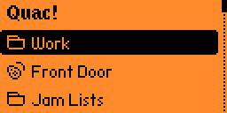
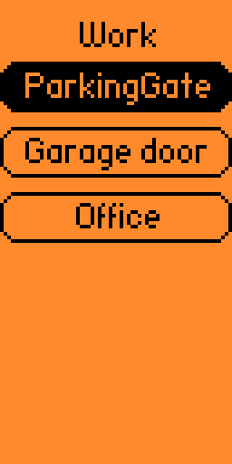

# Quac! Remote

## Quick Action Remote Control for Flipperzero

[Latest Version: 0.6](https://github.com/rdefeo/quac/releases)


This app allows you to organize previously recorded signals, of any type*, so that you can quickly and easily play them back. No more needing to recall whether that door is Sub-GHz or RFID! Just navigate to that action in **Quac!** and press OK to send!

The app does not provide any recording functionality - you must use the existing Flipperzero apps to create the saved files for your action/device. Quac! provides some basic functionality to manage your files. Or, you can manage the folder structure manually on your SD card.

> Support files include: Sub-Ghz (.sub), RFID (.rfid), Infrared (.ir), and NFC (.nfc)

## Features

* [Playback of rfid, sub-ghz, IR, NFC signals](README.md#signal-playback)
* [Easy navigation](README.md#navigation--controls)
* [Flexible signal organization](README.md#signal-organization) - utilizing the SDcard filesystem
* [In-app file management](README.md#action-settings) - rename, delete, import
* [Playlist support](README.md#playlists)
* [Flexible naming/sorting, hidden file/folder support](README.md#sorting-and-naming)
* [Customizable UI](README.md#application-settings)

## Screenshots




## Navigation / Controls

* Pressing `OK` on a folder label will open/navigate to that folder and display it's contents
* Pressing `OK` on a signal will transmit that signal
* Pressing `Back` will take you up one folder
* Pressing `Up` and `Down` will, you know, select things up and down...
* Long pressing `Right` will open that item's settings: Rename, Delete, Import Here, Create Group

## Signal playback

The signal files are played back as recorded. During playback/transmit, the LED light will flash blue until the action is complete. For RFID signals, they are continuously played back for 2.5 seconds, by default. This can be changed in [application Settings](README.md#application-settings).

## Signal Organization

The key to organizing your Quac! interface is to organize your `/ext/apps_data/quac` folder structure. The UI is derived directly from the filesystem structure. Every individual file/signal is given a label on screen. And every folder/directory is a logical group of more files/folders. Selecting a group in the UI will show you the contents of that folder. There is no limit on the number of actions or folders - nest as deep as you want!

You can organize your files by device type, or by function. For example, you may have a folder of "TV" actions, which correspond to Channel Up, Channel Down, Volume Up, Volume Down, etc. Or you may have a "Work Access" folder, which contains files/actions that correspond to Parking Gate, Garage Door, Lobby Entrance.

The files in a folder can be of mixed types. **This is Quac!'s main strength!** So continuing with the "Work Access" example, the Parking Gate can be Sub-Ghz and the Garage Door can be RFID.

Here's an example file layout for the screenshots above:

```text
/ext/apps_data/quac
  /00_Work
    00_ParkingGate.sub
    01_Garage_door.rfid
    02_Office.rfid
  01_Front_Door.rfid
  /02_Jam_Lists
     00_Gate_Spam.qpl
     01_TVs_OFF.qpl
     02_my_Playlist.qpl
```

## Action Settings

Long pressing the `Right` button will launch a settings menu for the currently selected action. This provides the following options:

* Rename: Allows you to rename the selected item. Useful for changing sorting order. The file extension is preserved on signal files. **Note: folder renaming is broken right now**
* Delete: Deletes files and folders - folders must be empty
* Import Here: Launches file browser to let you select a signal file from anywhere on the SDcard and then copies it to the current folder.
  * When importing an IR file, you are prompted to select which IR command to import. This individual command is imported as it's own `.ir` file into the current location.
* Create Group: Prompts for the name of a new folder that will be created at that point in the folder structure.

## Playlists

You can chain multiple signal playback actions together by creating a playlist. Simply create a text file, with extension `.qpl`, which contains a list of paths to the signals you wish to transmit - they will be played sequentially. Playlist names show up as clickable action, like all other individual signals/actions. Playlist files feature the following:

* Comments: lines that start with a `#` are ignored
* `pause <ms>` on a line will pause the playback by the specified millisecond duration
* Signal file names can be absolute (full path) or relative to the current directory
* RFID files can have an optional duration specified. Simply add a space, followed by a millisecond duration. This duration will override the Quac! Settings value, just for this one signal.

Errors found in the playlist will halt playback and vibrate the Flipper. Blank lines are ignored.

Here's an example playlist called `/ext/apps_data/quac/arrive_home.qpl`:

```text
# Home arrival playlist

.exterior_light_on.sub
.side_door_unlock.sub

pause 2500

/ext/apps_data/quac/03_Stereo/00_On.sub
/ext/apps_data/quac/06_Lights/Disco_Ball.sub

Lava_Lamp.rfid 4000
```

The first two `.sub` files live in the `/ext/apps_data/quac` folder, which is where `arrive_home.qpl` is located, and will not show up in any UI screen since they are hidden (start with a `.`). Next, we pause the playlist for 2.5 sec. The next two files live elsewhere, but can still be referenced by the playlist. Lastly, the RFID signal is transmitted for 4000ms, instead of the duration listed in Quac! Settings.

## Sorting and Naming

The list view UI is based on the sorted file and folder order. This is enforced by sorting the actual filenames. When there are cases where you need to force a specific order, you can prepend the file and folder names with `XX_` where `X` is a digit between 0-9. This will let you place an action called `On` before `Off`, even though when sorted alphabeticaly, `Off` would come before `On`. Therefore, you would name your files `00_On.rfid` and `01_Off.rfid`. But that looks ugly! When the files and folders are rendered for display, any `XX_` prefix will be stripped. All underscores will be replaced with spaces. Extensions will be stripped. Casing is preserved. Additionally, all files and folders that begin with a `.` will be ignored when drawing the UI - these are "hidden" files. However, they can still be referenced in playlists. This keeps the UI uncluttered.

## Application Settings



The settings menu will appear as the last item when you are viewing the "root" directory. Within the settings you can control:

* Layout: Switch between Horizontal and Vertical layout
* Show Icons: Toggles display of all icons
* Show Headers: Toggles display of header/folder text at the top, giving you room for one more item on screen!
* RFID Duration: Changes the length of time a RFID signal is transmitted. Within playlists, this can be overridden per `.rfid` file.
* NFC Duration: Changes the length of time a NFC signal is transmitted. Within playlists, this can be overridden per `.nfc` file.
* SubGhz Ext Ant: Whether to try using the external antenna for sub-ghz signals. If this is "Enabled" but no external antenna is attached, or the external antenna can't be accessed, Quac! will fall back to using the internal antenna.
* Show Hidden: Will display files and folders that start with a period (`.`)
* About: Application info

## On deck

* suggestions??

## Building / Install

This app is currently built with `ufbt`, intended for the stock firmware. I have not tested this on other firmwares. The `.fap` file can be found in the Releases section on the right.

<a href="https://www.buymeacoffee.com/rdefeo" target="_blank"></a>
