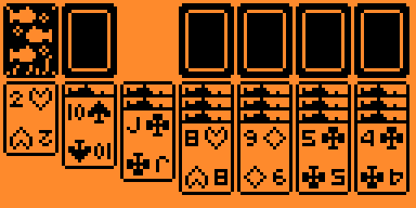

# Solitaire game for Flipper Zero

### Shortcuts
* Long press up skips the navigation inside the bottom column
* Long press center to automatically place the card to the top rigth section

## Building
> The app should be compatible with the official and custom flipper firmwares. If not, follow these steps to build it
> yourself
* Download your firmware's source code
* Clone the repository recursively `git clone REPO_URL --recursive` into the firmware's applications_user folder
* Navigate into the firmwares root folder
* Make sure you can use
  the [Fipper build tool](https://github.com/flipperdevices/flipperzero-firmware/blob/dev/documentation/fbt.md)
* To build the project, type this into your console:
  #### Linux
  > ./fbt fap_{APP_NAME}
  #### Windows
  > fbt.cmd fap_{APP_NAME}
* the finished build will be in the following location, copy this into your SD card:
  > build\f7-firmware-D\.extapps\blackjack.fap
