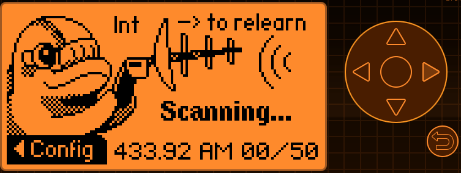

# TPMS application for [Flipper Zero](https://flipperzero.one/)

## Features
- Read [TPMS](https://en.wikipedia.org/wiki/Tire-pressure_monitoring_system) sensors
- Relearn by 125kHz signal

####  Supported sensors
* Schrader GG4
* Abarth 124 (soon)

## How to use
In some circumstances TPMS sensors should transmit message periodically (car moving) or by event (emergency pressure reduction or temperature increase), so it can be caught.

While the car is stationary or sensor is not mounted into tire, Relearn mode can be enabled by emitting 125kHz signal. Keep sensor housing or valve near Flipper Zero`s back, like RFID card and push Right button to activate relearn signal for 1 second.

When sensor transmit message, you will see jumps of RSSI meter.
If sensor is supported and correct frequency and modulation was set, an item with Model and ID will be added for each sensor.

Pressing OK displays temperature and pressure.

Feel free to contribute via PR or report issue

Code based on [weather station app](https://github.com/flipperdevices/flipperzero-firmware/tree/dev/applications/external/weather_station)
