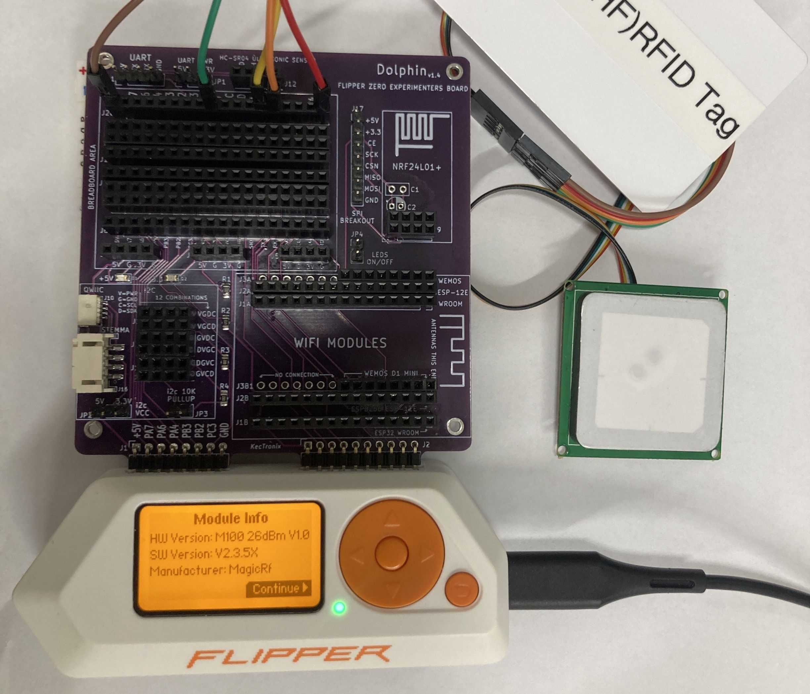

# [UHF]RFID App for FlipperZero

  
  

## Overview

This repository contains a UHF RFID application developed for FlipperZero, a versatile multi-tool device. The app leverages the YRM100 module to enable UHF RFID functionality.

## What's Ongoing

Working on the settings page to allow for changing of the module's settings.
Adding options like settings the access password, baud rate, rf power, channel, etc.

## What's Changed

- Added a settings page to allow for changing of the module's settings.
- Added options like baud rate, rf power, region; more to come.
- Tx communication is much more stable and faster now; more improvements to come.
- Bug fixes and improvements.

## Features

- [x] Read Single UHF RFID tag
  - [x] EPC Bank
  - [x] TID Bank
  - [x] USER Bank
- [x] View saved UHF RFID tags
- [x] Write Single UHF RFID tag
  - [x] EPC Bank
  - [ ] TID Bank (Not Supported if locked)
  - [x] USER Bank
- [ ] Change Module setting parameters **(In Progress)**
  - [x] Set Baudrates
  - [x] Set RF Power
  - [x] Set Region
  - [ ] Set/Reset Access Password
  - [ ] Set Kill Password
  - [ ] Kill Tag
- [ ] Edit/Create new data to write.
- Extras
  - [ ] Read multiple tags at once
  - [ ] View multiple on a list view

## Requirements

To run this application on FlipperZero, you will need:

- FlipperZero device (purchase from [Flipper Devices](https://www.flipperdevices.com))
- YRM100 UHF RFID module (purchase from [Ali-Express](https://www.aliexpress.com/item/1005005296512846.html))

## Setup and Installation

1. Ensure you have set up your FlipperZero device with the YRM100 module properly. You can also read more about how to setup the module from the [Md5Stack Docs page](http://docs.m5stack.com/en/unit/uhf_rfid).
   
2. Clone this repository to the `applications_user` folder of your flipper firmware of your choice
3. If you have VSCode setup with your flipper firmware.
   - ### Windows
     1. Press `Ctrl+Shift+B` on vscode while in the uhf_app folder
     2. Select the `Launch App on Flipper` option. And watch as the app launches on your flipper
     - If you don't have vscode setup you can use the cli command `./fbt COMPACT=1 DEBUG=0 launch APPSRC=applications_user\uhf_rfid`
   - ### MacOS
     ... tbd

## Usage

1. Power on your FlipperZero device.
2. Connect the uhf module to the flipper via gpio.
3. Navigate to the UHF RFID app on FlipperZero's menu.
4. Currently Read for EPC, TID, USER Banks are supported, as well as saving and Writing EPC, USER Banks
   ... will further update this page as it development goes

## Contributions

As this app is still in the development stage, I welcome contributions to this project. If you find any issues or want to enhance the application, feel free to create a pull request.

## Disclaimer

- This application is provided as-is and may contain bugs or issues.
- Use it at your own risk.
- I am not responsible for any damage or loss caused by the usage of this app.

## Extra Resources

- [MagicRF M100&QM100_Firmware_manual_en.pdf](assets/res/MagicRF_M100&QM100_Firmware_manual_en.pdf)
- [TDS_1_9_Standard.pdf](assets/res/TDS_1_9_Standard.pdf)
- [M5Stack Docs](https://docs.m5stack.com/en/unit/uhf_rfid)
- [MagicRF Chip DS](http://www.magicrf.com/product_en.htm)

## Contact

For any inquiries or support, you can reach out to us at :

- Personal Email : [frux.infoc@gmail.com](mailto:frux.infoc@gmail.com)
- Discord Server: [Flipper Zero Tutorial-Unoffical by @jamisonderek](https://discord.gg/REunuAnTX9)
- Discord User: [frux.c]()
