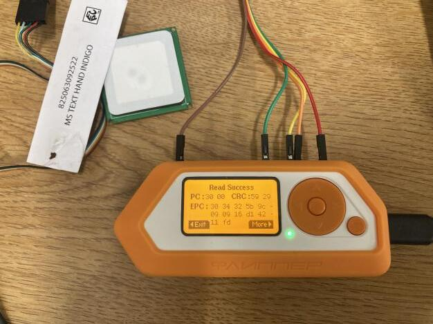

# [UHF]RFID App for FlipperZero



## Overview

This repository contains a UHF RFID application developed for FlipperZero, a versatile multi-tool device. The app leverages the YRM100 module to enable UHF RFID functionality.

## Features

- [x] Read Single UHF RFID tag.
- [x] View saved UHF RFID tag.
- [ ] Write Single UHF RFID tag. __(in progress)__
- [ ] Change Module setting parameters.
- [ ] Easy-to-use interface on FlipperZero's display.
    - Extras
        - [ ] Read multiple tags at once
        - [ ] View multiple on a list view

## Requirements

To run this application on FlipperZero, you will need:

- FlipperZero device (purchase from [Flipper Devices](https://www.flipperdevices.com))
- YRM100 UHF RFID module (purchase from [Ali-Express](https://www.aliexpress.com/item/1005005296512846.html))

## Setup and Installation

1. Ensure you have set up your FlipperZero device with the YRM100 module properly. You can also read more about how to setup the module from the [Md5Stack Docs page](http://docs.m5stack.com/en/unit/uhf_rfid).
   
2. Clone this repository to the `applications_user` folder of your flipper firmware of your choice
3. If you have VSCode setup with your flipper firmware.
   - ### Windows
     1. Press `Ctrl+Shift+B` on vscode while in the uhf_app folder
     2. Select the `Launch App on Flipper` option. And watch as the app launches on your flipper
     - If you don't have vscode setup you can use the cli command `./fbt COMPACT=1 DEBUG=0 launch APPSRC=applications_user\uhf_rfid`
   - ### MacOS
     ... tbd

## Usage

1. Power on your FlipperZero device.
2. Connect the uhf module to the flipper via gpio.
3. Navigate to the UHF RFID app on FlipperZero's menu.
4. Currently Reading the EPC tag is the only usable option
... will further update this page as it development goes

## Contributions

As this app is still in the development stage, I welcome contributions to this project. If you find any issues or want to enhance the application, feel free to create a pull request.

<!-- ## License

This project is licensed under the [MIT License](link_to_license_file). -->

## Future Plans
- Code cleanup
- Build a framework around the chip communication commands
- Build a proper tag class
```c
// Ideal concept
#include <stdint.h>
#include <stdio.h>
#include <string.h>

typedef struct {
    int uart_fd; // UART file descriptor or other identifier
} YRM100_RFID;

void sendCommand(YRM100_RFID *rfid, const uint8_t *command, size_t length) {
    // Implementation to send the command through UART
    // Write the command to the UART interface using rfid->uart_fd
}

// Configuration functions:

void setCommunicationBaudRate(YRM100_RFID *rfid) {
    uint8_t command[] = {0xBB, 0x00, 0x11, 0x00, 0x02, 0x00, 0xC0, 0xD3, 0x7E};
    sendCommand(rfid, command, sizeof(command));
}

void setWorkingArea(YRM100_RFID *rfid, uint8_t area) {
    uint8_t command[] = {0xBB, 0x00, 0x07, 0x00, 0x01, area, 0x09, 0x7E}; 
    sendCommand(rfid, command, sizeof(command));
}

// other method etc ... 
```

```c
// Ideal concept
#include <stdint.h>
#include <stdlib.h>

typedef struct {
    uint8_t *killPassword;
    uint8_t *accessPassword;
    size_t size;
} ReservedMemory;

typedef struct {
    uint8_t *header;
    uint8_t *filter;
    uint8_t *partition;
    uint8_t *companyPrefix;
    uint8_t *itemReference;
    size_t size;
} EPCMemory;

typedef struct {
    uint8_t *tid;
    size_t size;
} TIDMemory;

typedef struct {
    uint8_t *userMemory;
    size_t size;
} UserMemory;

typedef struct {
    ReservedMemory reserved;
    EPCMemory epc;
    TIDMemory tid;
    UserMemory user;
} ISO18000_6C_Tag;
```

## Disclaimer

- This application is provided as-is and may contain bugs or issues.
- Use it at your own risk.
- I am not responsible for any damage or loss caused by the usage of this app.

## Extra Resources

- [MagicRF M100&QM100_Firmware_manual_en.pdf](assets/res/MagicRF_M100&QM100_Firmware_manual_en.pdf)

## Contact

For any inquiries or support, you can reach out to us at :

- Personal Email : [frux.infoc@gmail.com](mailto:frux.infoc@gmail.com)
- Discord Server: [Flipper Zero Tutorial-Unoffical by @jamisonderek](https://discord.gg/REunuAnTX9)
- Discord User: [frux.c]()
