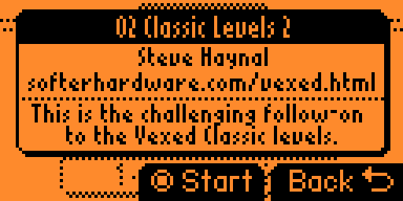
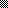

# Custom Levels

This game supports loading custom levels. 
Put them into: `[SDCARD]/apps_data/game_vexed/extra_levels` - you may upload them with [qFlipper](https://flipperzero.one/update)


Levels should be in Custom VXL format (CSV alike, derived from Vexed *.ini)

## Check before uploading

Be warned that app have very **simple** parser, some bugs in format will be noticed and app will refuse to load level and create file with error info - but other wont, and app will not work properly, crash itself or Flipper - test and check folowing:

* althou it seems like plaintext - treat it as binary! - DO NOT add extra spaces, newlines or comments, stick to the format
* do not use special characters in file name
* start file name from two digits (to order file on list)
* file name is level set name displayed in UI - keep it short!
* keep max. 100 levels per set
* make sure levels are numbered from 0 and there are no "holes" in level numbering

## VXL file format

Each file have following structure:

```
# metadata
# metadata
# metadata
leveldata
leveldata
leveldata
```

Each line ends with newline character (at least `\n`, but `\r\n` will work too).

**Remember to add new line after last level!**

## Metadata

```
# Id: Value
```

Supported IDs: `Author`, `URL`, `Description`

_For example:_

```
# Author: author name (short!)
# URL: author URL (short!)
# Description: (short!)
```

* Keep single space between `#`, `Id:` and `Value`
* Keep case the same, do not add spce before `#`
* Keep values short and check in app if they fit by center-click on levelset button of custom menu:




## Levels

Level have fields separated by semicolon `;`

```
number;title;board;solution
```

* `number` should start from `0`, each level shoud have number, they should be continous in set (eg.: 0, 1, 2, 3...)
* `title` as short as possible, no special characters
* `board` and `solution` have special format, inherided from Palm.OS Vexed 2.2

_For example:_

```CSV
0;Coffee Truffle;10/10/10/6a~2/7~2/5fb~2/3e~efab1/10;dGgDgG
1;Kahlua;10/10/10/5~d~a1/1h~1~~1~2/2~1~2~2/1h~d~d1a2/10;IdbEGdFe
```

### Boad data

Board have **10 x 8** logical size.

Board data is string defining each line of board, separated by `/`
Each line contains following characters:
* `number` - if it is wall, value tels how many blocks of wall to draw, `1` to `10`
* `character` - `a` to `h` representing each type of block
* `~` tilde character - representing empty space

| `1`..`10` | `~` | a | b | c | d | e | f | g | h |
|:---------:|:---:|:-:|:-:|:-:|:-:|:-:|:-:|:-:|:-:|
|  |  |  |   |  |  |  |  |  |  |


_In our example, for first level:_
```
10/10/10/6a~2/7~2/5fb~2/3e~efab1/10
```

means we have:
* first three lines are walls, `10`` characters each
* fourth line starts by `6` walls, followed by block type `a`, one empty space and remaining `2` walls
* line #5 starts with `7` walls, followed by empty space and remaining `2` walls
* line #6 starts with `5` walls, then bricks type `f` and `b` and remaining `2` walls
* line #7 starts with `3` walls, bricks  `e`, space,  bricks `e`,`f`,`a`,`b` and single wall
* last line is all walls

### Solution data

Solution string contains `XY` logical coordinates of block to move at each step of solution. Solution records only position and direction, as falling, gravity and explosions are deterministic and can be calculated for each step.

Solution string length also determines what is **par** (reference solution length) - wy dividing this string length by `2` we have moves count in solution == par.

Coordinates are calculated from **top-left** corner, starting from `0`.

String encodes coordinates as two letters:
* first letter for `X` coordinate, where `a` or `A` is 0, `b` or `B` is 1 ... and `j` or `J` is 9
* first letter for `Y` coordinate, where `a` or `A` is 0, `b` or `B` is 1 ... and `h` or `H` is 7
* if `X` coordinate letter is UPPERCASE `A..J` - it means in this step block is moved to the **left**
* if `Y` coordinate letter is UPPERCASE `A..H` - it means in this step block is moved to the **right**

_(it also means, that each pair have exactly and only one character uppercased)_

|       | a | b | c | d | e | f | g | h | i | j |
|-------|---|---|---|---|---|---|---|---|---|---|
| **x** | 0 | 1 | 2 | 3 | 4 | 5 | 6 | 7 | 8 | 9 |
| **y** | 0 | 1 | 2 | 3 | 4 | 5 | 6 | 7 |

| case   | direction |
|:------:|------|
| **Xy** | left |
| **xY** | right |

_In our example, for **second** level:_
```
IdbEGdFe
```

means we have:
* step 1: `Id` = block at x=8, y=3 moved to left
* step 2: `bE` = block at x=1, y=4 moved to right
* step 3: `Gd` = block at x=6, y=3 moved to left
* step 4: `Fe` = block at x=5, y=4 moved to left