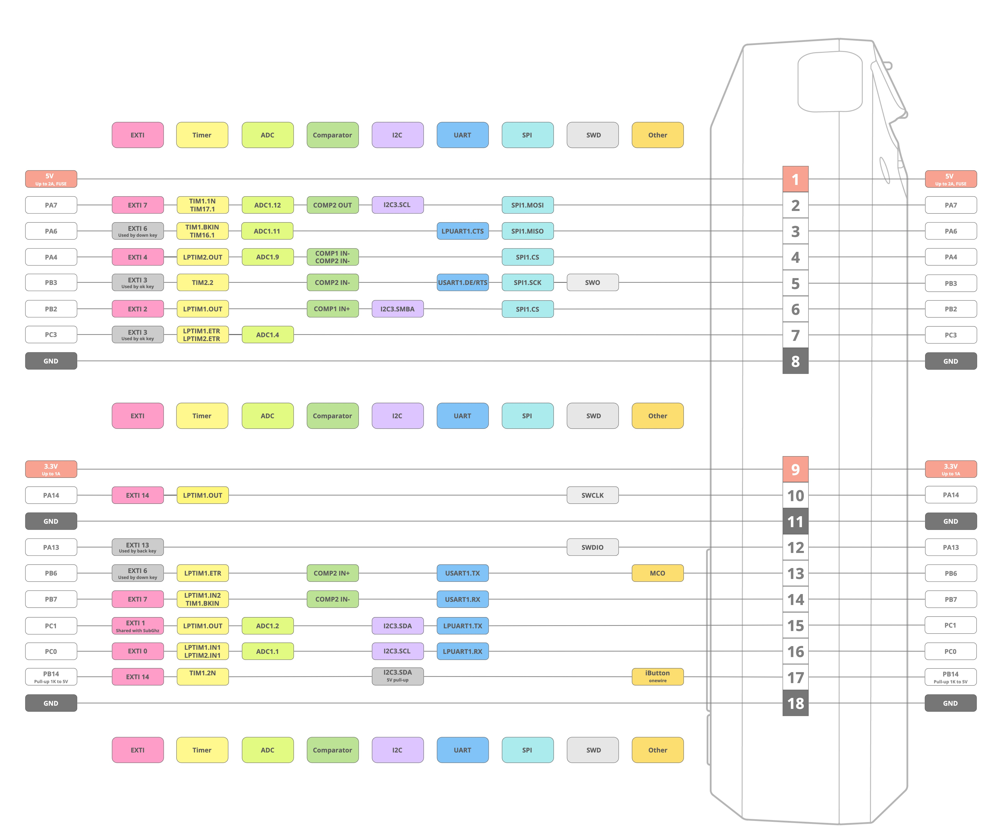
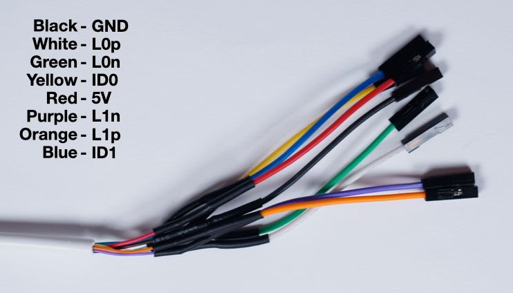
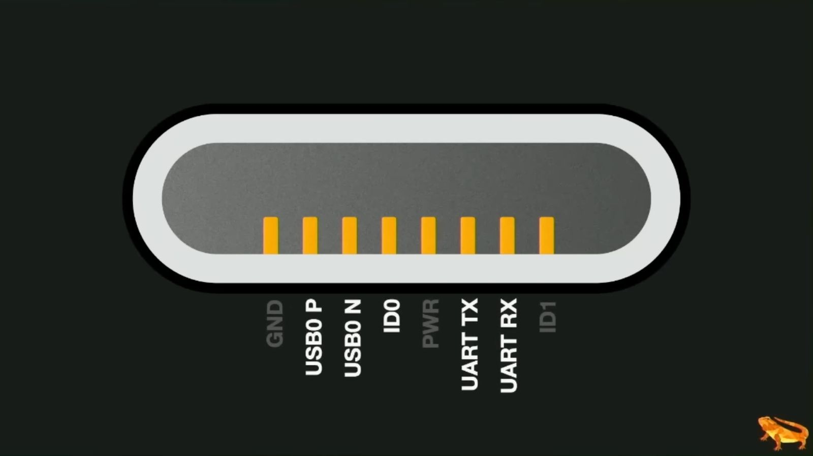
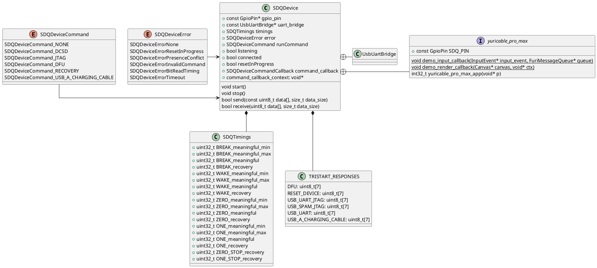
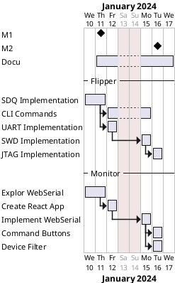

# YuriCable Pro Max

Implementation to use a Flipper-Zero as SWD/DCSD-Cable for iPhones just like known Kanzi/Kong/Tamarin Cables

> 

## Tested iPhones:

| iPhone      | DCSD | Reset | DFU | JTAG |
| ----------- | --- | ------ | --- | ---- |
| 14 Pro Max  |  ✅  |  ✅  |  ✅  |  ❌   |
| 14 Pro      |  ✅  |  ✅  |  ✅  |  ❌   |
| SE (2022)   |  ✅  |  ✅  |  ✅  |  ❌   |
| XS          |  ❌  |  ❌  |  ❌  |  ❌   |

## Thanks

### SDQ

Here some specs about the protocol used:

+ Name: SDQ (IDBUS) developed by Texas Instruments
+ Source: [Reversed Protocol](https://nyansatan.github.io/lightning/)

Credits for SDQ reverse engineering to [@nyansatan](https://github.com/nyansatan)

### Tamarin Cable Implementation

+ [Tamarin Firmware](https://github.com/stacksmashing/tamarin-firmware)

Credits to [@stacksmashing](https://github.com/stacksmashing) for an example pi pico implementation and his defcon talk
on this subject. (
watch [here](https://www.youtube.com/watch?v=8p3Oi4DL0eI&list=PL0P69gP-VL8eSCSNY-gQefgY1DXBSlNJC&index=6&))


## Project Setup

### Create .vscode

```shell
ufbt vscode_dist
```

### Open in CLion

Open the Project in CLion

## Flipper Docs

[Flipper Docs](https://docs.flipper.net/)

## Pinout Flipper Zero



## Pinout Lightning

Breakout Color Coding



Female Port Pinout


USB UART Pinout



## Build

### Build-Tool

#### Install Build-Tool

```shell
python -m pip install --upgrade ufbt
```

#### Update Firmware

+ Download Update

```shell
ufbt update --channel=release
```

#### Build App FLash it

+ Upload to Flipper

```shell
ufbt flash_usb
```

+ VSCode setup and build

```shell
ufbt faps vscode_dist
```

#### Build FAP

Navigiere in das Rootverzeichnis der App und führe dort nach installation von ufbt folgenden Befehl aus:

```shell
ufbt
```

Die `.fap`-Datei liegt dann im `./dist`-Ordner

#### Auto Launch

```shell
ufbt launch
```

## Debug

### ST-Link

+ [Older Guide for ST-Link](https://www.drewgreen.net/debugging-flipper-zero-firmware-with-st-link-v2/)

### JLink

#### Install JLINK Software

[Download latest JLINK Software](https://www.segger.com/downloads/jlink/)

Then update the Firmware of the JLink.

#### Pinout

+ Pinoout of the Segger J-Link


#### Pin Mapping

Mapping Table:

```txt
Flipper GPIO |  JLINK GPIO
__________________________
12 (SIO)     |  7 (TMS)
11 (GND)     |  8 (GND)
10 (SWC)     |  9 (TCK)
09 (3v3)     |  1 (VTref)
```


or buy a JTAG Adapter for Flipper Zero by [@jrozner](https://twitter.com/jrozner)
on [Tindie](https://www.tindie.com/products/cuttrace/flipper-zero-jlink-adapter/) and extend the GPIO-Pins


## Docs

### UFBT

+ Repo:  [UFBT GitHub](https://github.com/flipperdevices/flipperzero-ufbt)
+ Docs:  [UFBT DOCS](https://github.com/flipperdevices/flipperzero-ufbt/blob/dev/README.md)

### ARM Stuff

+ DWT_CYCCNT
  explained: [ARM DOCS](https://developer.arm.com/documentation/ddi0403/d/Debug-Architecture/ARMv7-M-Debug/The-Data-Watchpoint-and-Trace-unit/CYCCNT-cycle-counter-and-related-timers?lang=en)

## Class Diagramm



## Gantt


