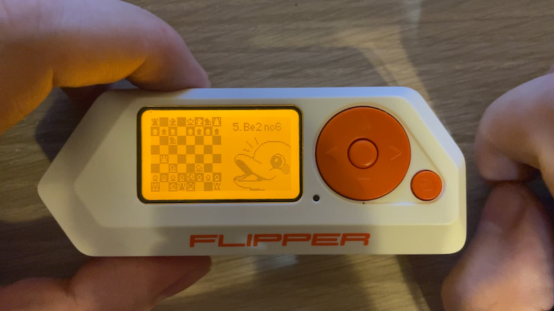

# "Broken" chess

This is the Chess app for Flipper Zero, that was made in the late 2021 as a proof-of-concept exclusively to make a YouTube video: https://youtu.be/_TRHik9JuOg. The purpose was to test, if a chess game is possible on such a small screen, and on Flipper Zero in general.

It somewhat worked (with issues) then, with a very ancient firmware version, but it cannot work with the newer versions.

If you still would like to get this thing to work, feel free to contact with the author: [e-mail](mailto:okalachev@gmail.com), [Telegram](https://t.me/okalachev). If there are several interested people, I might consider to fix it and release it as a normal app.

All the best!

